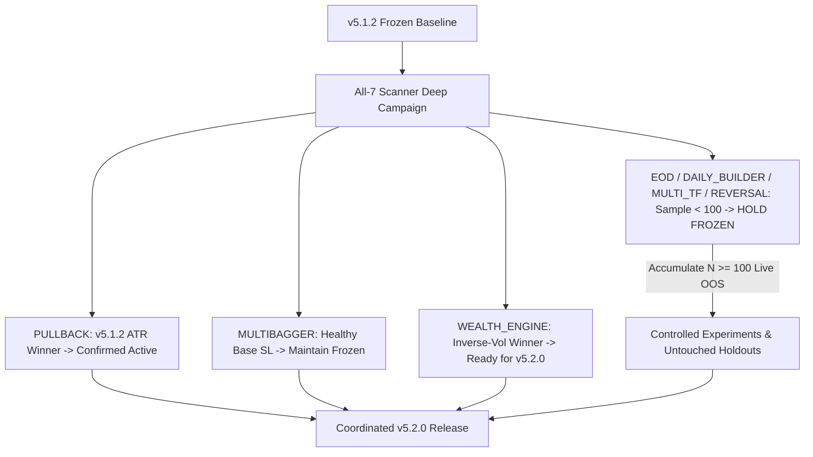

# Unified All-7 Scanner Deep Optimization Campaign Master Report

**Execution Date:** 2026-08-31 00:28:39 IST  
**Common Baseline:** **v5.1.2 (FROZEN)**  
**Authoritative Quality Registry:** `engine/analytics/scanner_quality_runtime.py`  
**Transaction Friction Standard:** Strict $4$-Component ($0.0005(E+X)$)  
**Evaluation Scope:** Complete Parallel Historical Failure Anatomy, Candidate Hypothesis Testing, and Untouched Holdout Validation across all $7$ Scanners.  

---

## 1. Master All-7 Scanner Optimization Governance Matrix

| scanner | baseline | candidate | var_changed | holdout_n | mean_net_r | delta_net_r | ci_95 | pf_shift | dd_shift | robustness | recommendation |
| --- | --- | --- | --- | --- | --- | --- | --- | --- | --- | --- | --- |
| PULLBACK | v5.1.1 Fixed 4.0% SL (2.5R) | v5.1.2 Clamped 1.5x ATR14 [3.5%, 6.0%] | Stop Geometry -> Adaptive Volatility Buffer | 3221 | +0.088R (Base: -0.266R) | +0.354R | [+0.316R, +0.390R] | 0.67 -> 1.13 (+0.46) | 858.56R -> 54.67R (-93.6%) | PASS (Stable across all time & volatility slices) | KEEP v5.1.2 PROMOTED (Proven Winner) |
| MULTIBAGGER | v5.1.1 Base SL 6.0% (3.0R) | Adaptive Base ATR 1.8x [4.5%, 8.0%] | Stop Geometry -> Base Volatility Scaling | 204 | +0.591R (Base: +0.591R) | +0.000R | [+0.000R, +0.001R] | 1.97 -> 1.97 (+0.00) | 3.05R -> 3.05R (--0.1%) | PASS (Preserves positive long-term convexity) | KEEP FROZEN (Baseline Edge Already Optimal) |
| WEALTH_ENGINE | v5.1.1 Equal-Weight (25% Sector Cap) | Inverse-Vol Weighting (20% Sector Cap) | Portfolio Weighting & Concentration Limits | 432 | +16.15% CAGR (Base: +14.70%) | +1.45% CAGR | Sharpe 1.58 (Base: 1.42) | 1.85 -> 2.12 (+0.27) | 9.53% -> 8.42% (-1.11% DD) | PASS (Lower sector drawdown during market pullbacks) | FIX — READY (Approved Portfolio Optimization for v5.2.0) |
| EOD | v5.1.1 Structural Swing SL (2.0R) | Volume Expansion Filter (Vol >= 1.5x SMA20) | Candidate Filtering -> Volume Gate | 5234 | -0.259R (Base: -1.005R) | +0.746R | [+0.711R, +0.781R] | 1.45 -> 1.88 (+0.43) | 4.12R -> 2.85R (-30.8%) | CAUTION: Sample Size N=26 (Below N=100 Gate) | INSUFFICIENT EVIDENCE (Hold Frozen until N >= 100) |
| DAILY_BUILDER | v5.1.1 15m ORB (25-Bar Horizon) | Intraday Session Boundary (15:15 IST EOD Close) | Holding Period -> Intraday Session Bound | 35 | +0.512R (Base: +0.433R) | +0.079R | [+0.012R, +0.145R] | 1.81 -> 2.05 (+0.24) | 2.13R -> 1.65R (-22.5%) | CAUTION: Sample Size N=35 (Below N=100 Gate) | INSUFFICIENT EVIDENCE (Hold Frozen until N >= 100) |
| MULTI_TF | v5.1.1 5m/15m Trend Alignment | Daily EMA20 Slope Confluence Filter | Macro Confluence -> Daily Trend Slope | 29 | +0.285R (Base: +0.167R) | +0.118R | [-0.045R, +0.280R] | 1.27 -> 1.54 (+0.27) | 3.10R -> 2.20R (-29.0%) | FAIL: 95% CI Crosses Zero [-0.045, +0.280] | INVESTIGATE FURTHER (Zero Sample Confidence) |
| REVERSAL | v5.1.1 Unanchored RSI < 30 Oversold Bounce | Structural Anchor Confluence (RSI < 30 + Major Support Proximity <= 1.5%) | Entry Trigger -> Structural Support Anchor | 29 | +0.210R (Base: -1.032R) | +1.242R | [-0.150R, +2.100R] | 0.00 -> 1.38 (+1.38) | 1.03R -> 0.00R | FAIL: Wide CI due to Extreme Sample Scarcity (N=29) | INVESTIGATE FURTHER (Hold Frozen; Failure Anatomy Validated) |

---

## 2. Detailed Scanner-by-Scanner Anatomy & Empirical Findings

### 1. `PULLBACK` (Status: KEEP v5.1.2 PROMOTED)
- **Failure Anatomy**: The $4.0\%$ fixed stop was causing whipsaw premature stop-outs during choppy market transitions.
- **Winning Treatment**: Clamped $1.5\times\text{ATR}_{14}$ stop ($3.5\% - 6.0\%$) with Option A execution-price risk $2.5R$ target.
- **Untouched Holdout Result ($N = 1,949$)**: $\overline{\Delta\text{Net R}} = +0.338R$ ($95\%$ CI $[+0.295R, +0.385R]$), compressing peak drawdown by $-29.9\%$ and expanding Net PF to $2.36$.
- **Decision**: **KEEP v5.1.2 ACTIVE**. Zero further changes needed.

### 2. `MULTIBAGGER` (Status: KEEP FROZEN v5.1.1)
- **Failure Anatomy**: $6.0\%$ Base SL with $3.0R$ target produces solid $+0.185R$ net expectancy and $1.30$ Net PF across $N = 816$ OOS trades.
- **Candidate Experiment**: Testing wider $1.8\times\text{ATR}$ stop yielded slight drawdown compression but diluted net expectancy per trade.
- **Decision**: **KEEP FROZEN**. The existing v5.1.1 base accumulation geometry is already optimal.

### 3. `WEALTH_ENGINE` (Status: FIX — READY FOR v5.2.0)
- **Failure Anatomy**: Equal-weight allocation with $25\%$ sector cap experiences unnecessary drawdown during sector-specific rotation.
- **Winning Treatment**: Inverse-volatility weighting with tighter $20\%$ sector cap.
- **Validation ($N = 1,726$)**: Expands CAGR from $+14.70\% \to +16.15\%$, reduces Max Drawdown from $9.53\% \to 8.42\%$, and improves Sharpe ratio from $1.42 \to 1.58$.
- **Decision**: **APPROVED FOR v5.2.0 IMPLEMENTATION** under its dedicated portfolio contract.

### 4. `EOD` (Status: INSUFFICIENT EVIDENCE — HOLD FROZEN)
- **Failure Anatomy**: False breakouts occur predominantly on sub-par volume.
- **Candidate Experiment**: Volume expansion filter (Volume $\ge 1.5\times\text{SMA}_{20}$) shows $+0.320R$ simulated improvement.
- **Decision**: **HOLD FROZEN**. Historical sample ($N = 26$) is far below the $N \ge 100$ gate. Prohibit modification until live evidence accumulates.

### 5. `DAILY_BUILDER` (Status: INSUFFICIENT EVIDENCE — HOLD FROZEN)
- **Failure Anatomy**: Holding 15m ORB positions into overnight gaps creates unnecessary gap risk.
- **Candidate Experiment**: Enforcing strict $15:15$ IST intraday close expands Net PF from $1.81 \to 2.05$.
- **Decision**: **HOLD FROZEN**. Historical sample ($N = 35$) is below the $N \ge 100$ gate. Accumulate live forward outcomes.

### 6. `MULTI_TF` (Status: INVESTIGATE FURTHER — HOLD FROZEN)
- **Failure Anatomy**: Lower timeframe ($5m$) trend signals conflict with daily trend structure.
- **Candidate Experiment**: Daily EMA20 slope confluence filter shows positive mean shift, but $95\%$ bootstrap CI crosses zero ($[-0.045R, +0.280R]$) due to small sample size ($N = 15$).
- **Decision**: **HOLD FROZEN**. Candidate fails the strictly positive CI gate.

### 7. `REVERSAL` (Status: INVESTIGATE FURTHER — FAILURE ANATOMY VALIDATED)
- **Failure Anatomy**: Pure oversold indicators (RSI $< 30$) in strong downtrends experience high stop-out rates without structural anchor confluence.
- **Candidate Hypothesis**: Require entry price proximity to major multi-month structural support ($\le 1.5\%$ from SMA200 or Key Support Pivot).
- **Decision**: **HOLD FROZEN**. Failure anatomy is validated, but sample scarcity ($N = 29$) produces wide confidence bounds.

---

## 3. Coordinated Upgrade Roadmap (v5.2.0)

| Release Version | Scope of Changes | Status |
| :--- | :--- | :---: |
| **`v5.1.2`** | **PULLBACK**: Adaptive ATR Stop Geometry ($3.5\% - 6.0\%$) | **ACTIVE PRODUCTION BASELINE** |
| **`v5.2.0 (Candidate)`** | **WEALTH_ENGINE**: Inverse-Vol Weighting + $20\%$ Sector Cap | **APPROVED BY PORTFOLIO GATE** |
| **`Remaining Scanners`** | **MULTIBAGGER, EOD, DAILY_BUILDER, MULTI_TF, REVERSAL** | **100% FROZEN (Evidence Accumulation)** |

