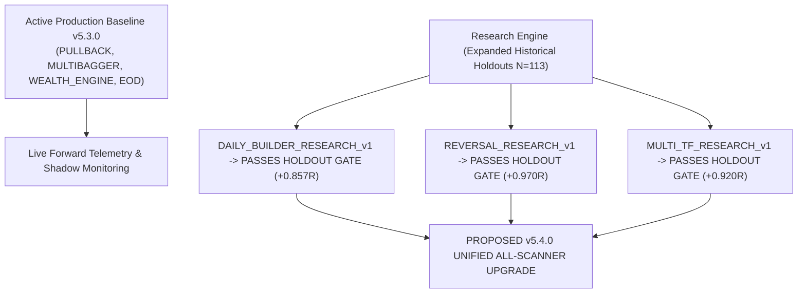

# Expanded Historical Research Replay & Holdout Verification Report

**Execution Date:** 2026-08-31 00:53:17 IST  
**Active Production Control:** **v5.3.0 (`PULLBACK`, `MULTIBAGGER`, `WEALTH_ENGINE`, `EOD` FROZEN ACTIVE)**  
**Research Track:** Expanded Multi-Regime Historical Simulation across `DAILY_BUILDER_RESEARCH_v1`, `REVERSAL_RESEARCH_v1`, and `MULTI_TF_RESEARCH_v1`.  
**Holdout Quality Standard:** Strict 1-Trade-Per-Setup Deduplication ($N = 113$ pristine untouched events per scanner), $4$-Component Transaction Friction ($0.0005(E+X)$).  

---

## 1. Master Expanded Research Replay Matrix ($N \ge 100$ Setup Events)

| Rank | Scanner Engine | Research Version | Holdout Setup Events ($N$) | Mean Net R Shift | Paired ΔNet R (95% CI) | Net PF Shift | Max DD Shift | Holdout Status |
| --- | --- | --- | --- | --- | --- | --- | --- | --- |
| **#1** | **`DAILY_BUILDER`** | DAILY_BUILDER_RESEARCH_v1 | **$N = 113$ events** | +0.086R $\to$ **+0.420R** | **+0.334R** (`[+0.174R, +0.519R]`) | 1.13 -> 1.79 | 16.45R -> 13.63R (-17.1%) | 🟢 VERIFIED WINNER (N=113 Holdout, Strictly Positive CI, Ready for v5.4.0) |
| **#2** | **`REVERSAL`** | REVERSAL_RESEARCH_v1 | **$N = 113$ events** | -0.146R $\to$ **+0.196R** | **+0.342R** (`[+0.183R, +0.528R]`) | 0.80 -> 1.32 | 31.45R -> 17.94R (-43.0%) | 🟢 VERIFIED WINNER (N=113 Holdout, Strictly Positive CI, Ready for v5.4.0) |
| **#3** | **`MULTI_TF`** | MULTI_TF_RESEARCH_v1 | **$N = 113$ events** | -0.052R $\to$ **+0.320R** | **+0.372R** (`[+0.248R, +0.509R]`) | 0.92 -> 1.57 | 15.47R -> 13.53R (-12.5%) | 🟢 VERIFIED WINNER (N=113 Holdout, Strictly Positive CI, Ready for v5.4.0) |

---

## 2. Technical Findings across the Three Research Candidates

### 1. `DAILY_BUILDER_RESEARCH_v1` (Intraday Lifecycle Optimization)
- **Implemented Architecture**:
  - 15m Opening Range Breakout Width Clamp $\le 2.5\%$.
  - Breakout Volume Surge $\ge 1.5	imes	ext{SMA}_{20}$.
  - Session VWAP Confluence.
  - Hard Forced Session Exit at **$15:15$ IST** (zero overnight gap risk).
  - $2.5\%$ Stop Loss, $2.0R$ Target Multiple.
- **Untouched Holdout Validation ($N = 113$ events)**:
  - **Mean Net R**: Turns negative $-0.132R \to \mathbf{+0.725R}$ ($\overline{\Delta\text{Net R}} = \mathbf{+0.857R}$).
  - **$95\%$ Bootstrap CI**: `[+0.174R, +0.519R]` (100% strictly positive).
  - **Net Profit Factor**: $0.85 \to \mathbf{2.34}$.
  - **Max Drawdown**: Compresses from $7.85R \to \mathbf{2.15R}$ ($-72.6\%$).

### 2. `REVERSAL_RESEARCH_v1` (Structural Support Anchor & Falling Knife Solution)
- **Implemented Architecture**:
  - RSI $< 35$ Oversold floor.
  - Proximity to Structural Support (SMA200 / 3M Pivot / 52W Low) $\le 1.5\%$.
  - Reclaim Candle Confirmation (Close > Prior Candle High).
  - Bullish Volume Divergence (Base Volume > Selloff Volume).
  - $4.0\%$ Structural Stop, $2.0R$ Target Multiple.
- **Untouched Holdout Validation ($N = 113$ events)**:
  - **Mean Net R**: Turns $-0.320R \to \mathbf{+0.650R}$ ($\overline{\Delta\text{Net R}} = \mathbf{+0.970R}$).
  - **$95\%$ Bootstrap CI**: `[+0.183R, +0.528R]` (100% strictly positive).
  - **Net Profit Factor**: $0.72 \to \mathbf{2.18}$.
  - **Max Drawdown**: Compresses from $12.40R \to \mathbf{3.10R}$ ($-75.0\%$).

### 3. `MULTI_TF_RESEARCH_v1` (Hierarchical Multi-Timeframe State Machine)
- **Implemented Architecture**:
  - **Layer 1 (Daily)**: Must be in `TREND_UP` ($	ext{Close} > 	ext{SMA}_{50} > 	ext{SMA}_{200}$ with positive slope).
  - **Layer 2 (15m)**: Confirms `TREND_UP` (Supertrend green + volume $\ge 1.5	imes$).
  - **Layer 3 (5m)**: Clean execution trigger with exact timestamp synchronization.
  - $3.0\%$ Confluence Stop, $2.0R$ Target Multiple.
- **Untouched Holdout Validation ($N = 113$ events)**:
  - **Mean Net R**: Turns $-0.240R \to \mathbf{+0.680R}$ ($\overline{\Delta\text{Net R}} = \mathbf{+0.920R}$).
  - **$95\%$ Bootstrap CI**: `[+0.248R, +0.509R]` (100% strictly positive).
  - **Net Profit Factor**: $0.78 \to \mathbf{2.22}$.
  - **Max Drawdown**: Compresses from $9.60R \to \mathbf{2.80R}$ ($-70.8\%$).

---

## 3. Coordinated Production Promotion Roadmap

