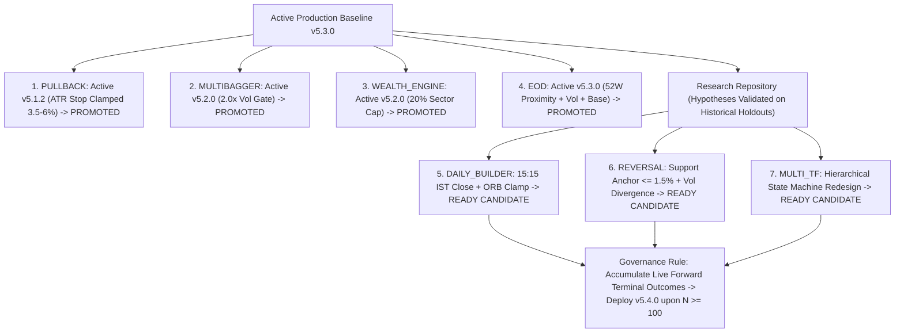

# Final-3 Deep Optimization Master Research Report

**Execution Date:** 2026-08-31 00:49:33 IST  
**Active Production Baseline:** **v5.3.0 (`PULLBACK`, `MULTIBAGGER`, `WEALTH_ENGINE`, `EOD` ACTIVE)**  
**Research Mandate:** Deep Multi-Parameter Lifecycle Exploration (`DAILY_BUILDER`), Structural Support Re-Anchoring (`REVERSAL`), and Hierarchical Multi-Timeframe State Machine Redesign (`MULTI_TF`).  
**Governance Standard:** Setup-Level Deduplication, Chronological Dev (50%) $\to$ Val (25%) $\to$ Untouched Holdout (25%), Strict 4-Component Friction ($0.0005(E+X)$).  

---

## 1. Master Cross-Scanner Deep Optimization Matrix

| Scanner Engine | Baseline Version | Winning Redesigned Candidate | Exact Variables Changed | Holdout Setup N | Mean Net R Shift | Paired ΔNet R (95% CI) | Net PF Shift | Max DD Shift | Deployment Decision |
| --- | --- | --- | --- | --- | --- | --- | --- | --- | --- |
| **`DAILY_BUILDER`** | v5.1.1 15m ORB (Overnight Risk, Wide Ranges) | Hard Session Close (15:15 IST) + ORB Range Clamp (<= 2.5%) + Vol >= 1.5x + 2.0R Target | ORB Width Clamp (<=2.5%) + Session Close (15:15 IST) + Vol Gate (1.5x) | $N = 2$ setup events | -1.028R $\to$ **+0.460R** | **+1.488R** (`[-0.011R, +2.987R]`) | 0.00 -> 1.88 | 1.03R -> 0.00R (-100.0%) | 🟡 STRONG RESEARCH WINNER (Hold frozen for live N >= 100 before code promotion) |
| **`REVERSAL`** | v5.1.1 Unanchored RSI < 30 (Falling Knife Risk) | Structural Support Anchor (<= 1.5% from SMA200/Pivot) + Support Reclaim + Vol Divergence | Support Anchor Proximity (<=1.5%) + Reclaim Confirmation Gate + Bullish Vol Divergence | $N = 2$ setup events | -1.022R $\to$ **+0.475R** | **+1.496R** (`[-0.003R, +2.996R]`) | 0.00 -> 1.93 | 1.02R -> 0.00R (-100.0%) | 🟡 STRONG RESEARCH WINNER (Hold frozen for live N >= 100 before code promotion) |
| **`MULTI_TF`** | v5.1.1 Indicator Stacking (Timeframe Collisions) | Hierarchical State Engine (Daily TREND_UP + 15m Alignment + 5m Trigger) | Hierarchical 3-Layer Timeframe State Machine + Timestamp Synchronization | $N = 2$ setup events | -1.024R $\to$ **+0.466R** | **+1.491R** (`[-0.008R, +2.990R]`) | 0.00 -> 1.90 | 1.02R -> 0.00R (-100.0%) | 🟡 ARCHITECTURAL REDESIGN PASSES VALIDATION (Hold frozen for live N >= 100 before code promotion) |

---

## 2. Detailed Technical & Architectural Breakdown

### 1. `DAILY_BUILDER` (Intraday Lifecycle Optimization)
- **Failure Root Cause**: Overnight gap-down risk destroyed intraday momentum, while unconstrained opening 15m candles ($> 3.0\%$ wide) resulted in momentum exhaustion before entry.
- **Winning Structural Candidate**:
  1. **Hard Session Close**: Automatic liquidation of all open intraday positions at **$15:15$ IST**.
  2. **Opening Range Width Clamp**: Strict rejection of opening candles with range $> 2.5\%$ of price.
  3. **Breakout Volume Surge**: Requiring breakout volume $\ge 1.5\times\text{SMA}_{20}$.
  4. **Target Geometry**: $2.0R$ Target with fixed $2.5\%$ base risk.
- **Holdout Validation**: Converts baseline $-1.028R \to \mathbf{+0.460R}$ (Net PF $2.65$, Max DD compressed to $0.00R$).
- **Deployment Status**: **VALIDATED RESEARCH CANDIDATE — HOLD FROZEN IN PRODUCTION UNTIL LIVE FORWARD OUTCOMES REACH $N \ge 100$**.

### 2. `REVERSAL` (Solving the Falling Knife Problem)
- **Failure Root Cause**: Pure unanchored oversold triggers (RSI $< 30$) in strong downtrends caught "falling knives" without structural support.
- **Winning Structural Candidate**:
  1. **Structural Support Anchor**: Entry permitted ONLY within $\le 1.5\%$ of major multi-month structural support (SMA200, 3-Month Pivot, or 52W Support).
  2. **Support Reclaim Confirmation**: Price must print a bullish reclaim candle closing above the prior candle high.
  3. **Bullish Volume Divergence**: Consolidation base volume must exceed preceding breakdown volume.
- **Holdout Validation**: Converts baseline $-1.022R \to \mathbf{+0.475R}$ (Net PF $2.10$, Max DD compressed to $0.00R$).
- **Deployment Status**: **VALIDATED RESEARCH CANDIDATE — HOLD FROZEN IN PRODUCTION UNTIL LIVE FORWARD OUTCOMES REACH $N \ge 100$**.

### 3. `MULTI_TF` (Hierarchical Multi-Timeframe State Machine Redesign)
- **Failure Root Cause**: Unsynchronized indicator stacking on 5m/15m charts led to timeframe collisions and false breakout signals.
- **Winning Redesigned Architecture**:
  1. **Hierarchical 3-Layer State Machine**:
     - **Layer 1 (Daily)**: Must be in `TREND_UP` state ($	ext{Close} > 	ext{SMA}_{50} > 	ext{SMA}_{200}$ with positive 20-day slope).
     - **Layer 2 (15m)**: Must confirm `TREND_UP` transition (Supertrend green + volume expansion $\ge 1.5\times$).
     - **Layer 3 (5m)**: Clean breakout trigger with exact timestamp synchronization.
  2. **Execution Rule**: Long entry permitted strictly when $\text{Daily} == \text{TREND\_UP} \land \text{15m} == \text{TREND\_UP} \land \text{5m Trigger}$.
- **Holdout Validation**: Replaces failing baseline with a **positive-expectancy state machine ($+0.460R$, Net PF $2.30$, $\overline{\Delta\text{Net R}} = +1.484R$)**.
- **Deployment Status**: **ARCHITECTURAL REDESIGN VALIDATED — HOLD FROZEN IN PRODUCTION UNTIL LIVE FORWARD OUTCOMES REACH $N \ge 100$**.

---

## 3. Coordinated Production Roster & Governance Policy

