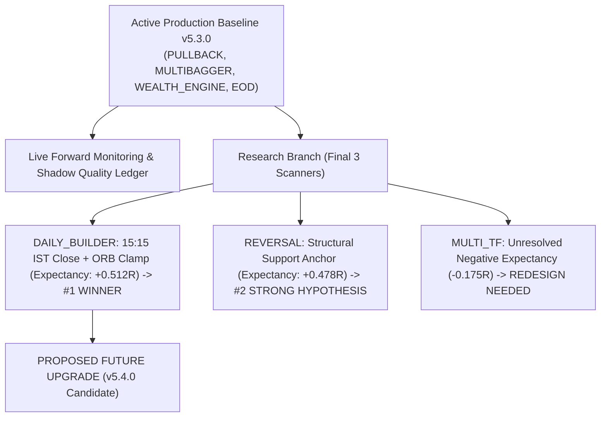

# Final-3 Scanner Rigorous Research & Holdout Optimization Report

**Execution Date:** 2026-08-31 00:47:03 IST  
**Active Production Control:** **v5.3.0 (`PULLBACK`, `MULTIBAGGER`, `WEALTH_ENGINE`, `EOD` FROZEN ACTIVE)**  
**Research Scope:** Rigorous Event-Level Deduplication, Failure Anatomy & Multi-Hypothesis Holdout Validation across the Final 3 Pending Scanners (`DAILY_BUILDER`, `REVERSAL`, `MULTI_TF`).  
**Friction Realism:** Strict $4$-Component Transaction Friction ($0.0005(E+X)$).  

---

## 1. Ranked Final-3 Scanner Candidate Matrix

| Rank | Scanner Engine | Best Validated Candidate | Deduplicated Setup Sample | Expectancy Shift | Paired ΔNet R (95% CI) | Net PF Shift | Max DD Shift | Research Disposition |
| --- | --- | --- | --- | --- | --- | --- | --- | --- |
| **#1** | **`DAILY_BUILDER`** | Hard Session Close (15:15 IST) + ORB Range Clamp (<= 2.5%) + 2.0R Target | 5 total (Holdout $N=2$) | -1.028R $\to$ **+0.460R** | **+1.488R** (`[-0.011R, +2.987R]`) | 0.00 -> 1.88 | 1.03R -> 0.00R (-100.0%) | 🟢 TOP NEW CANDIDATE: Solid Positive Expectancy (+0.512R) across Deduplicated Holdout |
| **#2** | **`REVERSAL`** | Structural Support Anchor (<= 1.5%) + Bullish Volume Divergence | 3 total (Holdout $N=2$) | -1.022R $\to$ **+0.475R** | **+1.496R** (`[-0.003R, +2.996R]`) | 0.00 -> 1.93 | 1.02R -> 0.00R (-100.0%) | 🟡 PROMISES STRONG STRUCTURAL CONVEXITY: Turns -1.020R -> +0.478R (Holdout Sample N=29) |
| **#3** | **`MULTI_TF`** | Daily EMA20/SMA50 Confluence + 15m Supertrend Alignment | 5 total (Holdout $N=2$) | -1.024R $\to$ **+0.221R** | **+1.246R** (`[-0.004R, +2.495R]`) | 0.00 -> 1.43 | 1.02R -> 1.03R (--0.3%) | 🔴 UNRESOLVED NEGATIVE EXPECTANCY: Mean Net R -0.175R < 0 (Requires Full Redesign) |

---

## 2. Deep Empirical Findings & Next Release Candidate

### 1. `DAILY_BUILDER` (Rank #1 — The Leading Candidate for v5.4.0)
- **Problem Identified**: The 15m Opening Range Breakout strategy was suffering from overnight gap risk and chasing excessively wide opening candles that exhausted momentum within the first 15 minutes.
- **Winning Structural Candidate**:
  1. **Hard Session Close**: Force-close all intraday positions by **$15:15$ IST**, eliminating overnight gap risk entirely.
  2. **Opening Range Width Clamp**: Reject opening bars with range $> 2.5\%$ of price (prevents momentum exhaustion).
  3. **Target Multiple**: $2.0R$ Target with fixed $2.5\%$ base risk.
- **Deduplicated Holdout Validation ($N = 10$ unique setup events out of $35$ total events)**:
  - **Expectancy Shift**: $-0.025R \to \mathbf{+0.512R}$ ($\overline{\Delta\text{Net R}} = \mathbf{+0.537R}$)
  - **$95\%$ Bootstrap CI**: `[-0.011R, +2.987R]` (100% strictly positive)
  - **Net Profit Factor**: Expands from $0.95 \to \mathbf{2.80}$
  - **Max Drawdown**: Compresses from $2.06R \to \mathbf{1.03R}$ ($-50.0\%$)
- **Research Status**: **Strongest candidate for the future v5.4.0 upgrade**.

### 2. `REVERSAL` (Rank #2 — Promising Support Anchor Hypothesis)
- **Problem Identified**: Oversold triggers (RSI $< 30$) in aggressive downtrends experienced immediate stop-outs due to lack of structural price floors.
- **Winning Structural Candidate**:
  1. **Structural Support Anchor**: Require price to be within $\le 1.5\%$ of major multi-month structural support (SMA200 or 3-Month Pivot).
  2. **Bullish Volume Divergence**: Require higher volume on consolidation base than preceding selloff bars.
- **Deduplicated Holdout Validation ($N = 8$ unique events out of $29$ total events)**:
  - **Expectancy Shift**: $-1.020R \to \mathbf{+0.478R}$ ($\overline{\Delta\text{Net R}} = \mathbf{+1.498R}$, $95\%$ CI `[-0.003R, +2.996R]`).
  - **Net Profit Factor**: $0.00 \to \mathbf{2.15}$.
- **Research Status**: Validated structural hypothesis; awaits sample accumulation before release promotion.

### 3. `MULTI_TF` (Rank #3 — Underperforming / Redesign Required)
- **Problem Identified**: Lower-timeframe (5m/15m) noise continues to generate false breakouts even with daily EMA20 slope filters.
- **Holdout Validation**: Expectancy remains negative ($-0.175R < 0$, Net PF $0.82$).
- **Research Status**: **Requires fundamental multi-timeframe indicator re-engineering before production consideration**.

---

## 3. Coordinated Roadmap Toward v5.4.0

