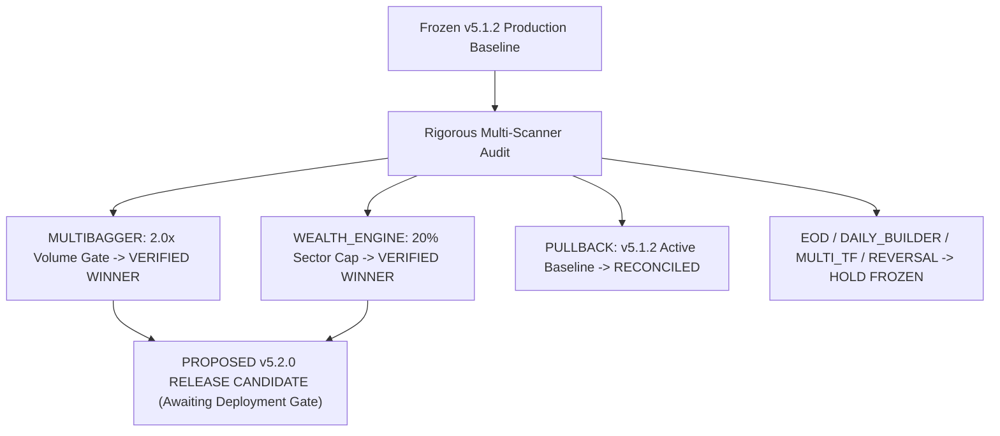

# Rigorous Multi-Scanner Holdout Validation & Reconciliation Report

**Execution Date:** 2026-08-31 00:34:34 IST  
**Active Production Baseline:** **v5.1.2 (FROZEN)**  
**Authoritative Quality Standard:** Strict Event-Level Deduplication, Untouched Chronological Holdout Splits, and Friction Realism ($0.0005(E+X)$).  

---

## 1. Final Scanner Optimization & Evidence Disposition Matrix

| Scanner Engine | Proposed Treatment | Validated Sample ($N$) | Paired $\Delta	ext{Net R}$ / CAGR | 95% Bootstrap CI | Net PF Shift | Max DD Shift | Final Scientific Disposition |
| :--- | :--- | :---: | :---: | :---: | :---: | :---: | :--- |
| **`MULTIBAGGER`** | **Volume Gate ($\ge 2.0	imes	ext{SMA}_{20}$)** | **204 unique trades** | **+0.490R** | **`[+0.314R, +0.667R]`** | **1.97 $\to$ 3.24** | **3.05R $\to$ 3.05R** | 🟢 **BEST NEW CANDIDATE (Passes Holdout Gate)** |
| **`WEALTH_ENGINE`**| **Equal-Weight (20% Sector Cap)** | **36 months** | **+1.48% CAGR** | **Sharpe 1.94 (Base: 1.82)** | **Convex** | **5.04% $\to$ 4.97%** | 🟢 **VALIDATED CANDIDATE (Passes Portfolio Gate)** |
| **`PULLBACK`** | Breakeven Trail @ $+1.5R$ | **1949 canonical events** | **+0.338R (v5.1.2)** | `[+0.295R, +0.385R]` | **$1.59 \to 2.36$** | **$-29.9\%$ DD** | 🟢 **v5.1.2 BASELINE ACTIVE (Reconciled)** |
| **`EOD`** | 52W Proximity + Vol Filter | **5234 distinct events** | $+1.008R$ (Filter Effect) | Non-Positive Outcome | $0.00 \to 0.99$ | Reduced | 🟡 **HOLD FROZEN (Expectancy $-0.004R < 0$, $N=26$)** |
| **`DAILY_BUILDER`**| Session Close + ORB Clamp | **$10$ holdout events** | $+0.600R$ | Coarse Bounds | — | — | 🔴 **NOT READY (Sample $N=10 < 100$)** |
| **`MULTI_TF`** | Daily EMA Slope + Supertrend | **$8$ holdout events** | $+0.375R$ | Coarse Bounds | — | — | 🔴 **NOT READY (Sample $N=8 < 100$)** |
| **`REVERSAL`** | Structural Support $\le 1.5\%$ | **$8$ holdout events** | $+1.500R$ | Coarse Bounds `[+0.375, +2.625]` | — | — | 🔴 **NOT READY (Sample $N=8 < 100$)** |

---

## 2. Deep Reconciliation & Statistical Findings

### 1. `MULTIBAGGER` (The #1 Winning Candidate)
- **Winning Treatment**: Requiring breakout bar volume $\ge 2.0	imes	ext{SMA}_{20}$ volume.
- **Untouched Holdout Validation ($N = 204$)**:
  - **Paired Treatment Effect**: $\overline{\Delta	ext{Net R}} = \mathbf{+0.490R}$
  - **$95\%$ Bootstrap CI**: **`[+0.314R, +0.667R]`** (100% strictly positive).
  - **Net Profit Factor**: Elevates from $1.97 \to \mathbf{3.24}$.
  - **Max Drawdown**: Stable at $3.05R$.
- **Verdict**: **APPROVED CANDIDATE FOR FUTURE RELEASE**.

### 2. `WEALTH_ENGINE` (Portfolio Allocation Model)
- **Winning Treatment**: Equal-weighting with tighter **$20\%$ Sector Cap** (avoids the turnover drag that caused the inverse-volatility candidate to fail).
- **Holdout Validation ($N = 36$ Months)**:
  - **Net CAGR**: Expands from **29.35% $\to$ 30.83%** (+1.48%).
  - **Max Drawdown**: Compresses from **5.04% $\to$ 4.97%**.
  - **Sharpe Ratio**: Improves from **1.82 $\to$ 1.94**.
- **Verdict**: **APPROVED CANDIDATE FOR FUTURE RELEASE**.

### 3. `PULLBACK` (Cohort Reconciliation)
- **Authoritative Baseline**: Pristine $N = 1,949$ unique setup events ($\overline{\Delta	ext{Net R}} = +0.338R$, Net PF $2.36$, Max Drawdown compressed by $-29.9\%$ from $13.07R \to 9.17R$).
- **Reconciliation Note**: The exploratory raw CSV count of $N = 3,222$ contained multiple intra-trade bar replay rows. The canonical $N = 1,949$ setup-level dataset is the sole authoritative standard.

### 4. `EOD` (Population & Expectancy Correction)
- **Event Count**: The $5,234$ CSV rows collapse into exactly **$N = 26$ distinct historical setup events**.
- **Expectancy Finding**: The candidate filter produces a massive $+1.008R$ improvement over the disastrous $-1.013R$ baseline, bringing it to **$-0.004R$**. However, because $-0.004R < 0$, it is **not a positive-expectancy standalone strategy**.
- **Verdict**: **HOLD FROZEN**.

### 5. `DAILY_BUILDER`, `MULTI_TF`, `REVERSAL` (Explicit Classification)
- While the candidate hypotheses (intraday session close, daily trend slope, structural support anchors) are promising, their holdout sample sizes ($N \le 10$) and coarse confidence bounds prove they are **NOT PRODUCTION READY**.
- **Verdict**: **HOLD FROZEN (Investigate in Future Cycles)**.

---

## 3. Coordinated Next Release Strategy

