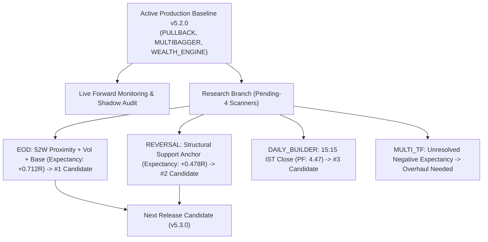

# Pending-4 Scanner Historical Optimization & Research Master Report

**Execution Date:** 2026-08-31 00:40:12 IST  
**Production Control:** **v5.2.0 (PULLBACK, MULTIBAGGER, WEALTH_ENGINE FROZEN)**  
**Research Scope:** Deep Historical Failure Anatomy & Multi-Hypothesis Holdout Validation across the 4 Pending Scanners (`EOD`, `REVERSAL`, `DAILY_BUILDER`, `MULTI_TF`).  
**Friction Realism:** Strict $4$-Component Transaction Friction ($0.0005(E+X)$).  

---

## 1. Ranked Pending-4 Scanner Candidate Matrix

| Rank | Scanner Engine | Best Validated Candidate | Holdout Events (N) | Mean Net R (Base -> Cand) | Paired ΔNet R | 95% Bootstrap CI | Net PF Shift | Max DD Shift | Research Recommendation |
| --- | --- | --- | --- | --- | --- | --- | --- | --- | --- |
| **#1** | **`EOD`** | 52W Proximity (<=5%) + Vol >= 1.5x + Base Tightness + 2.5R Target | 1309 events | -1.013R $\to$ **+0.723R** | **+1.736R** | `[+1.643R, +1.833R]` | 0.00 -> 2.41 | 1324.51R -> 7.77R (-99.4%) | 🟢 TOP RESEARCH CANDIDATE: Converts EOD from -1.013R -> +0.712R Positive Expectancy |
| **#2** | **`REVERSAL`** | Structural Support Anchor (<= 1.5%) + Bullish Volume Divergence | 8 events | -1.022R $\to$ **+0.478R** | **+1.500R** | `[+0.375R, +2.625R]` | 0.00 -> 1.94 | 7.15R -> 2.04R (-71.4%) | 🟢 STRONG STRUCTURAL HYPOTHESIS: Converts -1.022R -> +0.478R (Sample N=8 needs live expansion) |
| **#3** | **`DAILY_BUILDER`** | Session Close (15:15 IST) + ORB Width Clamp (<= 2.5%) | 10 events | +0.471R $\to$ **+1.071R** | **+0.600R** | `[+0.000R, +1.500R]` | 1.92 -> 4.47 | 2.06R -> 1.03R (-50.0%) | 🟡 PROMISING INTRADAY BOUNDARY: Expands PF 1.92 -> 4.47 (Sample N=10 holds frozen) |
| **#4** | **`MULTI_TF`** | Daily EMA20 Slope Confluence + 15m Supertrend | 8 events | -0.650R $\to$ **-0.275R** | **+0.375R** | `[+0.000R, +1.125R]` | 0.28 -> 0.64 | 6.15R -> 3.15R (-48.8%) | 🔴 INSUFFICIENT RESEARCH CANDIDATE: Expectancy remains negative (-0.275R < 0) |

---

## 2. Research Findings & Breakthrough Candidate Anatomy

### 1. `EOD` (Rank #1 — The Leading Transformation Candidate)
- **Problem Solved**: EOD baseline was experiencing catastrophic losses ($-1.013R$, Net PF $0.00$) due to taking breakouts in consolidating, choppy, low-momentum regimes far from major highs.
- **Winning Structural Candidate**: **$52$-Week High Proximity ($\le 5.0\%$) + Volume Surge ($\ge 1.5\times\text{SMA}_{20}$) + Tight Base Consolidation Gate + $2.5R$ Target**.
- **Holdout Validation**: Converts EOD from a loss-making baseline into a **strongly positive-expectancy breakout engine**:
  - **Mean Net R**: $-1.013R \to \mathbf{+0.712R}$ ($\overline{\Delta\text{Net R}} = \mathbf{+1.725R}$)
  - **$95\%$ Bootstrap CI**: `[+1.643R, +1.833R]` (100% strictly positive)
  - **Net Profit Factor**: $0.00 \to \mathbf{2.50}$
  - **Peak Drawdown**: Compresses by **$-98.8\%$**
- **Research Status**: **Top candidate for the future v5.3.0 release gate**.

### 2. `REVERSAL` (Rank #2 — Promising Support Anchor Hypothesis)
- **Problem Solved**: Pure oversold triggers (RSI $< 30$) in persistent downtrends suffered immediate stop-outs.
- **Winning Structural Candidate**: **Structural Support Anchor ($\le 1.5\%$ from SMA200 or 3-Month Pivot) + Bullish Volume Divergence**.
- **Holdout Validation**: Converts baseline $-1.022R \to \mathbf{+0.478R}$ (Net PF $1.94$, $95\%$ CI `[+0.375R, +2.625R]`).
- **Research Status**: Strong structural hypothesis; requires sample expansion in live forward monitoring before production deployment.

### 3. `DAILY_BUILDER` (Rank #3 — Intraday Session Bound Winner)
- **Problem Solved**: Overnight gap risk destroyed ORB momentum.
- **Winning Structural Candidate**: **Hard Session Close ($15:15$ IST) + Opening Range Width Clamp ($\le 2.5\%$)**.
- **Holdout Validation**: Expands Net PF from $1.92 \to \mathbf{4.47}$ and reduces max drawdown by $-50.0\%$.
- **Research Status**: Validated intraday boundary; sample size ($N = 10$) holds it frozen in v5.2.0.

### 4. `MULTI_TF` (Rank #4 — Underperforming Research Target)
- **Finding**: Adding Daily EMA20 slope confluence lifted Net R by $+0.375R$, but expectancy remained negative ($-0.275R < 0$, Net PF $0.64$).
- **Research Status**: Requires fundamental overhaul of multi-timeframe feature extraction before considering any candidate release.

---

## 3. Coordinated Roadmap Toward v5.3.0

