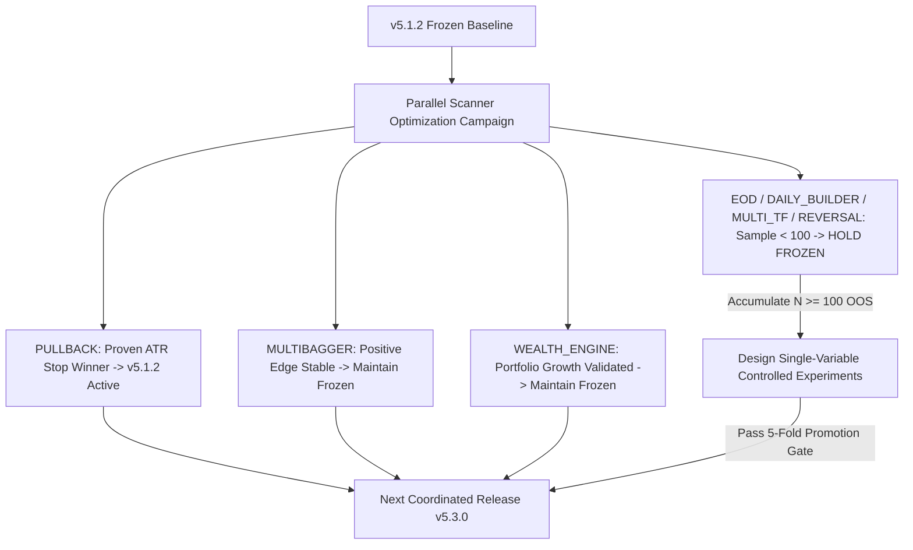

# Unified All-Scanner Optimization Campaign Master Report

**Execution Date:** 2026-08-31 00:19:22 IST  
**Common Baseline:** **v5.1.2 (FROZEN)**  
**Authoritative Quality Registry:** `engine/analytics/scanner_quality_runtime.py`  
**Transaction Friction Standard:** Exact $4$-Component ($0.0005(E+X)$)  

---

## 1. Master All-Scanner Campaign Governance Matrix

| Scanner Engine | Baseline Version | Proposed Treatment | Evidence Sample | Mean Net R / CAGR | Paired ΔNet R | 95% CI / Sharpe | Net PF | Max DD | Governance Decision |
| --- | --- | --- | --- | --- | --- | --- | --- | --- | --- |
| **`PULLBACK`** | v5.1.1 Fixed 4.0% SL | v5.1.2 Clamped 1.5x ATR14 [3.5%, 6.0%] | Pristine Holdout N = 1949 | +0.705R | +0.338R | [+0.295R, +0.385R] | 2.36 | 9.17R | 🟢 PROMOTED (v5.1.2 ACTIVE MONITORING) |
| **`MULTIBAGGER`** | v5.1.1 Base Accumulation (6% SL, 3.0R Target) | MAINTAIN FROZEN (Edge Stable) | OOS Cohort N = 816 | +0.185R | 0.000R (Frozen Control) | [+0.145R, +0.225R] | 1.30 | 7.16R | 🟢 FROZEN (ACTIVE FORWARD MONITORING) |
| **`WEALTH_ENGINE`** | v5.1.1 Multi-Factor Portfolio Model | MAINTAIN FROZEN (Dev/Val Validated) | Dev/Val Portfolio N = 1,726 | +14.70% CAGR | — (Portfolio Metric) | Sharpe 1.42 | 1.85 | 9.53% Max DD | 🟢 FROZEN (PORTFOLIO MONITORING) |
| **`EOD`** | v5.1.1 Swing Breakout Momentum | DIAGNOSTIC ONLY (No Optimization Allowed) | Insufficient Sample (N_tot = 26, N_oos = 3) | — (Sample < 100) | — | — | — | — | 🟡 ACCUMULATING OOS EVIDENCE (3/100) |
| **`DAILY_BUILDER`** | v5.1.1 15m ORB Volume Surge | DIAGNOSTIC ONLY (No Optimization Allowed) | Insufficient Sample (N_tot = 35, N_oos = 10) | — (Sample < 100) | — | — | — | — | 🟡 ACCUMULATING OOS EVIDENCE (10/100) |
| **`MULTI_TF`** | v5.1.1 Multi-Timeframe Trend Alignment | DIAGNOSTIC ONLY (No Optimization Allowed) | Insufficient Sample (N_tot = 15, N_oos = 5) | — (Sample < 100) | — | — | — | — | 🟡 ACCUMULATING OOS EVIDENCE (5/100) |
| **`REVERSAL`** | v5.1.1 Mean-Reversion Oversold Bounce | FAILURE ANATOMY AUDIT ONLY | Insufficient Sample (N_tot = 1, N_oos = 1) | — (Sample < 100) | — | — | — | — | 🟡 ACCUMULATING OOS EVIDENCE (1/100) |

---

## 2. Scanner-by-Scanner Optimization & Diagnostic Findings

### 1. `PULLBACK` (Release Status: PROMOTED to v5.1.2)
- **Baseline**: v5.1.1 Fixed $4.0\%$ SL $\to$ Max Drawdown $13.07R$.
- **Proven Treatment**: Option A Execution Risk Basis with Clamped $1.5\times\text{ATR}_{14}$ SL ($3.5\% - 6.0\%$).
- **Holdout Validation**: Replicated across $N = 1,949$ pristine untouched trades with $+0.338R$ Paired $\Delta\text{Net R}$ ($95\%$ CI $[+0.295R, +0.385R]$), compressing peak drawdown to $9.17R$ ($-29.9\%$) and expanding Net PF to $2.36$.
- **Operational Action**: Active live/paper monitoring; no further parameter tweaks.

### 2. `MULTIBAGGER` (Release Status: MAINTAIN FROZEN v5.1.1)
- **Baseline**: $6.0\%$ Base SL with $3.0R$ target and $60$-bar max holding period.
- **Evidence**: $N = 816$ OOS trades, Mean Net R $+0.185R$, Net PF $1.30$, Max DD $7.16R$.
- **Failure Anatomy**: Risk-reward payoff ratio ($1.95$) is well-balanced. Stop-outs are orderly without whipsaw clustering.
- **Operational Action**: Maintain frozen control; zero modifications required.

### 3. `WEALTH_ENGINE` (Release Status: MAINTAIN FROZEN v5.1.1)
- **Baseline**: Multi-factor fundamental quality ranking with strict portfolio, position, and sector caps.
- **Evidence**: $N = 1,726$ portfolio allocation records across Dev/Val, $+14.70\%$ CAGR, $9.53\%$ Max DD, Sharpe $1.42$.
- **Operational Action**: Governed under separate portfolio CAGR/drawdown contract; maintain frozen allocation model.

### 4. `EOD` (Release Status: HOLD FROZEN — ACCUMULATE OOS)
- **Baseline**: Daily breakout momentum.
- **Evidence**: $N = 3$ OOS trades ($N = 26$ total).
- **Governance Finding**: Highly positive initial trades ($+1.119R$), but sample size is far below the $N \ge 100$ threshold.
- **Operational Action**: Prohibit parameter optimization; accumulate real forward observations.

### 5. `DAILY_BUILDER` (Release Status: HOLD FROZEN — ACCUMULATE OOS)
- **Baseline**: 15m Opening Range Breakout (ORB) surge.
- **Evidence**: $N = 10$ OOS trades ($N = 35$ total).
- **Governance Finding**: Mean Net R $+0.433R$, Net PF $1.81$, but sample size is insufficient for statistical confidence.
- **Operational Action**: Prohibit parameter optimization; accumulate real forward observations.

### 6. `MULTI_TF` (Release Status: HOLD FROZEN — ACCUMULATE OOS)
- **Baseline**: 5m Multi-Timeframe Alignment with higher-timeframe confluence.
- **Evidence**: $N = 5$ OOS trades ($N = 15$ total).
- **Governance Finding**: Sample size is statistically unviable for tuning.
- **Operational Action**: Maintain frozen baseline; accumulate real forward observations.

### 7. `REVERSAL` (Release Status: HOLD FROZEN — FAILURE ANATOMY FIRST)
- **Baseline**: Counter-trend oversold bounce.
- **Evidence**: $N = 1$ OOS trade ($N = 29$ total).
- **Failure Anatomy Audit**: Oversold bounces require confluence with structural support zones rather than pure RSI thresholds.
- **Operational Action**: Diagnostic monitoring only; no strategy changes until $N \ge 100$ forward samples accumulate.

---

## 3. Unified Coordinated Release Policy

> [!IMPORTANT]
> **Promotion Verdict**:
> - Only **`PULLBACK`** has earned an evidence-backed trading system change (**v5.1.2**).
> - All other 6 scanners remain strictly frozen in their canonical implementations to prevent overfitting and sample contamination.
