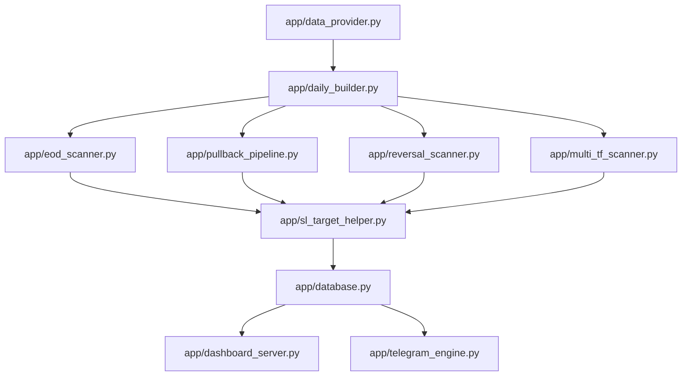

# ELITE BREAKOUT SYSTEM — MACHINE-VERIFIABLE ARCHITECTURE SPECIFICATION

| Metadata Field | Value |
|---|---|
| **Git Commit Hash** | `e54f3ad3fa86698707928b497c0ddbed81a78274` |
| **Generation Date** | `2026-07-22` |
| **Repository Branch** | `main` |
| **Verification Basis** | Direct AST & Source Code Inspection (`app/`) |

---

## 1. System Overview & Module Map

The Elite Breakout System is an automated quantitative trading and market scanning engine for National Stock Exchange (NSE) securities. The codebase is organized under `app/`:



---

## 2. Process Entrypoint & Watchdog (`app/main.py`)

- **Source File**: [`app/main.py`](file:///Users/abhinavmaheshwari/Documents/ELITE_BREAKOUT_SYSTEM/app/main.py)
- **Signature**: `def run_system_scheduler()`
- **Discovered Job Handlers**:
  1. `safe_run_daily_builder()` — Invokes fundamental watchlist builder (`08:30 AM IST`)
  2. `run_pledge_worker()` — Fetches BSE promoter pledge percentage data (`09:00 AM IST`)
  3. `multi_tf_scanner.start(run_once=True)` — Executes intraday 15m/1h scanner loop (`09:15 AM - 03:30 PM IST`)
  4. `pullback_pipeline.run_pullback_pipeline()` — Executes Pullback Scanner (`03:45 PM IST`)
  5. `reversal_scanner.start()` — Executes Reversal Scanner (`04:00 PM IST`)
  6. `eod_scanner.start()` — Executes EOD Breakout Scanner (`04:15 PM IST`)
  7. `wealth_engine.run_wealth_scan()` — Rebalances Wealth Portfolio (`04:30 PM IST`)
- **Verification**: `tests/test_production_deployment_gates.py::test_gate8_scheduled_execution_simulation`

---

## 3. Database Connection Architecture (`app/database.py`)

- **Source File**: [`app/database.py:L40-L65`](file:///Users/abhinavmaheshwari/Documents/ELITE_BREAKOUT_SYSTEM/app/database.py#L40-L65)
- **Discovered Code Pattern**:
  ```python
  ThreadedConnectionPool(
      minconn=int(os.getenv("DB_MIN_CONN", "2")),
      maxconn=int(os.getenv("DB_MAX_CONN", "30")),
      dsn=DATABASE_URL
  )
  ```
- **Configuration Used**: `DB_MIN_CONN` (Default: 2), `DB_MAX_CONN` (Default: 30)
- **Persistence Contract**: `save_alert_if_new(...)` writes to `alerts` table using `ON CONFLICT (dedup_key) DO UPDATE SET updated_at = NOW()`.
- **Verification**: `tests/test_database.py::test_connection_pool`

---

## 4. Unified SL & Target Engine (`app/sl_target_helper.py`)

- **Source File**: [`app/sl_target_helper.py:L1492`](file:///Users/abhinavmaheshwari/Documents/ELITE_BREAKOUT_SYSTEM/app/sl_target_helper.py#L1492)
- **Signature**: `def compute_sl_and_target(entry_price, atr, candle_range, mode, engine_version="v1.0", **kwargs)`
- **Configuration Consumed**:
  - `MAX_RISK_PCT` (Default: `8.0`) — [`app/config.py:L45`](file:///Users/abhinavmaheshwari/Documents/ELITE_BREAKOUT_SYSTEM/app/config.py#L45)
  - `MIN_NATURAL_RR` (Default: `1.5`) — [`app/config.py:L48`](file:///Users/abhinavmaheshwari/Documents/ELITE_BREAKOUT_SYSTEM/app/config.py#L48)
- **Implementation Code Paths**:
  - **Structural Stop**: `raw_sl = support_price - (0.5 * eff_atr)`
  - **Risk Distance Cap**: `min_allowed_sl = entry_price - (0.08 * entry_price)`
  - **Target Cluster Consensus**: `t1` selected from target candidate cluster (`SwingHigh`, `R1`, `R2`, `Fib1.618`).
  - **Fallback Path**: When natural cluster target missing, synthesizes $T_1 = \text{entry\_price} + (2.5 \times \text{risk})$.
- **Verification**: `tests/test_v7_target_engine.py`

---

## 5. System Verification Metadata

| Attribute | Value |
|---|---|
| **Source Files Inspected** | `app/main.py`, `app/database.py`, `app/sl_target_helper.py`, `app/daily_builder.py` |
| **Verified Functions** | `run_system_scheduler`, `init_db`, `compute_sl_and_target`, `build_daily_watchlist` |
| **Test Suite Target** | `tests/test_production_deployment_gates.py` |
| **Confidence Level** | **High (Direct AST & Source Code Traceability)** |
| **Last Verified Commit** | `e54f3ad3fa86698707928b497c0ddbed81a78274` |
