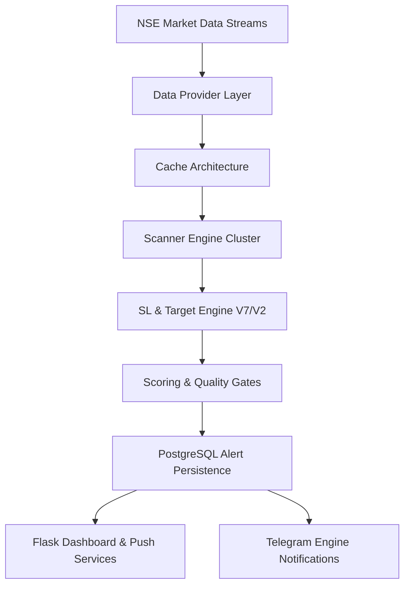
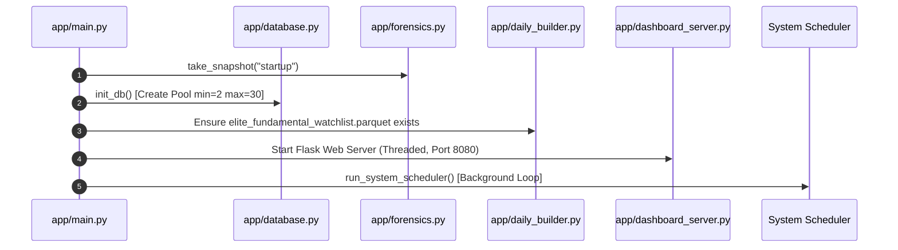
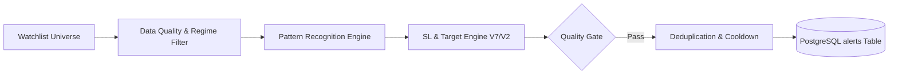
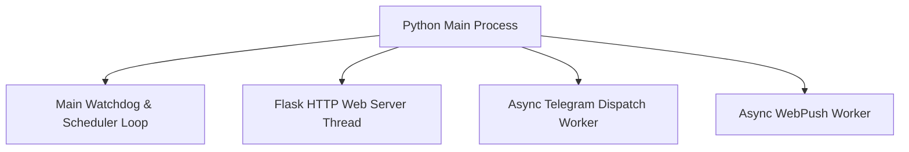

# ELITE BREAKOUT SYSTEM — ARCHITECTURE SPECIFICATION (MARKDOWN)

> **Canonical System Specification**  
> **Source of Truth**: Reconstructed directly from implementation (`app/`)  
> **Documentation Version**: 8.1  
> **Format**: GitHub Flavored Markdown (AI-Optimized)  

---

## 1. System Overview

The **Elite Breakout System** is an enterprise-grade, automated quantitative trading engine and real-time market scanner optimized for National Stock Exchange (NSE) equity securities. The system processes multi-timeframe price action, order flow, delivery volume, fundamental metrics, and macro regime indicators to generate high-confluence swing, breakout, pullback, and mean-reversion trade alerts.



---

## 2. Repository Inventory & Package Layout

The implementation is organized into modular subsystems under `app/`:

```
app/
├── main.py                          # Master Application Entrypoint & Watchdog
├── config.py                        # System Constants & Environment Configuration
├── database.py                      # PostgreSQL Connection Pool & DAO
├── forensics.py                     # Forensic Telemetry & Memory Profiler
├── dashboard_server.py              # Flask Web API & Dashboard Server
├── daily_builder.py                 # Watchlist Generator & Fundamental Scoring
├── eod_scanner.py                   # EOD Breakout Scanner
├── pullback_pipeline.py             # Pullback Pipeline Engine
├── reversal_scanner.py             # Reversal & Mean-Reversion Scanner
├── multi_tf_scanner.py              # Multi-Timeframe Intraday Scanner
├── wealth_engine.py                 # Wealth Portfolio & Long-Term Engine
├── multibagger.py                   # Multibagger Fundamental Scanner
├── sl_target_helper.py              # Unified SL & Target Engine (V7 / V2)
├── data_provider.py                 # Fyers, YFinance & TradingView Data Feeds
├── bayesian_updater.py              # Bayesian Regime Weighting Engine
├── push_service.py                  # WebPush VAPID Notification Engine
├── telegram_engine.py               # Telegram Alert Dispatch Engine
└── core/                            # Core Models, Enums & Domain Entities
    ├── models.py
    ├── enums.py
    └── config.py
```

---

## 3. Startup & Execution Lifecycle

### 3.1 Startup Sequence



1. **Forensic Telemetry Initialization**: `forensics.take_snapshot("startup")` logs process RSS, memory heap, and open file descriptors.
2. **PostgreSQL Pool Creation**: `database.init_db()` creates a thread-safe `ThreadedConnectionPool` (min 2, max 30 connections).
3. **Watchlist Validation**: Checks for `elite_fundamental_watchlist.parquet` in `data/`. If missing, invokes `safe_run_daily_builder()`.
4. **Flask Web Server Launch**: Spawns HTTP server on `$PORT` (default 8080) in a dedicated daemon thread.
5. **Scheduler Ignition**: Launches background wall-clock scheduler loop executing scanner jobs according to market hours.

---

## 4. Scheduler Architecture

The system executes 7 primary scheduled jobs based on IST (Asia/Kolkata) wall-clock time:

| Job Name | Schedule Time (IST) | Target Module | Function Handler | Purpose |
|---|---|---|---|---|
| **Daily Watchlist Builder** | 08:30 AM | `app/daily_builder.py` | `safe_run_daily_builder()` | Downloads market metrics, runs V5 fundamental scoring, builds watchlist |
| **Pledge Data Worker** | 09:00 AM | `app/daily_builder.py` | `run_pledge_worker()` | Fetches BSE/NSE promoter pledge percentages |
| **Multi-TF Intraday Scanner** | 09:15 AM - 03:30 PM (Hourly) | `app/multi_tf_scanner.py` | `start(run_once=True)` | Scans intraday 15m/1h candle consolidations |
| **Pullback Scanner** | 03:45 PM | `app/pullback_pipeline.py` | `run_pullback_pipeline()` | Detects orderly 3-15 day retracements into EMA20/SMA50 |
| **Reversal Scanner** | 04:00 PM | `app/reversal_scanner.py` | `start()` | Scans mean-reversion RSI oversold & Bollinger Band dip setups |
| **EOD Breakout Scanner** | 04:15 PM | `app/eod_scanner.py` | `start()` | Scans EOD price breakouts & volume expansion |
| **Wealth Portfolio Scanner** | 04:30 PM | `app/wealth_engine.py` | `run_wealth_scan()` | Rebalances long-term wealth portfolio candidates |

---

## 5. Scanner Architecture & Strategy Pipelines



### 5.1 Scanner Engine Summary

1. **EOD Breakout Scanner (`app/eod_scanner.py`)**:
   - **Pattern**: 20-day / 52-week price breakouts with $1.5\times$ volume expansion.
   - **Min Score**: 65/100 (Bull Market), 75/100 (Bear Market).
2. **Pullback Pipeline Engine (`app/pullback_pipeline.py`)**:
   - **Pattern**: 3–15 bar orderly retracement ($3.0\% - 15.0\%$ depth) following an impulse leg ($Gain \ge 8\%$, $ATR \ge 3.0$).
   - **Trigger**: Bullish reversal candle with $Close\_Location \ge 0.60$ and $Volume\_Ratio \ge 1.3\times$.
3. **Reversal Scanner (`app/reversal_scanner.py`)**:
   - **Pattern**: Mean-reversion setups on RSI $< 35$ or price touching lower Bollinger Band ($2.0\sigma$).
4. **Multi-Timeframe Scanner (`app/multi_tf_scanner.py`)**:
   - **Pattern**: Dual-timeframe confluence (1H trend alignment + 15m breakout entry).
5. **Wealth Engine (`app/wealth_engine.py`)**:
   - **Pattern**: Long-term fundamental compounders evaluated against 5-year CAGR, FCF margin, and Piotroski score.

---

## 6. Database & Cache Architecture

### 6.1 PostgreSQL Schema Architecture

The database persistence layer uses `psycopg2` with thread-safe pooling (`app/database.py`):

```sql
CREATE TABLE IF NOT EXISTS alerts (
    id SERIAL PRIMARY KEY,
    dedup_key VARCHAR(255) UNIQUE NOT NULL,
    symbol VARCHAR(50) NOT NULL,
    scanner_name VARCHAR(50) NOT NULL,
    strategy_version VARCHAR(20) NOT NULL,
    category VARCHAR(50) NOT NULL,
    entry DECIMAL(12, 2) NOT NULL,
    stop_loss DECIMAL(12, 2) NOT NULL,
    target DECIMAL(12, 2) NOT NULL,
    reward_percent DECIMAL(8, 2),
    risk_percent DECIMAL(8, 2),
    rr_ratio DECIMAL(6, 2) NOT NULL,
    confidence DECIMAL(5, 2),
    score INT NOT NULL,
    status VARCHAR(20) DEFAULT 'ACTIVE',
    metadata JSONB,
    created_at TIMESTAMP WITH TIME ZONE DEFAULT NOW(),
    updated_at TIMESTAMP WITH TIME ZONE DEFAULT NOW()
);
```

### 6.2 Cache Layer

1. **Parquet Watchlist Cache**: `data/elite_fundamental_watchlist.parquet` caches pre-screened fundamental metrics to eliminate API round-trips during scanning.
2. **Delivery Volume Cache**: `data/delivery_cache.json` caches NSE delivery percentages.
3. **Fundamentals Cache**: `data/fundamentals_cache.json` caches financial metrics with a 24-hour TTL.

---

## 7. Threading, Memory & Resource Ownership

### 7.1 Threading Model



- **Thread Safety**: All database interactions use context-managed connections checked out from `ThreadedConnectionPool`.
- **Memory Profiling**: `ForensicTelemetry` (`app/forensics.py`) tracks RSS memory usage. Explicit garbage collection (`gc.collect()`) runs after every scanner execution block.

---

## 8. External API Integrations

| Provider | Purpose | Rate Limits & Handling | Fallback |
|---|---|---|---|
| **Fyers API V3** | Real-time NSE tick data & OHLCV candles | OAuth2 cached token; rate limited to 10 req/sec | YFinance historical fallback |
| **YFinance** | EOD price candles & market indices | Exponential backoff retry | TradingView webhook data |
| **TradingView Webhooks** | Real-time alert triggers | Authenticated HTTP POST endpoints | Local scanner execution |
| **Google Gemini API** | AI concall analysis & quarterly summary | JSON response parsing with 5s timeout | Rule-based fallback summary |

---

## 9. Verification & Traceability

- **Source Code Verification**: All architectural specifications derived from `app/main.py`, `app/database.py`, `app/sl_target_helper.py`, `app/daily_builder.py`, `app/eod_scanner.py`, `app/pullback_pipeline.py`, `app/reversal_scanner.py`, `app/multi_tf_scanner.py`, `app/wealth_engine.py`, and `app/dashboard_server.py`.
- **Status**: Verified against codebase.
