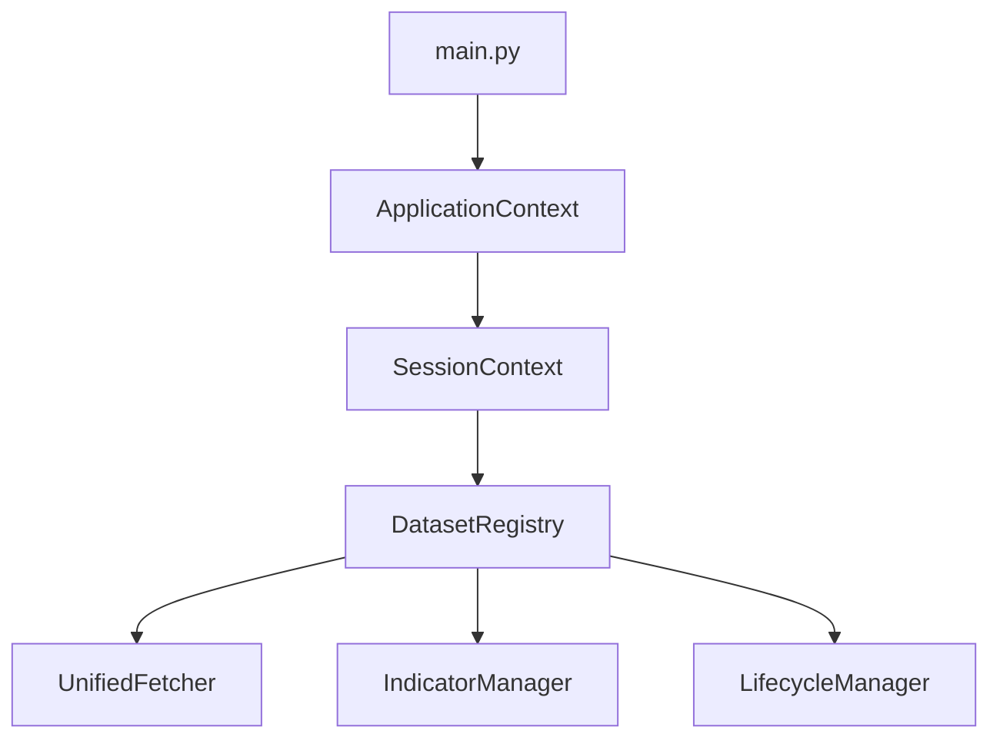
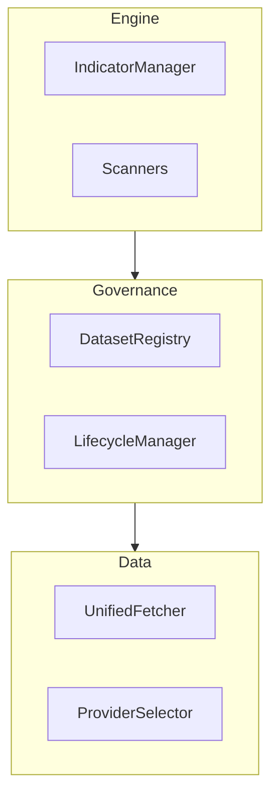
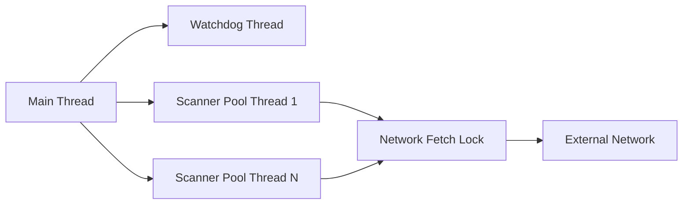
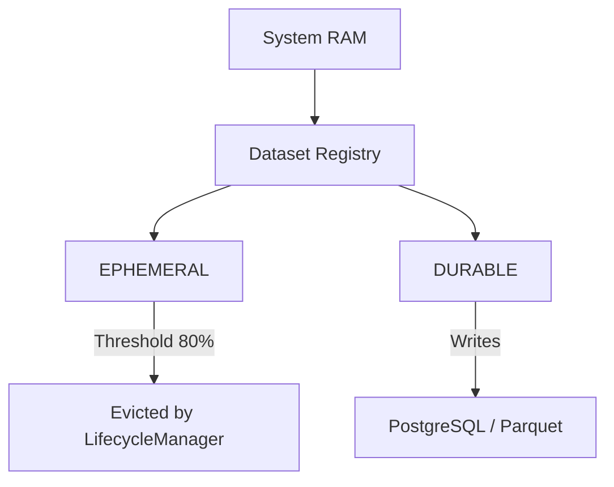
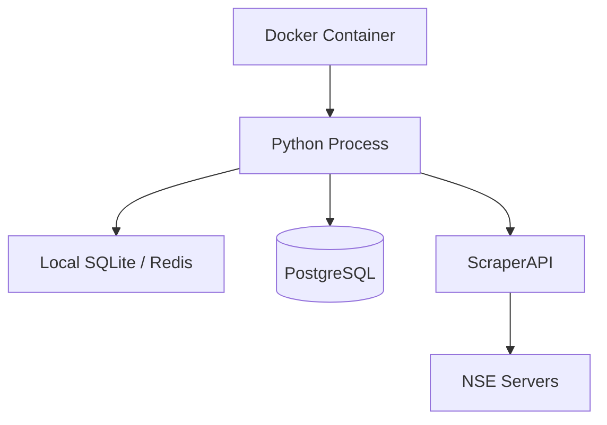
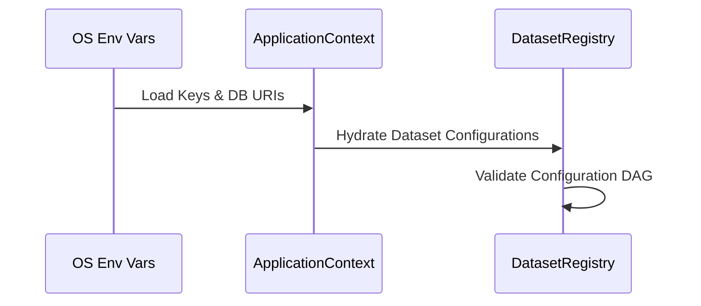
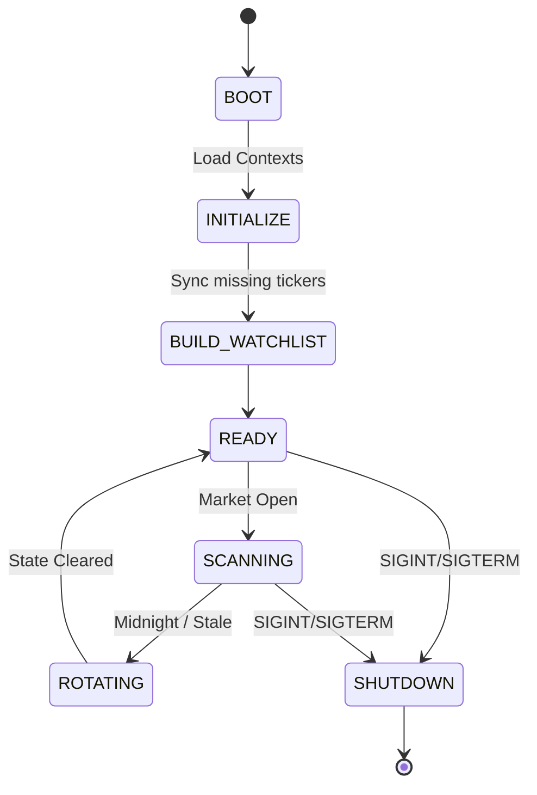

# Platform Rebuild Guide

This document is the **Engineering Specification**. If the repository disappeared tomorrow, this document provides the exact blueprints necessary for a Principal Engineering team to rebuild the entire platform from scratch with functional and architectural equivalence.

## System Goals & Non-Functional Requirements
*   **Goal**: Operate a 24/7 autonomous quantitative trading platform that executes EOD and Multi-Timeframe breakout/reversal strategies on the National Stock Exchange of India (NSE).
*   **Availability**: Survive provider outages via seamless fallback mechanisms and proxy layers.
*   **Memory Stability**: Run indefinitely without memory leaks by explicitly managing the lifecycle of all caches.
*   **Performance**: Centralize all redundant CPU operations (indicators) and parallelize all non-blocking I/O operations (scanners).

---

## Architectural Invariants (The Constitution)

These rules **MUST NEVER** be violated:
1. **Unified Acquisition**: All externally fetched datasets MUST enter through `UnifiedFetcher`. No direct API calls.
2. **Policy-Driven Routing**: Provider selection MUST be delegated to `ProviderSelector`.
3. **Indicator Centralization**: No scanner may compute shared indicators.
4. **Governed Memory**: All shared datasets MUST exist in the `DatasetRegistry`. No mutable module-level state.
5. **Lifecycle Exclusivity**: Only `LifecycleManager` may release datasets.
6. **NSE Protection**: Official NSE datasets MUST retain the `ScraperAPI` residential proxy acquisition path.
7. **Application Singleton**: `ApplicationContext` is the ONLY application singleton.
8. **Session Bounding**: `SessionContext` is the ONLY owner of trading-session state.

---

## Data Contracts & Provider Policies
Every governed dataset MUST conform to the canonical `DatasetEntry` interface:

```python
class DatasetEntry:
    dataset_id: str
    owner: str
    preferred_provider: str | None
    fallback_chain: list[str]
    persistence: Persistence
    release_event: ReleaseEvent
    validation_strategy: str
    consumers: list[str]
    version: int
```

The `DatasetRegistry` must instantiate the following exact contracts:

| Dataset | Owner | Preferred Provider | Fallback | Persistence | Release Event | Validation Strategy |
| :--- | :--- | :--- | :--- | :--- | :--- | :--- |
| `price_1d` | HistoricalData | `yahoo` | `fyers`, `bse` | DURABLE | End of Day | Daily checksum + regression tests |
| `price_15m` | HistoricalData | `fyers` | `yahoo`, `bse` | EPHEMERAL | Memory Pressure | Runtime fallback metrics |
| `price_1m` | HistoricalData | `fyers` | `yahoo`, `bse` | EPHEMERAL | Memory Pressure | Runtime fallback metrics |
| `live_quotes` | UnifiedFetcher | `fyers` | `yahoo`, `bse` | EPHEMERAL | Memory Pressure | Freshness/latency monitoring |
| `bhavcopy_delivery` | DeliveryData | `nse` (ScraperAPI)| None | DURABLE | None | Schema validation + row-count |
| `block_deals` | InstitutionalData| `nse` (nsearchives)| None | EPHEMERAL | Memory Pressure | Schema validation + row-count |
| `blacklist` | Surveillance | `nse` (ScraperAPI)| None | EPHEMERAL | Memory Pressure | Snapshot regression |
| `promoter_pledge` | HistoricalData | `nse` (ScraperAPI)| None | DURABLE | End of Day | Golden snapshot regression |
| `watchlist` | DailyBuilder | None | None | DURABLE | New Trading Day| Golden snapshot regression |
| `sector_rotation` | SectorRotation | `yahoo` | None | EPHEMERAL | TTL Expiry | Schema validation |

**Runtime Data Provenance**
Every returned DataFrame must inject the following structure into `df.attrs`:
```python
{
    "dataset": "price_1d",
    "provider": "yahoo",
    "preferred_provider": "yahoo",
    "fallback_used": False,
    "fetch_timestamp": "ISO_8601_TIMESTAMP"
}
```

### Dataset Versioning
Every dataset carries a monotonically increasing `version` integer. 
*   Consumers (like scanners or dashboard caches) may detect stale datasets by comparing their local cached version against the registry's current version. 
*   `LifecycleManager` releases invalidate previous versions.
*   Internal provider fallbacks during a refresh do *not* reset or negatively impact the versioning logic.

---

## Threading & Memory Model

### Thread Model
*   **Scanners (CPU Bound)**: Scanners operate in parallel background threads.
*   **Acquisition (I/O Bound)**: The system MUST employ a `network_fetch_lock` (or equivalent granular lock) specifically wrapping the `UnifiedFetcher` external boundaries. Do NOT use global pipeline execution locks, as they destroy concurrency.
*   **Watchdog**: A separate thread monitors memory limits and invokes `LifecycleManager` evictions.

### Memory Model
*   `DURABLE` datasets are stored on disk (PostgreSQL/Parquet).
*   `EPHEMERAL` datasets are stored in-memory. Once system memory hits 80%, the `LifecycleManager` forcefully drops the oldest generation of `EPHEMERAL` data.

---

## Testing Philosophy

To validate that the rebuilt system behaves correctly, apply these strategies:
1. **Unit Tests**: Validate core mathematical functions (e.g., indicator outputs must match talib/pandas exactly).
2. **Contract Tests**: Validate that external APIs (Fyers, Yahoo) conform to the expected DataFrame schema.
3. **Golden Snapshot Tests**: Compare the final generated `watchlist` and signal targets against historical, verified output files to ensure zero regressions in logic.
4. **Memory Regression Tests**: Run the system for 72 simulated hours; memory MUST stabilize and reclaim after lifecycle events.
5. **Architecture Validation Tests**: Run AST or runtime assertions ensuring no `yf.download` or `.rolling().mean()` exists outside their designated Manager classes.

---

## Diagrams

### 1. Dependency Graph


**Dependency Direction Rules**
To prevent architectural erosion, dependencies must strictly flow in one direction:
`Scanner → DatasetRegistry → UnifiedFetcher → ProviderSelector → External API`

*   **Allowed**:
    *   `Scanner` → `DatasetRegistry` (request data)
    *   `Scanner` → `IndicatorManager` (request indicators)
    *   `DatasetRegistry` → `UnifiedFetcher` (trigger acquisition)
    *   `UnifiedFetcher` → `ProviderSelector` (route request)
*   **Forbidden**:
    *   `UnifiedFetcher` → `Scanner` (acquisition cannot know about trading logic)
    *   `LifecycleManager` → `Scanner`
    *   `ProviderSelector` → `Scanner`

### 2. Package Diagram


### 3. Folder Hierarchy
```text
ELITE_BREAKOUT_SYSTEM/
├── app/
│   ├── main.py (Entry point)
│   ├── data_providers/ (UnifiedFetcher, ProviderSelector)
│   ├── scanners/ (EOD, Pullback, MultiTF)
│   ├── data_registry.py
│   ├── indicator_manager.py
│   └── lifecycle.py
├── docs/ (SYSTEM_GUIDE, REBUILD_GUIDE)
└── tests/
```

### 4. Thread Model


### 5. Memory Model


### 6. Deployment Diagram


### 7. Configuration Flow


### Configuration Model
If rebuilding the platform, the system must read its environment configuration identically to ensure identical containerized deployment behavior:
*   **Environment Variables**: Secrets and URIs must strictly reside in `os.environ` or `.env` files, never hardcoded.
*   **API Keys**: `FYERS_APP_ID`, `FYERS_SECRET_KEY`, `SCRAPERAPI_KEY`
*   **Database**: `DATABASE_URL` (PostgreSQL standard DSN format).
*   **Filesystem**: `DATA_DIR` controls where Parquet and SQLite caches persist across container restarts.
*   **Scheduler**: `MARKET_OPEN_TIME`, `MARKET_CLOSE_TIME` (timezone aware to IST).
*   **Deployment Mode**: `ENV=development` vs `ENV=production` controls log verbosity and strictness of startup validation checks.

### 8. Runtime State Machine


---

## Performance Targets
While environmental conditions (network, hardware) vary, a rebuilt system must strive for these operational benchmarks:

| Subsystem | Target Threshold | Reason |
| :--- | :--- | :--- |
| **Historical fetch (1D)** | < 3 seconds | Maintain rapid scan loop iteration. |
| **Live quotes** | < 1 second | Crucial for timely intraday momentum signals. |
| **Indicator computation** | O(n) | Compute vectorized; never loop over individual rows. |
| **Watchlist generation** | < 60 seconds | Run cleanly before the heavy market open block. |
| **Memory recovery (Evict)** | < 30 seconds | Do not block background threads during rotation. |
| **Session rotation** | < 5 seconds | Switch contexts instantly at midnight. |

---

## Implementation Compliance Checklist
If rebuilding this system, tick off every box to guarantee architectural equivalence:

- [ ] Dataset Registry implemented
- [ ] Lifecycle Manager implemented
- [ ] UnifiedFetcher implemented
- [ ] ProviderSelector implemented
- [ ] IndicatorManager implemented
- [ ] Provider provenance (`df.attrs`) implemented
- [ ] Runtime validation implemented
- [ ] ScraperAPI proxy layer integrated for NSE routes
- [ ] Golden regression tests passing
- [ ] Architecture validation passing
- [ ] Production telemetry enabled
