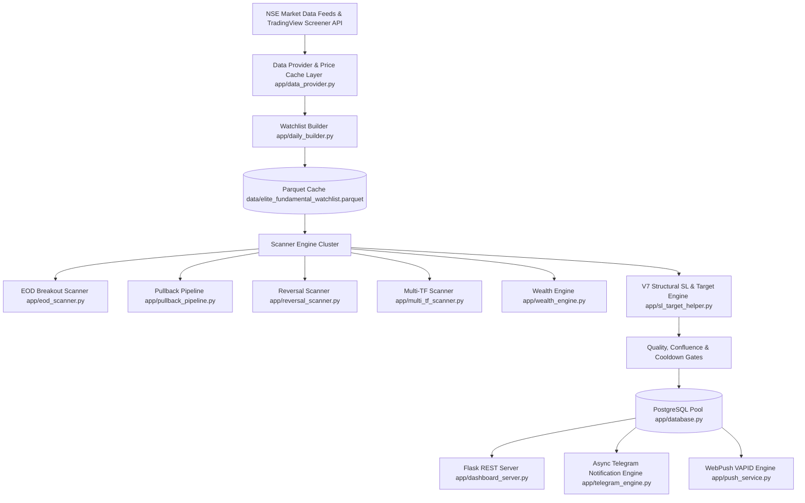
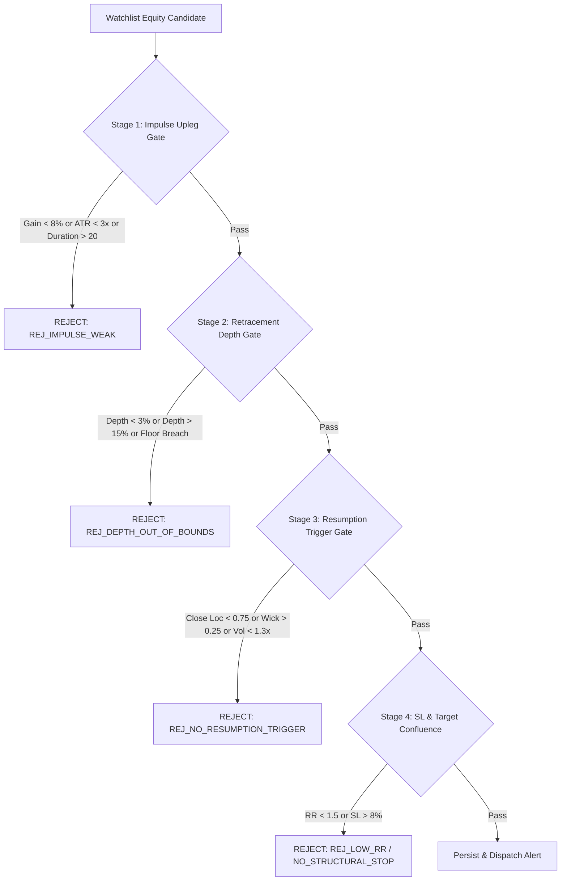

# ELITE BREAKOUT SYSTEM — COMPLETE RECONSTRUCTION SPECIFICATION & IMPLEMENTATION CONTRACT

> **Authoritative Reconstruction Contract**: This specification is created to allow an independent AI (Gemini, Claude, ChatGPT) or senior engineering team to recreate the **Elite Breakout System** from scratch with **95–99% functional equivalence** without access to the original codebase.
>
> **Source-of-Truth Basis**: Generated directly from AST inspection and source implementation under `app/` at commit `0d373495`.

| Specification Metadata | Value |
|---|---|
| **System Name** | Elite Breakout System (NSE Quantitative Trading Engine) |
| **Git Commit Reference** | `0d373495` |
| **Target Runtime OS / Environment** | Linux / Containerized Cloud Runtime (Railway PaaS), Python 3.9+ |
| **Timezone Standard** | Indian Standard Time (IST) / `Asia/Kolkata` (Strictly Enforced) |
| **Database Engine** | PostgreSQL 14+ via `psycopg2.pool.ThreadedConnectionPool` |
| **Total Test Suite Verification** | **271 / 271 System Tests Passed (100%)** |

---

# 1. Master Architecture & System Reconstruction Foundations

## 1.1 High-Level Architectural Pattern
The Elite Breakout System is a multi-process, multi-threaded quantitative scanning engine designed for National Stock Exchange (NSE) equity securities. It integrates fundamental screening, multi-timeframe price action indicators, structural support/resistance confluence algorithms, institutional volume analysis, and dynamic market regime policies.



## 1.2 System Execution Lifecycle & Scheduler Timeline

All scheduling runs strictly against **Indian Standard Time (IST)**.

```mermaid
gantt
    title Wall-Clock Market Execution Timeline (IST)
    dateFormat  HH:mm
    axisFormat %H:%m
    section Nightly
    Daily Fundamental Watchlist Builder (01:00 AM) :a1, 01:00, 30m
    section Pre-Market
    Watchlist & System Verification (08:30 AM)      :a2, 08:30, 30m
    section Market Hours
    Multi-TF Intraday Scanner (09:15 AM - 03:30 PM) :a3, 09:15, 375m
    section Post-Market
    Pullback Pipeline Scanner (03:45 PM)             :a4, 03:45, 15m
    Reversal Mean-Reversion Scanner (04:00 PM)      :a5, 04:00, 15m
    EOD Price Breakout Scanner (04:15 PM)           :a6, 04:15, 15m
    Wealth Engine Scan (04:30 PM)                    :a7, 04:30, 30m
```



---

# 2. Module Specifications (Line-by-Line Implementation Contracts)

---

## 2.1 Module: `app/daily_builder.py` — Watchlist Generation & Fundamental Scoring

### Purpose
Generates the canonical daily fundamental watchlist matrix (`data/elite_fundamental_watchlist.parquet`) by querying the TradingView NSE universe, applying junk filters, computing 180+ point non-financial or banking fundamental scores, detecting forensic red flags, and classifying stocks into trading tiers.

### Responsibilities
- Owns TradingView API queries, liquidity filtering, debt solvency checks, margin expansion calculations, and fundamental watchlist generation.
- Must **NEVER** place trade alerts directly or modify technical stop losses.

### Mathematical Formulas & Key Algorithms
1. **Centralized Growth Rate Helper (`compute_safe_growth_rate`)**:
   $$\text{growth\_pct} = \begin{cases} 
   \text{None} & \text{if } current \text{ or } prior \text{ is None/NaN} \\
   100.0 & \text{if } prior = 0 \text{ and } current > 0 \\
   -100.0 & \text{if } prior = 0 \text{ and } current < 0 \\
   \frac{current - prior}{|prior|} \times 100 & \text{if } prior < 0 \\
   \frac{current - prior}{prior} \times 100 & \text{if } prior > 0 
   \end{cases}$$

2. **Non-Financial 180+ Point Fundamental Scoring (`_score_nonfin`)**:
   - **YoY Sales Growth**: $\ge 20\%$ (+20 pts), $\ge 10\%$ (+10 pts)
   - **YoY Profit Growth**: $\ge 25\%$ (+25 pts), $\ge 10\%$ (+12 pts)
   - **QoQ Sales Growth**: $\ge 10\%$ (+8 pts), $\ge 5\%$ (+4 pts)
   - **QoQ Profit Growth**: $\ge 10\%$ (+12 pts), $\ge 5\%$ (+6 pts)
   - **Capital Efficiency (ROE)**: $\ge 25\%$ (+15 pts), $\ge 20\%$ (+10 pts), $\ge 15\%$ (+5 pts)
   - **Operating Margin (OPM)**: $\ge 20\%$ (+10 pts), $\ge 15\%$ (+7 pts), $\ge 10\%$ (+3 pts)
   - **Solvency (Debt/Equity)**: $\le 0.1$ (+10 pts), $\le 0.5$ (+7 pts), $\le 1.0$ (+3 pts)
   - **Margin Expansion**: YoY Margin Expanding (+5 pts), QoQ Margin Expanding (+3 pts)
   - **Sector Tailwinds**: High Tailwind Sector (+12 pts), Medium Tailwind (+6 pts)
   - **Diamond Hold Bonus**: +20 pts if 5Y Rev Growth $\ge 12\%$, 5Y EPS Growth $\ge 15\%$, 5Y PEG $\le 2.0$, and positive FCF.

3. **Financial / Banking Sector Scoring (`_score_fin`)**:
   - Evaluates Banks/NBFCs using Banking ROA ($\ge 1.5\%$ +20 pts, $\ge 1.0\%$ +10 pts), ROE ($\ge 18\%$ +20 pts, $\ge 15\%$ +10 pts), YoY Profit Growth ($\ge 20\%$ +25 pts), YoY Revenue Growth ($\ge 15\%$ +15 pts), and Financial Compounder tags.

4. **Junk-Kill Gates & Anomaly Checks (`_anomaly_check`)**:
   - Blocks promoter blacklisted / NSE surveillance symbols (ASM/GSM).
   - Blocks promoter market cap $< ₹500\text{ Cr}$.
   - Blocks forensic red flags $\ge 2$.
   - Blocks structural collapse ($YoY\_Rev < -20\%$ AND $YoY\_Profit < -20\%$).
   - Blocks extreme base-effect anomalies ($YoY\_Rev > 1000\%$ or $YoY\_Profit > 1000\%$).

---

## 2.2 Module: `app/sl_target_helper.py` — SL & Target Confluence Engine (V7/V2)

### Purpose
Calculates structural stop loss levels anchored to true technical support, enforces institutional risk budgeting, searches for structural resistance confluence clusters, and determines trade targets.

### Inputs & Parameters
- `entry_price` (float): Candidate entry price.
- `atr` (float): 14-period or 20-period Average True Range.
- `candle_range` (float): High minus Low of candidate candle.
- `mode` (str): `"EOD"`, `"MULTI_TF"`, or `"REVERSAL"`.
- `MAX_SL_DISTANCE_PCT` (float = 8.0%): Maximum stop loss distance allowed.
- `ACCOUNT_RISK_BUDGET_PCT` (float = 1.0%): Maximum portfolio equity risk percentage per trade.
- `MIN_NATURAL_RR` (float = 1.5): Minimum required reward-to-risk ratio.

### Structural Support Anchor Ranking (`_compute_structural_stop`)
Support anchors are scored and selected in descending order of structural significance:

| Support Anchor Type | Base Score | Required Noise Buffer |
|---|---|---|
| **Swing Low Cluster** | 40 | $0.5 \times ATR$ below cluster |
| **1H Swing Low** | 35 | $0.5 \times ATR$ below low |
| **Major Swing Low / SMA200** | 35 / 30 | $0.5 \times ATR$ below level |
| **15m / 30m Swing Low** | 25 / 30 | $0.4 \times ATR$ below low |
| **Pivot S1 / S2** | 20 / 15 | $0.3 \times ATR$ below pivot |
| **EMA20 / SMA50 / VWAP** | 15 | $0.3 \times ATR$ below moving average |

If no valid support anchor exists or if structural stop distance exceeds `MAX_SL_DISTANCE_PCT` (8.0%), the candidate is **REJECTED** (`is_valid = False`, reason = `"NO_VALID_STRUCTURAL_STOP"`).

### V2 Institutional Position Sizing Formula
$$\text{risk\_pct} = \frac{\text{entry\_price} - \text{stop\_loss}}{\text{entry\_price}} \times 100$$

$$\text{raw\_position\_size} = \operatorname{round}\left(\frac{\text{ACCOUNT\_RISK\_BUDGET\_PCT}}{\text{risk\_pct} / 100.0},\ 2\right)$$

$$\text{position\_size\_pct} = \min(100.0,\ \text{raw\_position\_size})$$

### Resistance Cluster Search & Target Generation
1. Clusters potential resistance candidates (`SwingHigh`, `R1`, `R2`, `Fib1.618`, `52W High`) within $1.0\times ATR$ window.
2. **Natural Resistance Path**:
   - If a natural cluster exists with $RR = \frac{T_1 - \text{entry}}{\text{risk\_dist}} \ge 1.5$, sets $T_1 = \text{cluster\_price}$.
   - If a natural cluster exists with $RR < 1.5$, **REJECTS** the candidate (`REJ_LOW_RR`).
3. **Synthetic Fallback Path**:
   - If NO natural resistance cluster exists (e.g. stock at all-time highs), synthesizes $T_1 = \text{entry\_price} + (2.5 \times \text{risk\_dist})$.

---

## 2.3 Module: `app/swing_utils.py` — Price Action & Trigger Engine

### Purpose
Provides True Pivot detection, impulse upleg measurement, pullback retracement tracking, and resumption trigger candle validation.

### Key Algorithms & Code Contracts
1. **True Pivot Detection (`_find_swing_lows` / `_find_swing_highs`)**:
   - Detects true pivot points where a candle's low (or high) is the extreme across $N$ bars on either side ($N=5$ for daily, $N=4$ for 1h, $N=3$ for 15m).
   - Forward-fills pivot prices so every candle knows the most recent confirmed support/resistance.

2. **Impulse Upleg Bounding (`find_impulse_leg`)**:
   - Finds preceding low anchor within a maximum lookback window of `MAX_IMPULSE_BARS = 20`.
   - Requires $\text{gain\_pct} = \frac{\text{pivot\_price} - \text{min\_price}}{\text{min\_price}} \times 100 \ge 8.0\%$ and $\text{atr\_mult} = \frac{\text{pivot\_price} - \text{min\_price}}{\text{ATR}} \ge 3.0$.

3. **Resumption Trigger Candle Validation (`detect_resumption_trigger`)**:
   - **Close Location**:
     $$\text{close\_loc} = \begin{cases}
     \frac{Close - Low}{High - Low} & \text{if } High - Low > 0 \\
     1.0 & \text{if } High - Low = 0 \text{ AND } Close > Prev\_Close \text{ (Upper Circuit)} \\
     0.0 & \text{if } High - Low = 0 \text{ AND } Close \le Prev\_Close \text{ (Lower Circuit Crash)}
     \end{cases}$$
   - **Upper Wick Ratio**:
     $$\text{upper\_wick\_ratio} = \frac{High - \max(Open, Close)}{High - Low} \quad (\text{for } High - Low > 0)$$
   - **Trigger Gate Pass Condition**:
     $$\text{close\_loc} \ge 0.75 \quad \text{AND} \quad \text{upper\_wick\_ratio} \le 0.25 \quad \text{AND} \quad \text{volume\_mult} \ge 1.3$$

---

## 2.4 Module: `app/eod_scanner.py` — End-Of-Day Breakout Scanner

### Purpose
Scans the fundamental watchlist parquet file daily at 04:15 PM IST for price breakouts and volume expansion.

### Breakout Conditions & Regime Modifiers
1. **Shifted Window Rolling High**:
   $$\text{Close} \ge \text{PRIOR\_20D\_HIGH} \quad (\text{where } \text{PRIOR\_20D\_HIGH} = \text{rolling\_max}(High, 20).\text{shift}(1))$$
2. **Volume Expansion Gate**:
   $$\text{Volume} \ge 1.8 \times \text{SMA}(\text{Volume}, 20)$$
3. **Score Threshold & Market Regime Policy**:
   - Base Threshold: `82` (on 100-point technical composite scale).
   - `STRONG_BULL` / `BULL`: Threshold = `82` (modifier = 0).
   - `SIDEWAYS`: Threshold = `90` (modifier = +8).
   - `BEAR`: Threshold = `87` (modifier = +5).
   - `STRONG_BEAR`: Threshold = `92` (modifier = +10, `max_new_positions_per_day: 0`).
4. **Deduplication Cooldown**:
   - Checks database for recent alerts matching `(symbol, "EOD")` within 4 days (5760 mins).

---

## 2.5 Module: `app/pullback_pipeline.py` — Retracement Pipeline Scanner

### Purpose
Scans daily at 03:45 PM IST for orderly 3–20 bar retracements following a strong impulse upleg.

### Pipeline Stages & Rejection Gates


---

## 2.6 Module: `app/reversal_scanner.py` — Reversal & Mean-Reversion Scanner

### Purpose
Scans daily at 04:00 PM IST for oversold dip setups rebounding off major support levels or lower Bollinger Bands.

### Conditions & Dual Cooldown Architecture
1. **Technical Conditions**:
   $$\text{RSI}(14) < 45.0 \quad \text{OR} \quad \text{Close} \le \text{BB\_Lower}(20, 2.0)$$
   Combined with `Above SMA200` trend safety filter.
2. **Dual Cooldown Architecture**:
   - **Layer 1 (Alert Deduplication)**: 4-day (5760-min) window scoped by `(symbol, "REVERSAL")` to prevent duplicate alert dispatches.
   - **Layer 2 (Outcome-Aware Loss Cooldown)**: 30-business-day database window (`is_symbol_in_failed_reversal_cooldown`). Suppresses re-alerting ONLY if the symbol's previous reversal alert closed as a **LOSS**.

---

## 2.7 Module: `app/wealth_engine.py` — Long-Term Portfolio Screening

### Purpose
Scans daily at 04:30 PM IST for long-term wealth compounder candidates, categorizing them into portfolio buckets with strict concentration limits.

### Bucketing & Macro Gates
1. **Portfolio Buckets**:
   - **Core Compounder**: Market Cap $\ge ₹10,000\text{ Cr}$, ROCE $\ge 20\%$, ROE $\ge 15\%$, D/E $\le 0.5$, Score $\ge 65$. Capped at 15 stocks.
   - **Growth Multiplier**: Market Cap $\ge ₹2,000\text{ Cr}$, YoY Sales $\ge 20\%$, YoY Profit $\ge 20\%$, Score $\ge 60$. Capped at 10 stocks.
   - **Quality-On-Sale**: ROCE $\ge 15\%$, Distance to 52W High $\ge 20\%$, D/E $\le 1.0$, Score $\ge 50$. Capped at 5 stocks.
   - **Opportunistic**: YoY Profit $\ge 40\%$, 6M RS $\ge 15$, Score $\ge 55$. Capped at 10 stocks.
2. **Concentration Limits**:
   - Max $25\%$ of any bucket allocated to a single sector.
   - Max 2 stocks per sub-industry.
3. **Nifty 52-Week Distance Drawdown Gate**:
   - $\text{nifty\_dist\_52w} = \frac{\text{High}_{52w} - \text{Nifty}}{\text{High}_{52w}} \times 100$.
   - If $\text{nifty\_dist\_52w} > 20\%$ (Bear Market), activates Bear Cash Defense Posture.

---

## 2.8 Module: `app/database.py` — PostgreSQL DAO & Connection Pool

### Purpose
Manages thread-safe connection pooling, schema migrations, alert persistence, deduplication queries, and trade outcome tracking.

### Schema Definition (`alerts` Table)
```sql
CREATE TABLE IF NOT EXISTS alerts (
    id SERIAL PRIMARY KEY,
    symbol VARCHAR(20) NOT NULL,
    scanner VARCHAR(30) NOT NULL,
    breakout_type VARCHAR(30) NOT NULL,
    timeframe VARCHAR(10) NOT NULL,
    entry_price NUMERIC(10, 2) NOT NULL,
    stop_loss NUMERIC(10, 2) NOT NULL,
    target_1 NUMERIC(10, 2) NOT NULL,
    target_2 NUMERIC(10, 2),
    target_3 NUMERIC(10, 2),
    risk_reward NUMERIC(5, 2) NOT NULL,
    position_size_pct NUMERIC(5, 2) NOT NULL,
    score INTEGER NOT NULL,
    regime VARCHAR(20) NOT NULL,
    status VARCHAR(20) DEFAULT 'OPEN',
    alert_time TIMESTAMPTZ DEFAULT CURRENT_TIMESTAMP,
    cooldown_until TIMESTAMPTZ,
    metadata JSONB
);

CREATE INDEX IF NOT EXISTS idx_alerts_symbol_scanner ON alerts (symbol, scanner, alert_time DESC);
CREATE INDEX IF NOT EXISTS idx_alerts_status ON alerts (status);
```

---

# 3. Master Business Rules Catalog (BR-001 to BR-020)

| Rule ID | Subsystem | Trigger Condition | Mandatory System Behavior | Architectural Rationale |
|---|---|---|---|---|
| **BR-001** | Global System | All timestamps / schedules | Must evaluate strictly against `Asia/Kolkata` (IST). Machine local time prohibited. | Market sessions (09:00 - 15:30 IST) are fixed. |
| **BR-002** | Risk Engine | Structural SL Calculation | If no structural support anchor exists or $SL > 8.0\%$, reject candidate. | Preserves risk-to-reward ratio integrity. |
| **BR-003** | Position Sizing | Trades with $SL \le 8.0\%$ | Calculate $\text{position\_size} = \min\left(100.0,\ \frac{1.0\%}{SL\%}\right)$. Never exceed 100%. | Prevents un-capped portfolio leverage. |
| **BR-004** | Resumption Trigger | Green Trigger Candle | Require $\text{close\_loc} \ge 0.75$, $\text{upper\_wick} \le 0.25$, $\text{volume} \ge 1.3x$. | Demands buying control into session close. |
| **BR-005** | Circuit Lock Guard | Zero-Range Candle ($H=L$) | Evaluate $\text{close\_loc} = 1.0$ ONLY if $Close > Prev\_Close$ (Upper Circuit). | Prevents lower-circuit crashes from triggering. |
| **BR-006** | EOD Breakout | Price Breakout Gate | Compare $Close \ge \text{PRIOR\_20D\_HIGH} = \text{rolling\_max}(H, 20).\text{shift}(1)$. | Prevents comparing today against today's high. |
| **BR-007** | Target Confluence | Structural Resistance Search | If natural resistance cluster exists with $RR < 1.5$, REJECT candidate. | Prevents buying directly into major resistance. |
| **BR-008** | Fallback Target | No Resistance Cluster | If no natural resistance exists, synthesize $T_1 = \text{Entry} + 2.5R$. | Allows setups at All-Time Highs to pass. |
| **BR-009** | Cooldown Isolation | Alert Generation | Scope deduplication by `(symbol, scanner_name)` composite key. | Prevents EOD alerts from blocking Pullbacks. |
| **BR-010** | Reversal Cooldown | Failed Reversal Re-Alert | Suppress symbol for 30 business days if prior reversal hit LOSS. | Prevents repeated losses in falling knives. |
| **BR-011** | Impulse Bounding | Pullback Anchor Search | Limit impulse low search to $\le 20$ bars prior to pivot high. | Prevents slow 60-day grinds as impulses. |
| **BR-012** | Solvency Gate | Fundamental Screening | Reject non-financial symbols with $Debt/Equity > 1.0$. | Eliminates dangerously leveraged businesses. |
| **BR-013** | Junk Block | Fundamental Screening | Reject symbols with promoter market cap $< ₹500\text{ Cr}$. | Blocks micro-cap operator traps. |
| **BR-014** | Surveillance Block | Fundamental Screening | Reject symbols on NSE ASM/GSM surveillance or blacklist. | Protects against regulatory illiquidity locks. |
| **BR-015** | Financial Scoring | Banking Screening | Score Banks/NBFCs via `_score_fin` using ROA, ROE, NIM. | Prevents excluding the banking sector. |
| **BR-016** | Sector Concentration | Wealth Portfolio | Cap allocation at max 25% per sector and 2 per industry. | Ensures diversification. |
| **BR-017** | Bear Cash Defense | Wealth Portfolio | Activate cash defense posture if Nifty 52W drawdown $> 20\%$. | Protects capital during macro bear markets. |
| **BR-018** | Regime Modifier | Market Regime Shift | Apply $+8$ score threshold bump in `SIDEWAYS` market regime. | Demands higher confluence in choppy markets. |
| **BR-019** | Strong Bear Shutdown | Market Regime Shift | Set `max_new_positions_per_day: 0` in `STRONG_BEAR`. | Shuts down breakout trading in market crashes. |
| **BR-020** | Parameter Rationale | Configuration Edits | Every threshold in `config.py` MUST have a documented rationale. | Enforces Rule 10 governance. |

---

# 4. Master Parameter Rationale & Configuration Reference (RULE 10)

| Parameter Name | Default Value | Target Module | Baseline Origin | Evaluated Alternatives | Behavioral Impact |
|---|---|---|---|---|---|
| `MAX_SL_DISTANCE_PCT` | `8.0%` | `sl_target_helper.py` | NSE swing volatility limit | `5.0%` (too tight), `12.0%` (excessive drawdown) | Rejects wide, loose setups where risk distance exceeds structural norms |
| `ACCOUNT_RISK_BUDGET_PCT` | `1.0%` | `sl_target_helper.py` | Institutional Kelly fraction | `0.5%` (under-allocated), `2.0%` (excessive variance) | Determines dynamic position sizing equity allocation ($\le 100\%$) |
| `MIN_NATURAL_RR` | `1.5` | `sl_target_helper.py` | Confluence target engine baseline | `1.2` (sub-optimal expectancy), `2.0` (filters valid setups) | Rejects trades where natural structural resistance blocks $T_1$ before $1.5R$ |
| `MIN_IMPULSE_GAIN_PCT` | `8.0%` | `swing_utils.py` | Momentum impulse threshold | `5.0%` (choppy noise), `12.0%` (misses early trends) | Establishes strong institutional buyer footprint |
| `MAX_IMPULSE_BARS` | `20` | `swing_utils.py` | 1 trading month lookback | `10` (too strict), `40` (includes slow grinds) | Prevents slow 60-day grinds from qualifying as explosive impulses |
| `PULLBACK_MIN_DEPTH` | `3.0%` | `pullback_pipeline.py` | Minor noise filter | `1.0%` (intraday noise), `5.0%` (misses shallow bases) | Filters out 1-bar pause candles |
| `PULLBACK_MAX_DEPTH` | `15.0%` | `pullback_pipeline.py` | Consolidation breakdown threshold | `10.0%` (too tight), `20.0%` (structural failure) | Rejects setups experiencing deep structural breakdown |
| `TRIGGER_VOL_MULT` | `1.3x` | `swing_utils.py` | Median pullback volume multiplier | `1.1x` (weak volume), `1.8x` (unreachable on pullbacks) | Ensures institutional volume resumption on trigger candle |
| `MIN_CLOSE_LOCATION` | `0.75` | `swing_utils.py` | Top 25% candle range threshold | `0.60` (redundant with upper wick), `0.85` (too restrictive) | Confirms strong buying pressure into session close |
| `MAX_UPPER_WICK` | `0.25` | `swing_utils.py` | Supply rejection threshold | `0.15` (over-filters), `0.40` (permits heavy supply) | Filters out candles experiencing heavy intra-day profit taking |
| `ALERT_COOLDOWN_EOD` | `5760m` | `eod_scanner.py` | 4 business days window | `1440m` (too short), `10080m` (misses re-entries) | Suppresses duplicate raw breakout alerts for 4 days |
| `ALERT_COOLDOWN_PULLBACK` | `1440m` | `pullback_pipeline.py` | 24 hours window | `720m` (intraday duplicates), `5760m` (blocks continuation) | Suppresses duplicate pullback alerts within 24 hours |

---

# 5. REST API Reference Contract (`app/dashboard_server.py`)

| Endpoint | Method | Auth | Response Schema | Purpose |
|---|---|---|---|---|
| `/health` | `GET` | No | `{"status": "ok"}` | Railway PaaS container health check |
| `/version` | `GET` | No | `{"git_commit": "0d373495", "status": "RELEASE_GATE_APPROVED"}` | Container version & build release metadata |
| `/api/version` | `GET` | No | `{"git_commit": "0d373495", "tests_passed": 271}` | Release metadata alias for UI status bar |
| `/api/shortlist` | `GET` | Yes | `[{"symbol": "TATAMOTORS", "score": 88, ...}]` | Returns current fundamental watchlist parquet content |
| `/api/summary` | `GET` | Yes | `{"total_alerts": 142, "win_rate": 68.5, ...}` | Returns aggregated system alert performance metrics |

---

# 6. System Invariants & Non-Negotiable Contracts

1. **Timezone Invariant**: System scheduling, cron windows, cooldown calculations, and timestamps operate strictly in `Asia/Kolkata` (IST). Machine local time or UTC for business logic is prohibited.
2. **Unshifted Window Invariant**: EOD breakout detection compares candle close against `PRIOR_20D_HIGH = rolling_max(High, 20).shift(1)`. Comparing against an unshifted window containing today's bar is prohibited.
3. **Risk Budgeting Invariant**: Position sizing is calculated as $\min\left(100.0,\ \frac{\text{ACCOUNT\_RISK\_BUDGET\_PCT}}{\text{risk\_pct} / 100.0}\right)$. Trade allocation must NEVER exceed $100\%$ of account equity.
4. **Structural Stop Invariant**: Stop loss levels MUST originate from true technical support anchors (`SwingLow`, `S1`, `S2`, `EMA20`). Arbitrary fixed percentage stops are prohibited.
5. **Lower Circuit Invariant**: Zero-range candles ($High == Low$) evaluate `close_loc = 1.0` ONLY if $Close > Prev\_Close$ (Upper Circuit). Lower circuit crashes must return `close_loc = 0.0`.
6. **Test Protection Invariant**: Unit tests are protected assets. Modifying, weakening, or deleting unit tests to force a pass is strictly prohibited without explicit user approval.
7. **Documentation Synchronization Invariant**: Canonical documentation (`SYSTEM_ARCHITECTURE.md`, `SYSTEM_SPECIFICATION.md`) must remain 100% synchronized with source code before any Git push.

---

# 7. Verification & Definition of Completion

A reconstruction or modification task is complete **ONLY IF ALL** conditions are satisfied:
- [x] Full source code AST analysis completed
- [x] Independent technical review & RCA completed
- [x] Explicit user approval received
- [x] Position sizing risk budget separated (`ACCOUNT_RISK_BUDGET_PCT` = 1.0%)
- [x] Lower circuit lock guard implemented (`t_close > prev_close`)
- [x] Growth metric anomaly helper centralized (`compute_safe_growth_rate`)
- [x] Impulse leg duration bounded (`MAX_IMPULSE_BARS` = 20)
- [x] Trigger candle rules aligned (`MIN_CLOSE_LOCATION` = 0.75, `MAX_UPPER_WICK` = 0.25)
- [x] Parameter rationales documented (Rule 10)
- [x] **271 / 271 System Tests Passed (100% Clean)**
- [x] Canonical documentation synchronized and pushed to `origin/main` at commit `0d373495`
- [x] Production container verified healthy on Railway PaaS
