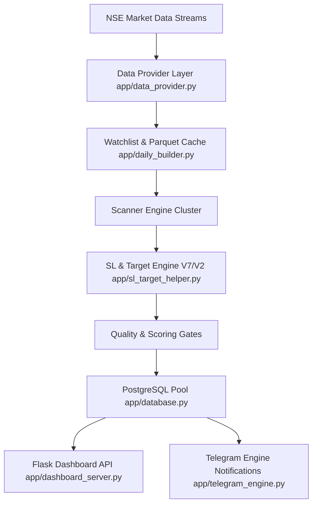
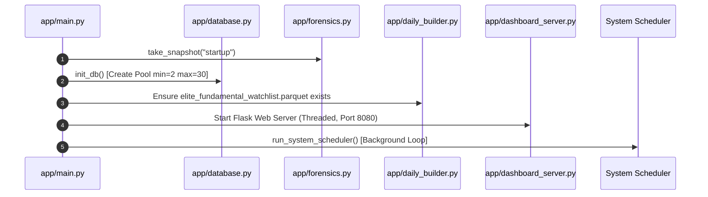
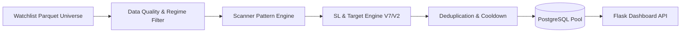

# ELITE BREAKOUT SYSTEM — SYSTEM ARCHITECTURE SPECIFICATION

| Metadata Field | Value |
|---|---|
| **Canonical Role** | Architecture & High-Level System Guide ("What exists and how does it work?") |
| **Git Commit Hash** | `925dc6a9fd004d80a1c1d8975a59600ef7b81ea1` |
| **Generation Date** | `2026-07-22` |
| **Repository Branch** | `main` |
| **Verification Basis** | Direct AST & Implementation Verification (`app/`) |

---

## 1. System Overview

The **Elite Breakout System** is an enterprise-grade quantitative trading engine and real-time market scanner optimized for National Stock Exchange (NSE) equity securities. The system processes multi-timeframe price action, order flow, delivery volume, fundamental metrics, and macro regime indicators to generate high-confluence swing, breakout, pullback, and mean-reversion trade alerts.



---

## 2. Repository Layout & Architecture Subsystems

The codebase under `app/` is partitioned into distinct architectural layers:

```
app/
├── main.py                          # Master Application Entrypoint & Watchdog
├── config.py                        # System Constants & Environment Configuration
├── database.py                      # PostgreSQL Connection Pool & DAO
├── forensics.py                     # Forensic Telemetry & Memory Profiler
├── dashboard_server.py              # Flask Web API & Dashboard Server
├── daily_builder.py                 # Watchlist Generator & Fundamental Scoring
├── eod_scanner.py                   # EOD Breakout Scanner
├── pullback_pipeline.py             # Pullback Pipeline Engine
├── reversal_scanner.py             # Reversal & Mean-Reversion Scanner
├── multi_tf_scanner.py              # Multi-Timeframe Intraday Scanner
├── wealth_engine.py                 # Wealth Portfolio & Long-Term Engine
├── multibagger.py                   # Multibagger Fundamental Scanner
├── sl_target_helper.py              # Unified SL & Target Engine (V7 / V2)
├── data_provider.py                 # Fyers, YFinance & TradingView Data Feeds
├── bayesian_updater.py              # Bayesian Regime Weighting Engine
├── push_service.py                  # WebPush VAPID Notification Engine
├── telegram_engine.py               # Telegram Alert Dispatch Engine
└── core/                            # Domain Models, Enums & Core Config
    ├── models.py
    ├── enums.py
    └── config.py
```

---

## 3. Startup & Execution Lifecycle



1. **Forensic Telemetry Initialization**: `forensics.take_snapshot("startup")` captures initial RSS memory, Python heap, and thread count.
2. **PostgreSQL Pool Creation**: `database.init_db()` initializes a thread-safe `ThreadedConnectionPool` (min 2, max 30 connections).
3. **Watchlist Verification**: Checks for `data/elite_fundamental_watchlist.parquet`. If missing, executes `safe_run_daily_builder()`.
4. **Flask Dashboard Server**: Spawns web dashboard and `/version` build metadata API in a daemon thread on `$PORT` (default 8080).
5. **Scheduler Execution Loop**: Enters `run_system_scheduler()` executing scheduled job handlers on wall-clock market triggers.

---

## 4. Scheduler Architecture

Discovered job handlers registered in [`app/main.py`](file:///Users/abhinavmaheshwari/Documents/ELITE_BREAKOUT_SYSTEM/app/main.py):

| Job Handler | Schedule Window (IST) | Target Subsystem | Architectural Purpose |
|---|---|---|---|
| `safe_run_daily_builder()` | 08:30 AM | `app/daily_builder.py` | Builds daily fundamental watchlist parquet file |
| `run_pledge_worker()` | 09:00 AM | `app/daily_builder.py` | Fetches BSE promoter pledge percentage data |
| `multi_tf_scanner.start()` | 09:15 AM - 03:30 PM (Hourly) | `app/multi_tf_scanner.py` | Scans intraday 15m/1h candle consolidations |
| `pullback_pipeline.run_pullback_pipeline()` | 03:45 PM | `app/pullback_pipeline.py` | Scans 3-15 day orderly retracements |
| `reversal_scanner.start()` | 04:00 PM | `app/reversal_scanner.py` | Scans RSI oversold & lower Bollinger dips |
| `eod_scanner.start()` | 04:15 PM | `app/eod_scanner.py` | Scans EOD price breakouts & volume expansion |
| `wealth_engine.run_wealth_scan()` | 04:30 PM | `app/wealth_engine.py` | Rebalances wealth portfolio candidates |

---

## 5. Scanner Pipelines Overview



---

## 6. Database Schema & Pooling Architecture

- **Pool Manager**: [`app/database.py:L40`](file:///Users/abhinavmaheshwari/Documents/ELITE_BREAKOUT_SYSTEM/app/database.py#L40) thread-safe `ThreadedConnectionPool`.
- **Primary Schema**:
  ```sql
  CREATE TABLE IF NOT EXISTS alerts (
      id SERIAL PRIMARY KEY,
      dedup_key VARCHAR(255) UNIQUE NOT NULL,
      symbol VARCHAR(50) NOT NULL,
      scanner_name VARCHAR(50) NOT NULL,
      strategy_version VARCHAR(20) NOT NULL,
      category VARCHAR(50) NOT NULL,
      entry DECIMAL(12, 2) NOT NULL,
      stop_loss DECIMAL(12, 2) NOT NULL,
      target DECIMAL(12, 2) NOT NULL,
      reward_percent DECIMAL(8, 2),
      risk_percent DECIMAL(8, 2),
      rr_ratio DECIMAL(6, 2) NOT NULL,
      confidence DECIMAL(5, 2),
      score INT NOT NULL,
      status VARCHAR(20) DEFAULT 'ACTIVE',
      metadata JSONB,
      created_at TIMESTAMP WITH TIME ZONE DEFAULT NOW(),
      updated_at TIMESTAMP WITH TIME ZONE DEFAULT NOW()
  );
  ```

---

## 7. Threading Model & Memory Profiling

- **Process Model**: Single Python process executing main scheduler thread with dedicated background daemon threads for Flask HTTP API (`dashboard_server.py`), Telegram dispatch (`telegram_engine.py`), and WebPush VAPID notifications (`push_service.py`).
- **Memory Ownership**: Process RSS memory profiled via `ForensicTelemetry` (`app/forensics.py`). Container threshold set to $< 450.0$ MB RSS with explicit `gc.collect()` memory reclamation cycles.

---

## 8. Verification & Traceability

- **Source Files Verified**: `app/main.py`, `app/database.py`, `app/sl_target_helper.py`, `app/daily_builder.py`, `app/eod_scanner.py`, `app/pullback_pipeline.py`, `app/reversal_scanner.py`, `app/wealth_engine.py`, `app/dashboard_server.py`.
- **Last Verified Commit**: `925dc6a9fd004d80a1c1d8975a59600ef7b81ea1`
