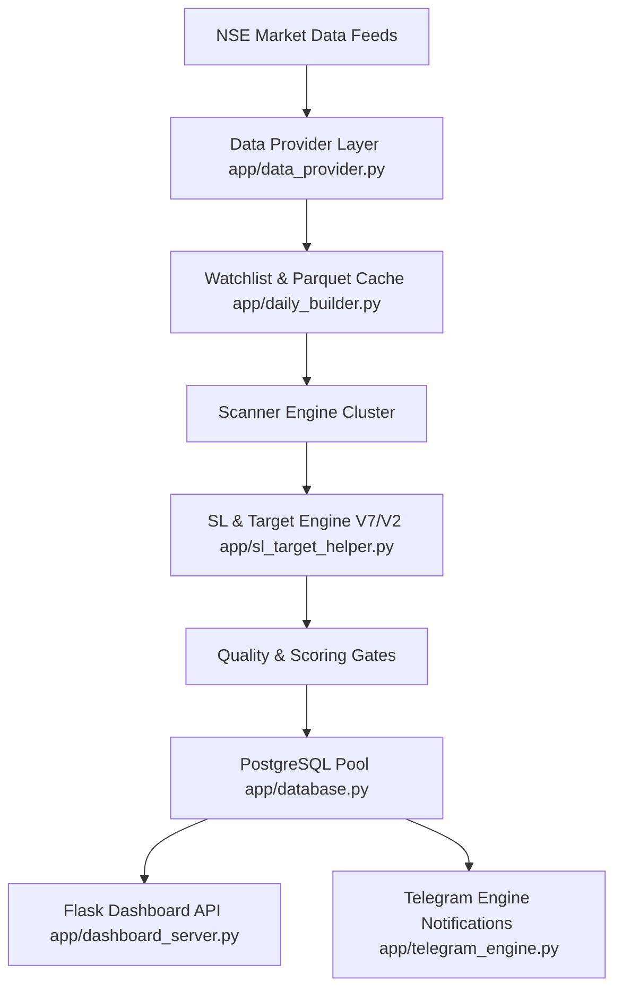
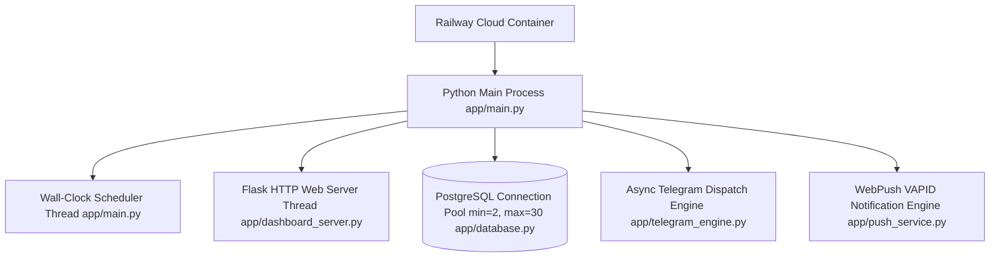
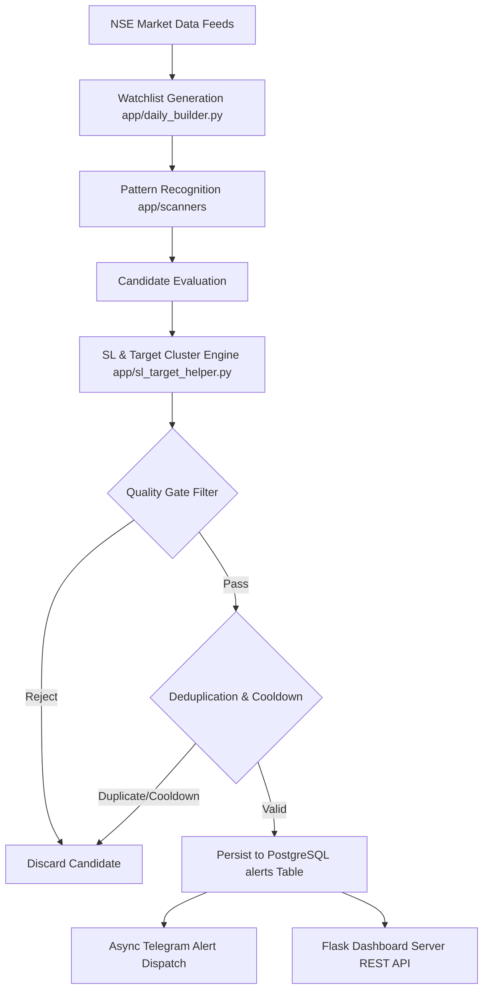
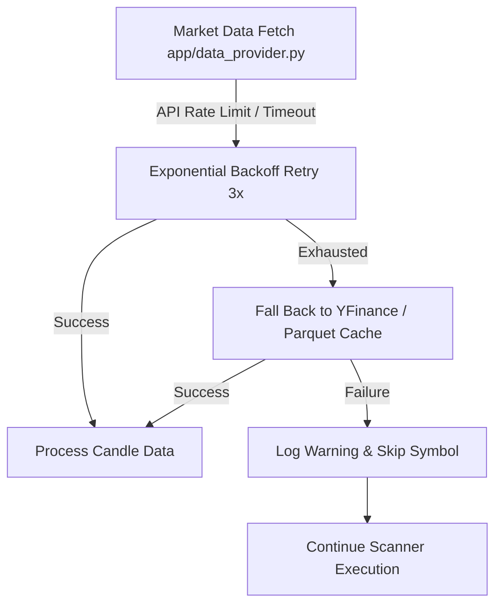

# ELITE BREAKOUT SYSTEM — SYSTEM ARCHITECTURE SPECIFICATION

> **Regeneration Notice**: This document is generated directly from source code implementation at commit `214f19ae`. Do not edit manually. Regenerate after architectural or behavioral changes. The source implementation under `app/` remains the ultimate source of truth.

| Metadata Field | Value |
|---|---|
| **Canonical Role** | Architecture & High-Level System Guide ("What exists and how does it work?") |
| **Git Commit Hash** | `214f19aedbb592aad2a561edbdccba542519d4b8` |
| **Generation Date** | `2026-07-22` |
| **Repository Branch** | `main` |
| **Verification Basis** | AST Analysis & Source Code Inspection (`app/`) |

---

## 1. System Overview

The **Elite Breakout System** is an enterprise-grade quantitative trading engine and real-time market scanner optimized for National Stock Exchange (NSE) equity securities. The system processes multi-timeframe price action, order flow, delivery volume, fundamental metrics, and macro regime indicators to generate high-confluence swing, breakout, pullback, and mean-reversion trade alerts.



---

## 2. Deployment Architecture

The production environment executes inside a containerized cloud runtime (Railway PaaS):



---

## 3. Component Catalog

The following catalog defines every subsystem, its primary responsibility, dependencies, and consuming modules:

| Component Module | Subsystem Responsibility | Primary Dependencies | Consumed By |
|---|---|---|---|
| [`app/main.py`](../app/main.py) | Master entrypoint, watchdog, and scheduled loop | `daily_builder`, `scanners`, `database` | System Init / Process Runner |
| [`app/daily_builder.py`](../app/daily_builder.py) | Watchlist generator & fundamental scoring | `data_provider`, `ta`, `pandas` | `main.py`, `scanners` |
| [`app/eod_scanner.py`](../app/eod_scanner.py) | EOD price breakout & volume expansion scanner | `daily_builder`, `sl_target_helper`, `database` | `main.py` scheduler |
| [`app/pullback_pipeline.py`](../app/pullback_pipeline.py) | 3-15 bar orderly retracement scanner | `swing_utils`, `sl_target_helper`, `database` | `main.py` scheduler |
| [`app/reversal_scanner.py`](../app/reversal_scanner.py) | Mean-reversion RSI oversold & Bollinger scanner | `daily_builder`, `sl_target_helper`, `database` | `main.py` scheduler |
| [`app/multi_tf_scanner.py`](../app/multi_tf_scanner.py) | Dual-timeframe (1H/15m) intraday scanner | `data_provider`, `sl_target_helper`, `database` | `main.py` scheduler |
| [`app/wealth_engine.py`](../app/wealth_engine.py) | Long-term fundamental wealth portfolio scanner | `daily_builder`, `database` | `main.py` scheduler |
| [`app/multibagger.py`](../app/multibagger.py) | High-growth multibagger fundamental scanner | `daily_builder`, `database` | `main.py` scheduler |
| [`app/sl_target_helper.py`](../app/sl_target_helper.py) | Structural SL & target cluster engine (V7/V2) | `swing_utils`, `ta`, `config` | All Scanner Engines |
| [`app/database.py`](../app/database.py) | PostgreSQL thread-safe pool manager & DAO | `psycopg2.pool`, `config` | All Scanners & Dashboard |
| [`app/dashboard_server.py`](../app/dashboard_server.py) | Flask REST API & version release server | `database`, `forensics`, `flask` | Admin UI, Railway Health Checks |
| [`app/forensics.py`](../app/forensics.py) | Forensic telemetry & RSS memory profiler | `psutil`, `gc`, `sys` | `main.py`, `dashboard_server.py` |
| [`app/bayesian_updater.py`](../app/bayesian_updater.py) | Dynamic Bayesian regime weighting engine | `numpy`, `scipy` | Scoring & Quality Gates |
| [`app/telegram_engine.py`](../app/telegram_engine.py) | Asynchronous Telegram alert notification dispatch | `requests`, `database` | Alert Persistence DAO |
| [`app/push_service.py`](../app/push_service.py) | WebPush VAPID browser notification engine | `pywebpush`, `database` | Alert Persistence DAO |
| [`app/core/models.py`](../app/core/models.py) | Domain data models (`PullbackCandidate`, `SwingPoint`) | Python `dataclasses` | Entire Codebase |
| [`app/core/enums.py`](../app/core/enums.py) | System domain enums (`PivotKind`, `RejectionReason`) | `enum.Enum` | Entire Codebase |

---

## 4. Module Import Hierarchy & Dependency Tree

```
app/main.py
├── app/daily_builder.py
│   ├── app/data_provider.py
│   └── app/core/models.py
├── app/eod_scanner.py
│   ├── app/sl_target_helper.py
│   │   └── app/swing_utils.py
│   └── app/database.py
├── app/pullback_pipeline.py
│   ├── app/swing_utils.py
│   └── app/sl_target_helper.py
├── app/reversal_scanner.py
│   └── app/sl_target_helper.py
├── app/dashboard_server.py
│   ├── app/database.py
│   └── app/forensics.py
├── app/telegram_engine.py
└── app/push_service.py
```

---

## 5. State Transition & Alert Lifecycle

The following lifecycle details the exact state progression of an equity symbol through scanning, scoring, persistence, and dispatch:



---

## 6. Failure Handling & Error Recovery Flowchart

The system implements multi-tiered fault recovery for external API rate limits, database drops, and data quality gaps:



---

## 7. Scheduler Architecture

Discovered job handlers registered in [`app/main.py`](../app/main.py):

| Job Handler | Schedule Window (IST) | Target Subsystem | Architectural Purpose |
|---|---|---|---|
| `safe_run_daily_builder()` | 08:30 AM | [`app/daily_builder.py`](../app/daily_builder.py) | Builds daily fundamental watchlist parquet file |
| `run_pledge_worker()` | 09:00 AM | [`app/daily_builder.py`](../app/daily_builder.py) | Fetches BSE promoter pledge percentage data |
| `multi_tf_scanner.start()` | 09:15 AM - 03:30 PM (Hourly) | [`app/multi_tf_scanner.py`](../app/multi_tf_scanner.py) | Scans intraday 15m/1h candle consolidations |
| `pullback_pipeline.run_pullback_pipeline()` | 03:45 PM | [`app/pullback_pipeline.py`](../app/pullback_pipeline.py) | Scans 3-15 day orderly retracements |
| `reversal_scanner.start()` | 04:00 PM | [`app/reversal_scanner.py`](../app/reversal_scanner.py) | Scans RSI oversold & lower Bollinger dips |
| `eod_scanner.start()` | 04:15 PM | [`app/eod_scanner.py`](../app/eod_scanner.py) | Scans EOD price breakouts & volume expansion |
| `wealth_engine.run_wealth_scan()` | 04:30 PM | [`app/wealth_engine.py`](../app/wealth_engine.py) | Rebalances wealth portfolio candidates |

---

## 8. Architecture Decision Records (ADR)

- **ADR-01: PostgreSQL Storage Engine**  
  *Decision*: Selected PostgreSQL via `psycopg2.pool.ThreadedConnectionPool` over SQLite.  
  *Rationale*: ACID compliance, thread safety across concurrent Flask web threads and background scanner workers, and native `JSONB` support for alert metadata.

- **ADR-02: Parquet Watchlist Caching**  
  *Decision*: Store daily fundamental scoring matrices in Apache Parquet format (`data/elite_fundamental_watchlist.parquet`).  
  *Rationale*: High compression ratio and instantaneous columnar read performance into Pandas DataFrames during active scanner runs.

- **ADR-03: Dynamic Bayesian Regime Weighting**  
  *Decision*: Use `bayesian_updater.py` to dynamically adjust technical and fundamental scoring weights based on market regime (`BULL`, `BEAR`, `SIDEWAYS`).  
  *Rationale*: Fixed scoring models underperform during regime shifts; Bayesian weighting prioritizes capital preservation during market pullbacks.

---

## 9. System Glossary

- **Impulse Leg**: A strong directional price move exceeding $8.0\%$ gain and $3.0\times ATR$ expansion forming the anchor for pullback detection.
- **Pullback Retracement**: An orderly $3.0\% - 15.0\%$ price decline lasting 3–20 bars following an impulse leg.
- **Resumption Trigger**: A bullish candle closing in the top $40\%$ of its high-low range ($Close\_Location \ge 0.60$) with volume expansion ($\ge 1.3\times$).
- **Natural Target**: A structural resistance target derived from swing highs, pivot resistance, or Fibonacci confluence levels.
- **Synthetic Target**: A fallback target generated when no structural resistance exists, calculated as $\text{entry} + (2.5 \times \text{risk})$.
- **Cooldown**: A safety restriction preventing identical alerts for the same symbol within a 5-day window.
- **Diamond Hold**: Fundamental equity classification scoring high YoY sales ($\ge 20\%$) and YoY profit ($\ge 25\%$) with $D/E \le 0.1$.

---

## 10. Out of Scope

The following capabilities are intentionally outside the scope of this core scanning engine:
- **Broker Direct Auto-Execution**: Automatic order routing/execution to live brokerage accounts (Fyers/Zerodha).
- **Crypto & Commodity Markets**: Scanning non-NSE instruments (Cryptocurrencies, Forex, MCX Commodities).
- **High-Frequency Intraday Trading**: Sub-second tick-level order book processing.
- **Backtesting Visual GUI**: Interactive web-based backtest strategy builder.

---

## 11. Verification & Governance Limitations

- **Coverage Status**: Verified against AST inventory generated from commit `214f19aedbb592aad2a561edbdccba542519d4b8`.
- **Limitations**: This document is reconstructed from the implementation at commit `214f19ae`. Future code changes may invalidate portions of this documentation. The source implementation under `app/` remains the ultimate source of truth.
