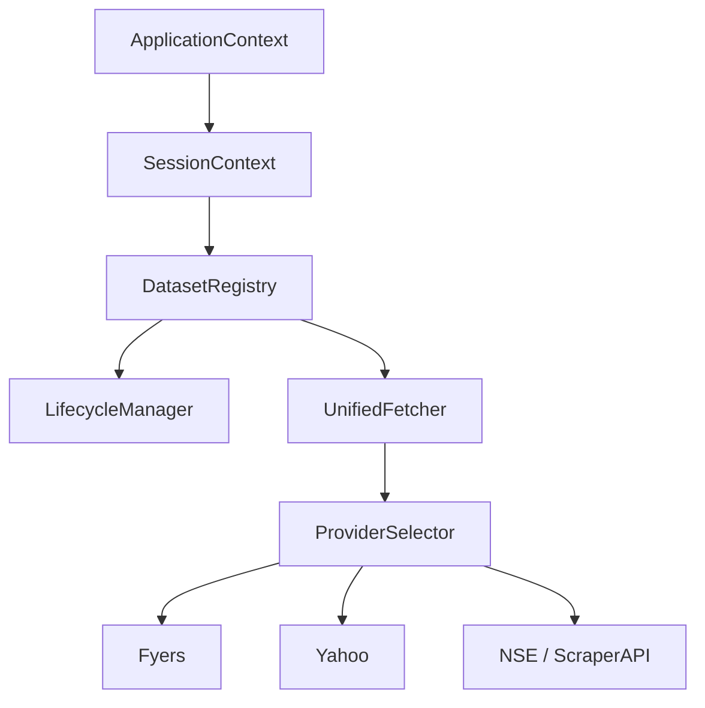
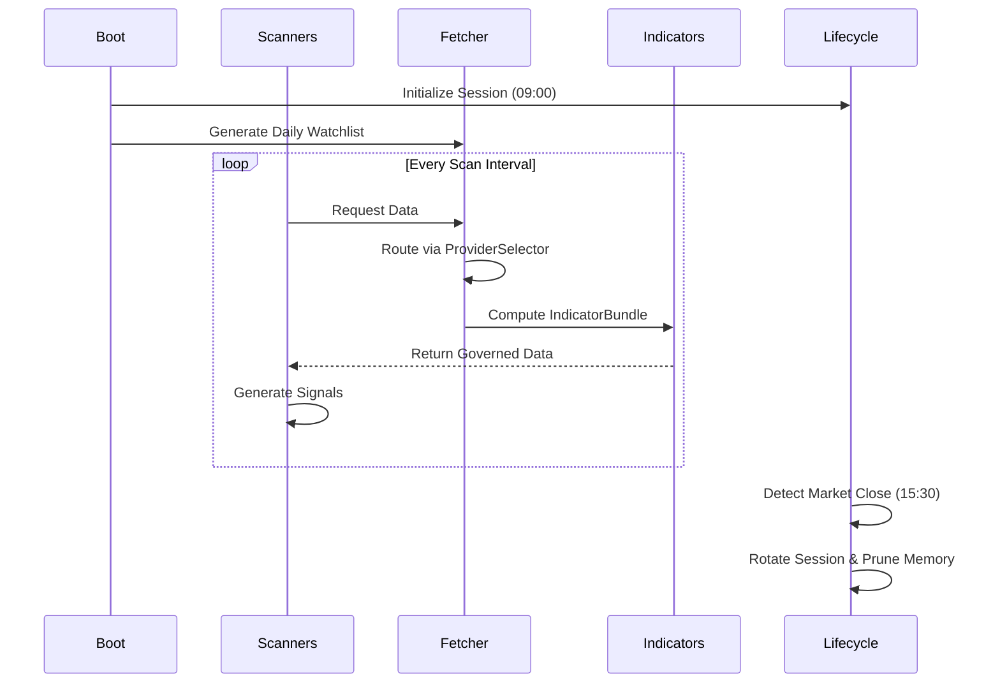
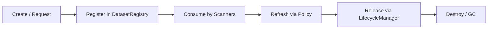
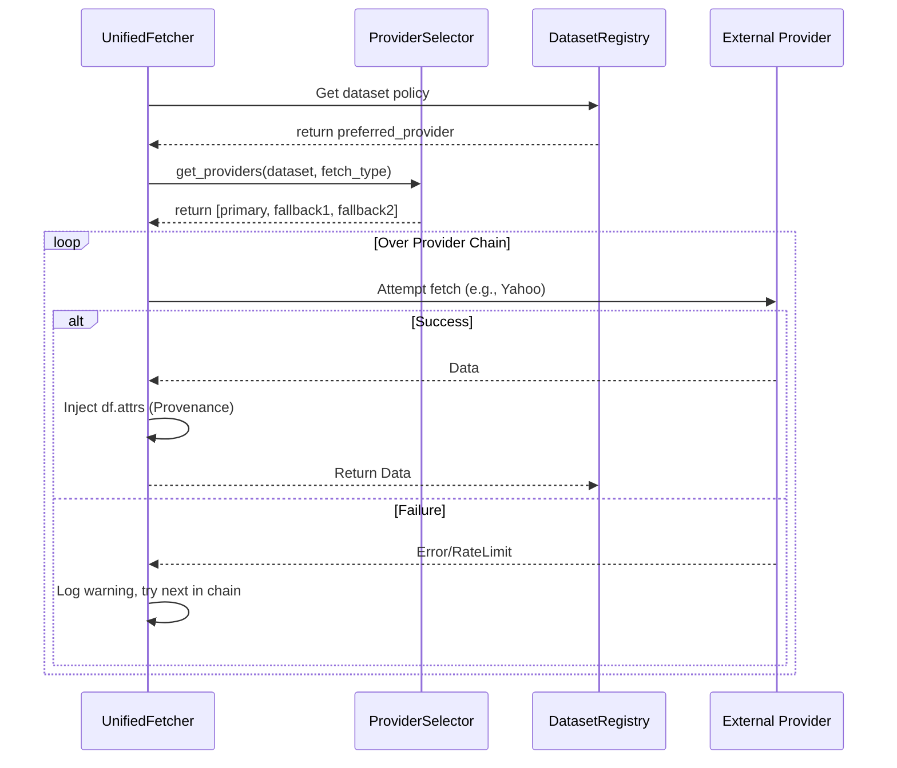
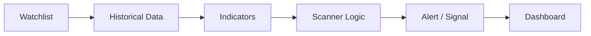
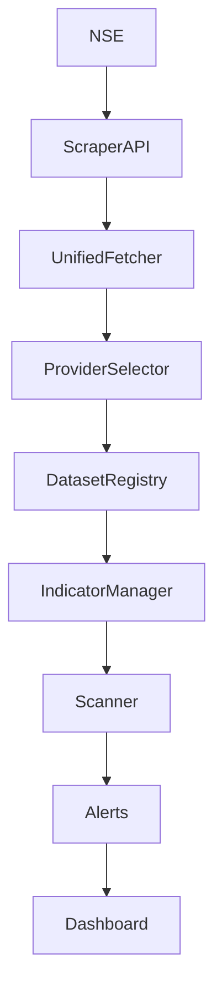

# System Guide

This is the operational and architectural guide for the system. It contains everything a developer needs to understand, debug, modify, and operate the platform. 

## What Does This Project Do?
The system is a fully governed, quantitative breakout and momentum trading platform for the National Stock Exchange of India (NSE). It automatically manages its own daily lifecycle to acquire market data (historical OHLCV, live quotes, bulk/block deals, promoter pledges, and bhavcopy delivery), computes technical indicators uniformly, and evaluates the market against highly specific scanner strategies to generate actionable trading signals. 

The output is presented via a persistent dashboard that displays actionable trade targets, relative sector rotation strength, and current portfolio momentum.

---

## High-Level Architecture & Execution Flow

The system operates as a governed data platform. Business logic (scanners) is strictly separated from data acquisition, indicator computation, and memory management.

### End-to-End Execution Walkthrough
This is a standard day in the life of the platform:

**09:00 - Boot**
1. **Application starts:** `main.py` is invoked.
2. **ApplicationContext created:** The core global singleton initializes database connections and core infrastructure.
3. **SessionContext created:** A fresh daily trading session is initialized to hold ephemeral session state.
4. **Daily Builder:** Executes to reconcile delisted tickers and build the day's active universe.
5. **Watchlist created:** The active trading universe is registered into the dataset registry.

**09:15 - Market Open (Scan Iterations)**
6. **DatasetRegistry populated:** Scanners request data (e.g., `price_1d`). The `UnifiedFetcher` pulls data via the `ProviderSelector` and registers the dataset.
7. **Indicators computed:** The `IndicatorManager` intercepts the raw data, computes standard indicators (SMA, EMA, RSI, ATR), and saves them into an `IndicatorBundle`.
8. **Scanners execute:** `EODScanner`, `MultiTFScanner`, `PullbackScanner`, and `ReversalScanner` consume the data and indicators to look for patterns.
9. **Signals generated:** Breakouts, reversals, and multibagger targets are computed and saved.
10. **Dashboard updated:** The local web interface surfaces the new signals in real time.

**15:30 - Market Close & Cleanup**
11. **Session rotated:** Once the trading day ends or midnight hits, the `SessionContext` detects staleness.
12. **Datasets released:** The `LifecycleManager` evicts ephemeral caches (like 1m intraday data) to reclaim memory.
13. **Shutdown / Sleep:** The platform awaits the next trading day.

---

## Architectural Diagrams

### 1. Overall Component Diagram


### 2. Daily Execution Sequence (Market Open to Close)


### 3. Dataset Lifecycle


### 4. Provider Selection Sequence


### 5. Scanner Flow


### 6. Data Flow


---

## Core Subsystems

### Dataset Registry & Lifecycle
The `DatasetRegistry` is the sole authority on shared memory. Caches are never stored as hidden module-level dictionaries. Every dataset declares a persistence tier (`EPHEMERAL` or `DURABLE`), a refresh policy, and a release event. The `LifecycleManager` monitors memory thresholds and enforces dataset eviction based on these policies.

### Data Acquisition: UnifiedFetcher & ProviderSelector
To prevent external API bans and rate-limiting, all data acquisition must route through the `UnifiedFetcher`. 
The fetcher delegates provider choice to the `ProviderSelector`, which evaluates the dataset's declared policy (e.g., `price_1d` prefers `yahoo` for adjusted historicals, while `price_1m` prefers `fyers` for live granularity).

### IndicatorManager
Scanners never compute standard indicators. The `IndicatorManager` acts as a middleware that wraps historical data into an `IndicatorBundle`, computing standard technicals (EMA, SMA, ATR, RSI) exactly once. This eliminates redundant CPU cycles.

### Component Responsibilities

| Component | Responsibility | Must Never |
| :--- | :--- | :--- |
| **ApplicationContext** | Application lifetime | Hold trading state |
| **SessionContext** | Trading day state | Own application resources |
| **DatasetRegistry** | Dataset ownership | Fetch external data |
| **UnifiedFetcher** | Data acquisition | Decide trading logic |
| **ProviderSelector** | Provider routing | Perform HTTP requests directly |
| **IndicatorManager** | Shared indicators | Execute scanners |
| **LifecycleManager** | Dataset lifecycle | Fetch market data |
| **Scanner** | Trading decisions | Compute shared indicators |

---

## Concurrency & Memory Model
The platform avoids broad, pipeline-blocking locks. Instead, synchronization is resource-scoped. For example, `network_fetch_lock` prevents concurrent external API hits from getting the application rate-limited, but allows local CPU-bound scanners to run in parallel.
Memory is governed: `EPHEMERAL` datasets are aggressively swept by the `LifecycleManager` when memory pressure reaches 80%, guaranteeing long-running stability.

---

## Data Provenance & Observability
Every DataFrame generated by the platform carries a metadata dictionary in `df.attrs` detailing its provenance:
```python
df.attrs = {
    "dataset": "price_1d",
    "provider": "fyers",
    "preferred_provider": "yahoo",
    "fallback_used": True,
    "fetch_timestamp": "2026-07-23T15:00:00.000000"
}
```
This enables operational observability: if a signal looks wrong, you can immediately check if a provider fallback caused degraded data quality.

---

## Failure Classes & Recovery Mechanisms
The system classifies and isolates failures to degrade gracefully rather than crashing the execution pipeline.

| Failure Class | Recovery Mechanism |
| :--- | :--- |
| **Provider Unavailable** | Seamlessly route to the next fallback provider via `ProviderSelector`. |
| **Dataset Validation Failure** | Reject dataset. Wait for next `refresh_interval` to attempt re-fetch. |
| **Indicator Computation Failure** | Skip the current symbol. Log error and continue iterating the watchlist. |
| **Memory Pressure (OOM Risk)** | `LifecycleManager` forcefully evicts `EPHEMERAL` data generations. |
| **Registry Corruption** | Halt execution. Startup configuration validation fails aggressively. |
| **Session Corruption (Stale Data)** | Detect midnight rollover and forcefully trigger Session Rotation. |

---

## Runtime KPIs

To validate the operational health of the system under production workloads, the following KPIs form the platform's SLOs (Service Level Objectives):

| Metric | Purpose |
| :--- | :--- |
| **Provider Fallback %** | Detect upstream provider degradation or failure |
| **Dataset Refresh Time** | Measure fetch latency and network performance |
| **Registry Size** | Track memory growth and leak prevention |
| **Memory Recovery %** | Confirm `LifecycleManager` evicts ephemeral data |
| **Indicator Cache Hit Rate**| Ensure shared computations are reused optimally |
| **Scanner Duration** | Catch performance regressions in execution |
| **Session Rotation Duration**| Validate daily rollover correctness |

---

## Architecture Decision Records (ADRs)

### Why DatasetRegistry exists
The `DatasetRegistry` provides centralized ownership of shared datasets. Central ownership enables deterministic lifecycle management, memory governance, dependency tracking, and runtime validation.

### Why UnifiedFetcher & ProviderSelector exist
Centralizing data acquisition creates a single boundary for universal fallback policies and rate-limit management. It isolates external provider instability from the internal trading logic.

### Why SessionContext exists
The system is designed for 24/7 autonomous operation. The `SessionContext` safely boundaries daily state, enabling a deterministic "soft reboot" of ephemeral market data overnight without interrupting persistent connections or long-lived infrastructure.

### Why Data Provenance exists
Data provenance correlates unusual scanner behavior with upstream provider changes. Injecting `df.attrs` directly into the datasets ensures a permanent audit trail of exactly where every row of data originated at runtime.

### Why Shared Indicators exist
Shared indicators are centralized to eliminate redundant computation and ensure mathematically consistent indicator outputs across all downstream scanners.

### Why ScraperAPI is mandatory for NSE
The National Stock Exchange utilizes active WAFs to block automated IP access. `ScraperAPI` provides a necessary residential proxy layer, ensuring deterministic acquisition of official compliance datasets (Bhavcopy, Delivery, Promoter Pledges) without permanent host bans.
