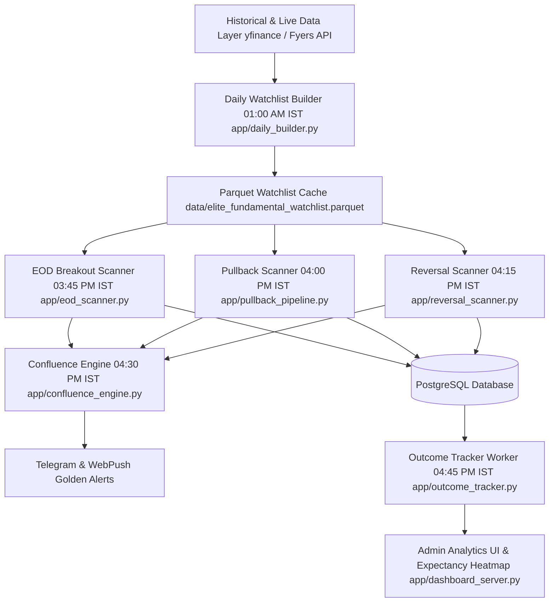

# MASTER V10.0 AI RECONSTRUCTION SPECIFICATION & ARCHITECTURAL CONTRACT

> **AI Reconstruction Guarantee**: This document defines the exact architecture, data flows, core sub-engines, database schemas, and verification contracts required for an AI agent or software engineer to reconstruct the **Elite Breakout System** from scratch.
>
> **Canonical Basis**: Reflects commit `400382c0` (`origin/main`) with 276 passing Pytest system tests.

| Specification Field | Value |
|---|---|
| **System Name** | Elite Breakout System |
| **System Version** | V10.0 Production Master |
| **Git Baseline Commit** | `400382c0` |
| **Target Runtime** | Python 3.9+ / PostgreSQL 14+ / Flask |
| **Timezone Invariant** | `Asia/Kolkata` (IST strictly required) |
| **Test Verification** | `python3 -m pytest` (276 / 276 tests passing) |

---

## 1. System Overview & Core Architecture

The Elite Breakout System is an institutional-grade quantitative breakout scanning, fundamental scoring, cross-scanner confluence, outcome tracking, and risk management system built for Indian Equities (NSE).

---

## 2. Core Architectural Subsystems

### 2.1 Watchlist Builder (`app/daily_builder.py`)
- Executes daily at `01:00 AM IST`.
- Computes `_score_nonfin(...)` for standard equities and `_score_fin(...)` for Banks & NBFCs (incorporating Net NPA trend, Banded NIM, CAR, and CASA).
- `FM_Score` is **100% pure fundamental** (no momentum bonuses added inside `daily_builder.py`).

### 2.2 Relative Strength & Sector Regime Engine (`app/macro_utils.py`)
- **F-03 Relative Strength**: 63-day RS rating vs Nifty 50 over active scan universe (~500–700 equities). `RS >= 80th` percentile awards **+10 pts RS Bonus**.
- **F-07 Sector Regime**: 14 NSE sector indices evaluated using blended 63d (70%) + 21d (30%) return with a **3-Session Hysteresis Rule** (must hold Top 3 for 3 consecutive days for `TAILWIND` status / **+8 pts Sector Bonus**).
- **Capped Bonus Arithmetic**: `MAX_MOMENTUM_BONUS = 15`, `RS_BONUS = 10`, `SECTOR_BONUS = 8`.

### 2.3 Stop Loss & Target Confluence Engine (`app/sl_target_helper.py`)
- Hard stop-loss distance cap: `MAX_SL_DISTANCE_PCT = 8.0%`.
- Portfolio risk budget: `ACCOUNT_RISK_BUDGET_PCT = 1.0%`.
- Minimum Natural Reward-to-Risk: `MIN_NATURAL_RR = 1.5`.

### 2.4 Cross-Scanner Confluence Engine (`app/confluence_engine.py`)
- Runs at `04:30 PM IST` with Staleness Guard (`input_date == today_date`).
- Evaluates: $\text{FM\_Score} \ge 75 \quad \text{AND} \quad \text{Any Active Technical Signal} \quad \text{AND} \quad \text{rs\_percentile} \ge 80.0$.
- Promotes setup to `ELITE_CONFLUENCE_ALERT` (Score 95+).

### 2.5 Alert Outcome & Excursion Tracker (`app/outcome_tracker.py`)
- Post-market worker (`04:45 PM IST` with `07:00 PM` retry).
- Accumulates daily running excursion ($\text{MFE}_R$ and $\text{MAE}_R$).
- Applies conservative same-bar collision rule (`AMBIGUOUS_SL_HIT` = -1.0R loss).
- Calculates gap-down slippage ($R = \frac{\text{Open} - \text{Entry}}{\text{Risk\_Dist}}$).

---

## 3. Core Database Schemas

### `alerts` Table
Primary trade alerts table with composite key `(symbol, breakout_type, scanner, alert_date)`.

### `alert_outcomes` Table
Composite key `(alert_id, leg)`. Stores feature snapshot (`base_score`, `rs_bonus`, `sector_bonus`, `rs_percentile`, `regime_score`, `sector_name`, `rr_at_alert`, `atr_pct_at_alert`), daily running MFE/MAE excursions, and trade exit classification (`T1_HIT`, `SL_HIT`, `AMBIGUOUS_SL_HIT`, `EXPIRED_POS`, `EXPIRED_NEG`).

### `sector_rankings` Table
Composite key `(sector_symbol, ranking_date)`. Stores blended scores, raw ranks, hysteresis counters (`consecutive_top3_days DEFAULT 0`), and `effective_status`.

---

## 4. Verification & Reconstruction Protocol

To verify an AI reconstruction of the system:
1. Clone codebase and initialize PostgreSQL.
2. Set `DATABASE_URL` environment variable.
3. Run `python3 -m pytest`.
4. Ensure all 276 system tests pass cleanly.
