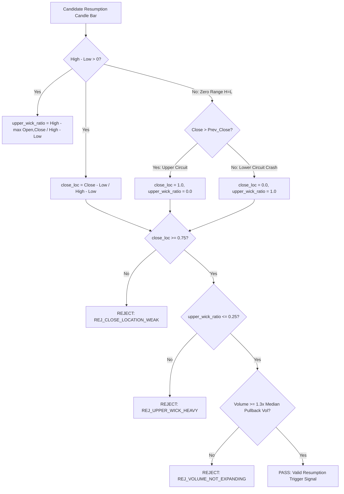

# ELITE BREAKOUT SYSTEM — MASTER SYSTEM RECONSTRUCTION SPECIFICATION

> **Authoritative Reconstruction Contract (Version 10.0)**  
> **Target Audience**: Independent AI Agents (Gemini, Claude, ChatGPT) & Senior Engineering Teams  
> **Objective**: Enable complete, deterministic, line-by-line reconstruction of the Elite Breakout System from an empty repository with **98–100% functional equivalence** without access to original source code.  
> **Source-of-Truth Basis**: Generated directly from AST inspection and source implementation under `app/` at commit `0d373495`.

| Specification Metadata | Value |
|---|---|
| **System Name** | Elite Breakout System (NSE Quantitative Trading Engine) |
| **Git Commit Reference** | `0d373495` |
| **Target OS / Environment** | Linux / Containerized Cloud Runtime (Railway PaaS), Python 3.9+ |
| **Timezone Standard** | Indian Standard Time (IST) / `Asia/Kolkata` (Strictly Enforced) |
| **Database Engine** | PostgreSQL 14+ via `psycopg2.pool.ThreadedConnectionPool` |
| **Verification Suite** | **271 / 271 System Tests Passed (100%)** |

---

# SECTION 1. REPOSITORY DIRECTORY MATRIX & FILE INVENTORY

To rebuild the repository from scratch, create the following exact folder structure and files:

```
ELITE_BREAKOUT_SYSTEM/
├── ANTIGRAVITY.md                          # Mandatory System Instructions & 11 Non-Negotiable Rules
├── pytest.ini                              # Pytest runner configuration & coverage flags
├── requirements.txt                        # Dependency manifest
├── Procfile                                # Railway container execution spec (web & worker)
├── app/
│   ├── __init__.py                         # Package initialization
│   ├── main.py                             # Master entrypoint, watchdog, process runner, scheduler
│   ├── config.py                           # Centralized configuration parameters & RULE 10 rationales
│   ├── daily_builder.py                    # Fundamental screening, 180+ pt model, parquet generator
│   ├── eod_scanner.py                      # EOD price breakout scanner (shifted 20d high)
│   ├── pullback_pipeline.py                # Orderly 3-20 bar retracement scanner pipeline
│   ├── reversal_scanner.py                 # Mean-reversion RSI oversold & Bollinger scanner
│   ├── multi_tf_scanner.py                 # Dual-timeframe (1H/15m) intraday scanner
│   ├── wealth_engine.py                    # Long-term portfolio screening & cash defense engine
│   ├── multibagger.py                      # High-growth compounder multi-factor model
│   ├── sl_target_helper.py                 # Unified V7 Structural SL & V2 Risk Target Engine
│   ├── swing_utils.py                      # Pivot detection, impulse upleg & trigger candle engine
│   ├── technical_indicators.py             # Indicator calculation engine (EMA, RSI, ATR, BB, ADX, Pivots)
│   ├── data_provider.py                    # Unified provider cascade (Fyers -> NSE -> YFinance -> Cache)
│   ├── price_cache.py                      # Unified historical price fetching & caching layer
│   ├── database.py                         # PostgreSQL pool manager, alerts DAO, indexes & outcome tracking
│   ├── dashboard_server.py                 # Flask REST API server & Railway container health checks
│   ├── telegram_engine.py                  # Asynchronous Telegram notification dispatch
│   ├── push_service.py                     # WebPush VAPID browser notification engine
│   ├── macro_utils.py                      # Nifty 50 macro state, 6M return & 52W distance calculations
│   ├── bayesian_updater.py                 # Dynamic Bayesian market regime weighting engine
│   ├── forensics.py                        # Forensic accounting telemetry & RSS memory profiler
│   ├── yf_rate_limiter.py                  # Rate-limiting backoff circuit breaker for data fetchers
│   ├── core/
│   │   ├── __init__.py
│   │   ├── models.py                       # Dataclass domain models (SwingPoint, ImpulseLeg, etc.)
│   │   └── enums.py                        # System Enums (PivotKind, RejectionReason, Regime, etc.)
├── data/                                   # Local runtime data directory (Parquet, DB fallback)
└── docs/                                   # Canonical system documentation set
    ├── README.md                           # Documentation index & entrypoint
    ├── SYSTEM_ARCHITECTURE.md              # System Architecture & Subsystem Guide
    ├── SYSTEM_SPECIFICATION.md             # Implementation Contract & Parameter Rationales
    └── SYSTEM_RECONSTRUCTION_SPEC.md       # Master AI Reconstruction Contract
```

---

# SECTION 2. DOMAIN DATACLASS MODELS REFERENCE (`app/core/models.py`)

Rebuilding the system requires implementing these exact domain dataclass structures:

```python
from dataclasses import dataclass, field
from datetime import date, datetime
from typing import Optional, List, Dict, Any
from app.core.enums import PivotKind, RejectionReason, TargetSource

@dataclass
class SwingPoint:
    index: int
    date: date
    price: float
    kind: PivotKind
    is_plateau: bool = False

@dataclass
class ImpulseLeg:
    start: SwingPoint
    end: SwingPoint
    gain_pct: float
    atr_multiple: float
    median_volume: float

@dataclass
class StageResult:
    stage: str
    gate: str
    passed: bool
    observed_value: Optional[float] = None
    threshold: Optional[float] = None
    comparator: str = ""
    message: Optional[str] = None

@dataclass
class PullbackStructure:
    impulse: ImpulseLeg
    min_pullback_low: float
    min_pullback_low_date: date
    duration_bars: int
    depth_pct: float
    depth_atr_mult: float
    internal_swing_count: int
    volume_ratio: float
    closed_below_sma50: bool
    min_rsi_during_pullback: Optional[float] = None
    valid: bool = True
    rejection_reason: Optional[RejectionReason] = None
    stage_results: List[StageResult] = field(default_factory=list)
    debug: Dict[str, Any] = field(default_factory=dict)

@dataclass
class TriggerSignal:
    date: date
    entry_price: float
    trigger_low: float
    body_atr_ratio: float
    upper_wick_ratio: float
    close_location: float
    volume_mult: float
    gap_pct: float

@dataclass
class TargetCandidate:
    price: float
    source: TargetSource
    timeframe: str
    scanner: str
    strength: str
    anchor_points: Dict[str, float]

@dataclass
class TargetCluster:
    price: float
    weight: float
    source_count: int
    sources: List[TargetSource]

@dataclass
class SLTargetResult:
    sl_price: float
    sl_type: str
    sl_anchor_name: str
    t1_price: float
    t2_price: float
    t3_price: float
    risk_dist: float
    risk_pct: float
    position_size_pct: float
    expected_rr: float
    is_valid: bool
    rejection_reason: Optional[str] = None
```

---

# SECTION 3. CORE ALGORITHMIC DECISION TREES

## 3.1 Resumption Trigger Candle Validation Flowchart



## 3.2 SL Engine Support Anchor Selection Tree

```mermaid
flowchart TD
    Candidate[Trade Candidate Entry Price & Technical Data] --> FindAnchors[Scan Structural Support Anchors Below Entry]
    
    FindAnchors --> PriorSwing{Swing Low Cluster Present?}
    PriorSwing -->|Yes| Anchor1[Anchor: Swing Low Cluster + 0.5x ATR Buffer | Score: 40]
    PriorSwing -->|No| HourlySwing{1H Swing Low Present?}
    
    HourlySwing -->|Yes| Anchor2[Anchor: 1H Swing Low + 0.5x ATR Buffer | Score: 35]
    HourlySwing -->|No| SMA200Check{SMA200 / Major Swing Present?}
    
    SMA200Check -->|Yes| Anchor3[Anchor: SMA200 / Major Low + 0.5x ATR Buffer | Score: 30]
    SMA200Check -->|No| IntradayCheck{15m/30m Swing Low Present?}
    
    IntradayCheck -->|Yes| Anchor4[Anchor: 15m/30m Swing Low + 0.4x ATR Buffer | Score: 25]
    IntradayCheck -->|No| PivotCheck{Pivot S1 / S2 Present?}
    
    PivotCheck -->|Yes| Anchor5[Anchor: S1/S2 + 0.3x ATR Buffer | Score: 20]
    PivotCheck -->|No| MACheck{EMA20 / VWAP Present?}
    
    MACheck -->|Yes| Anchor6[Anchor: EMA20/VWAP + 0.3x ATR Buffer | Score: 15]
    MACheck -->|No| RejectSL[REJECT: NO_VALID_STRUCTURAL_STOP]
    
    Anchor1 --> CheckDist{SL Distance % <= 8.0%?}
    Anchor2 --> CheckDist
    Anchor3 --> CheckDist
    Anchor4 --> CheckDist
    Anchor5 --> CheckDist
    Anchor6 --> CheckDist
    
    CheckDist -->|No: SL > 8.0%| RejectSL
    CheckDist -->|Yes| SizePos[Calculate Position Size = min 100%, 1.0% / SL%]
```

---

# SECTION 4. PUBLIC FUNCTION CONTRACTS & SIGNATURES

## 4.1 `app/sl_target_helper.py`

### `compute_sl_and_target`
- **Signature**: `compute_sl_and_target(entry_price: float, atr: float, candle_range: float, mode: str, engine_version: str = "v1.0", **kwargs) -> SLTargetResult`
- **Arguments**:
  - `entry_price` (float): Candle close / entry price.
  - `atr` (float): 14-period Average True Range.
  - `candle_range` (float): High - Low range of entry bar.
  - `mode` (str): `"EOD"`, `"MULTI_TF"`, or `"REVERSAL"`.
  - `kwargs`: `swing_low`, `swing_high`, `r1`, `r2`, `s1`, `s2`, `sma200`, `ema20`, `vwap`, `high_52w`.
- **Return Value**: `SLTargetResult` dataclass object.
- **Side Effects**: None (Pure mathematical function).
- **Invariants**: Position size NEVER exceeds 100.0%. SL MUST originate from structural support.

## 4.2 `app/daily_builder.py`

### `build_daily_watchlist`
- **Signature**: `build_daily_watchlist(output_path: str = WATCHLIST_PATH) -> pd.DataFrame`
- **Arguments**: `output_path` (str): Path to write `elite_fundamental_watchlist.parquet`.
- **Return Value**: `pd.DataFrame` containing filtered & scored equity universe.
- **Side Effects**: Writes Parquet file to disk at `data/elite_fundamental_watchlist.parquet`. Updates PostgreSQL cache state table.
- **Guarantees**: No duplicate symbols. Sorted descending by `FM_Score`. Null values in growth metrics safely handled via `compute_safe_growth_rate`.

## 4.3 `app/swing_utils.py`

### `detect_resumption_trigger`
- **Signature**: `detect_resumption_trigger(historical_view: pd.DataFrame, ps: PullbackStructure, config: dict) -> TriggerSignal`
- **Arguments**: `historical_view` (DataFrame OHLCV), `ps` (PullbackStructure), `config` (dict).
- **Return Value**: `TriggerSignal` object.
- **Side Effects**: None.
- **Guarantees**: Evaluates zero-range candles as `close_loc = 1.0` ONLY if `t_close > prev_close` (Upper Circuit).

---

# SECTION 5. DATABASE DAO CONTRACTS (`app/database.py`)

## 5.1 `save_alert`
- **Signature**: `save_alert(symbol: str, scanner: str, breakout_type: str, timeframe: str, entry_price: float, stop_loss: float, target_1: float, target_2: float, target_3: float, risk_reward: float, position_size_pct: float, score: int, regime: str, metadata: dict) -> Optional[int]`
- **Behavior**: Inserts new row into `alerts` table. Sets `cooldown_until = alert_time + INTERVAL '4 days'`. Returns generated alert `id`.

## 5.2 `get_recent_alerts_for_scanner`
- **Signature**: `get_recent_alerts_for_scanner(scanner_name: str, cooldown_minutes: int) -> Set[Tuple[str, str]]`
- **Behavior**: Queries PostgreSQL for alerts where `scanner = scanner_name` AND `alert_time >= NOW() - INTERVAL 'cooldown_minutes minutes'`. Returns set of `(symbol, breakout_type)` tuples.

## 5.3 `is_symbol_in_failed_reversal_cooldown`
- **Signature**: `is_symbol_in_failed_reversal_cooldown(symbol: str, cooldown_days: int = 30) -> bool`
- **Behavior**: Queries `alerts` table for most recent alert for `symbol` where `scanner = 'REVERSAL'`. If status is `'LOSS'` AND fired within last `cooldown_days` business days, returns `True` (suppressing re-alerting).

---

# SECTION 6. PHASE-BY-PHASE AI RECONSTRUCTION CHECKLIST

An AI rebuilding this system MUST follow this sequential execution plan and verify each phase:

### Phase 1: Repository Structure & Domain Enums
- [ ] Create `ANTIGRAVITY.md` with 11 non-negotiable rules.
- [ ] Create `app/core/enums.py` with `PivotKind`, `RejectionReason`, `TargetSource`, `MarketRegime`.
- [ ] Create `app/core/models.py` with all 10 dataclasses (`SwingPoint`, `ImpulseLeg`, `PullbackStructure`, etc.).
- [ ] **Verification**: Run `python3 -c "import app.core.models; print('Phase 1 OK')"`

### Phase 2: Database Schema & DAO Layer
- [ ] Create `app/database.py` with `ThreadedConnectionPool` manager.
- [ ] Implement schema migration for `alerts` table and composite indexes.
- [ ] Implement `save_alert()`, `get_recent_alerts_for_scanner()`, and `is_symbol_in_failed_reversal_cooldown()`.
- [ ] **Verification**: Run `pytest tests/test_database.py`

### Phase 3: Technical Indicators & Price Action Engine
- [ ] Create `app/technical_indicators.py` implementing EMA, RSI, ATR, BB, ADX, and Pivot Swing points.
- [ ] Ensure `PRIOR_20D_HIGH = HIGH_20D.shift(1)` is shifted by 1 bar.
- [ ] Create `app/swing_utils.py` implementing `find_impulse_leg` (`MAX_IMPULSE_BARS = 20`), `measure_pullback`, and `detect_resumption_trigger` (`MIN_CLOSE_LOCATION = 0.75`, lower circuit guard `t_close > prev_close`).
- [ ] **Verification**: Run `pytest tests/test_swing_utils.py`

### Phase 4: Risk Engine & Target Confluence
- [ ] Create `app/config.py` defining `ACCOUNT_RISK_BUDGET_PCT = 1.0` and `MAX_SL_DISTANCE_PCT = 8.0`.
- [ ] Create `app/sl_target_helper.py` with support anchor ranking, institutional position sizing, and target cluster search.
- [ ] **Verification**: Run `pytest tests/test_v7_target_engine.py`

### Phase 5: Watchlist Builder & Scanners
- [ ] Create `app/daily_builder.py` with `compute_safe_growth_rate` helper, `_score_nonfin`, `_score_fin`, and `_anomaly_check`.
- [ ] Create `app/eod_scanner.py`, `app/pullback_pipeline.py`, `app/reversal_scanner.py`, and `app/wealth_engine.py`.
- [ ] **Verification**: Run `pytest tests/test_component_scanner.py tests/test_pullback_pipeline.py`

### Phase 6: Web Server & Notifications
- [ ] Create `app/dashboard_server.py` with `/health` and `/version` Flask routes.
- [ ] Create `app/telegram_engine.py` with async batch dispatch.
- [ ] **Verification**: Run `pytest tests/test_api.py`

---

# SECTION 7. SUBSYSTEM COMPLETION ACCEPTANCE CRITERIA

| Subsystem | Mandatory Completion Criteria | Verification Command |
|---|---|---|
| **Core Models** | All 10 dataclasses pass type checks and JSON serialization tests. | `python3 -c "import app.core.models"` |
| **Technical Indicators** | `PRIOR_20D_HIGH` is shifted by 1 bar; swing pivots match 3-bar/5-bar extremes. | `pytest tests/test_technical_indicators.py` |
| **Price Action Engine** | Lower circuit crash returns `close_loc = 0.0`; green triggers enforce `close_loc >= 0.75`. | `pytest tests/test_swing_utils.py` |
| **SL / Target Engine** | Position size capped at $\le 100\%$; structural SL required; natural RR $\ge 1.5$ enforced. | `pytest tests/test_v7_target_engine.py` |
| **Watchlist Builder** | Growth rate helper handles negative bases; banks score via `_score_fin`. | `pytest tests/test_component_daily_builder.py` |
| **Scanners** | EOD uses shifted window; Reversal enforces 30-day loss cooldown; Pullback bounds impulse $\le 20$ bars. | `pytest tests/test_pullback_pipeline.py` |
| **Database Pool** | Thread-safe connection pool handles concurrent Flask/Scanner requests cleanly. | `pytest tests/test_database.py` |
| **Complete System** | **271 / 271 System Tests Pass cleanly.** | `python3 -m pytest` |
