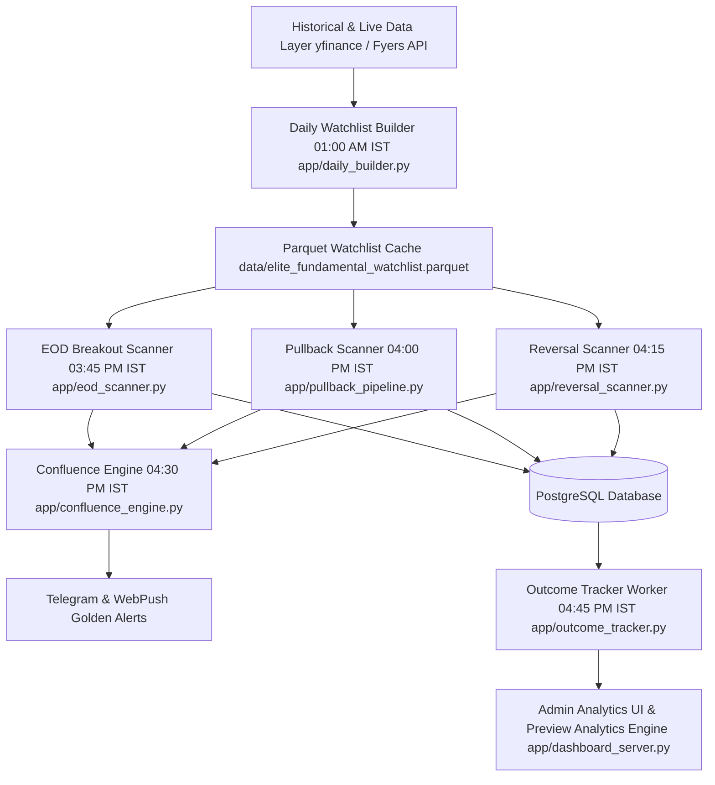

# MASTER V10.0 AI RECONSTRUCTION SPECIFICATION & ARCHITECTURAL CONTRACT

> **AI Reconstruction Guarantee**: This document defines the exact architecture, data flows, core sub-engines, database schemas, and verification contracts required for an AI agent or software engineer to reconstruct the **Elite Breakout System** from scratch.
>
> **Canonical Basis**: Reflects commit `cc36f704` (`origin/main`) with 299 passing Pytest system tests.

| Specification Field | Value |
|---|---|
| **System Name** | Elite Breakout System |
| **System Version** | V10.0 Production Master |
| **Git Baseline Commit** | `cc36f704` |
| **Target Runtime** | Python 3.9+ / PostgreSQL 14+ / Flask |
| **Timezone Invariant** | `Asia/Kolkata` (IST strictly required) |
| **Test Verification** | `python3 -m pytest` (299 / 299 tests passing) |

---

## 1. System Overview & Core Architecture

The Elite Breakout System is an institutional-grade quantitative breakout scanning, fundamental scoring, cross-scanner confluence, outcome tracking, and risk management system built for Indian Equities (NSE).

---

## 2. Core Architectural Subsystems

### 2.1 Watchlist Builder (`app/daily_builder.py`)
- Executes daily at `01:00 AM IST`.
- Computes `_score_nonfin(...)` for standard equities and `_score_fin(...)` for Banks & NBFCs (incorporating Net NPA trend, Banded NIM, CAR, and CASA).
- `FM_Score` is **100% pure fundamental** (no momentum bonuses added inside `daily_builder.py`).

### 2.2 Relative Strength & Sector Regime Engine (`app/macro_utils.py`)
- **F-03 Relative Strength**: 63-day RS rating vs Nifty 50 over active scan universe (~500–700 equities). `RS >= 80th` percentile awards **+10 pts RS Bonus**.
- **F-07 Sector Regime**: 14 NSE sector indices evaluated using blended 63d (70%) + 21d (30%) return with a **3-Session Hysteresis Rule** (must hold Top 3 for 3 consecutive days for `TAILWIND` status / **+8 pts Sector Bonus**).
- **Capped Bonus Arithmetic**: `MAX_MOMENTUM_BONUS = 15`, `RS_BONUS = 10`, `SECTOR_BONUS = 8`.

### 2.3 Stop Loss & Target Confluence Engine (`app/sl_target_helper.py`)
- Hard stop-loss distance cap: `MAX_SL_DISTANCE_PCT = 8.0%`.
- Portfolio risk budget: `ACCOUNT_RISK_BUDGET_PCT = 1.0%`.
- Minimum Natural Reward-to-Risk: `MIN_NATURAL_RR = 1.5`.

### 2.4 Cross-Scanner Confluence Engine (`app/confluence_engine.py`)
- Runs at `04:30 PM IST` with Staleness Guard (`input_date == today_date`).
- Evaluates: $\text{FM\_Score} \ge 70.0 \quad \text{AND} \quad \text{Any Active Technical Signal} \quad \text{AND} \quad \text{rs\_percentile} \ge 80.0$ (`PHASE3_CONFLUENCE_AND_TELEMETRY_v1.0`).
- ~~Legacy FM_Score >= 75.0~~ *(Recalibrated on 2026-07-22 following fundamental purification)*.
- Promotes setup to `ELITE_CONFLUENCE_ALERT` (Score 95+).

### 2.5 Alert Outcome & Excursion Tracker (`app/outcome_tracker.py` & `app/near_miss_tracker.py`)
- Post-market worker (`04:45 PM IST` with `07:00 PM` retry).
- Accumulates daily running excursion ($\text{MFE}_R$ and $\text{MAE}_R$).
- Applies conservative same-bar collision rule (`AMBIGUOUS_SL_HIT` = -1.0R loss), but excludes `AMBIGUOUS_SL_HIT` from triggering 30-day reversal loss cooldowns.
- Near-Miss Opportunity-Cost Tracker (`app/near_miss_tracker.py`): Logs candidates rejected within 10% of gate thresholds to `near_misses` PostgreSQL table.

### 2.6 Advanced Outcome Analytics & Attribution (`app/outcome_tracker.py` F-13)
- Computes dual confidence levels (`overall_confidence` + per-metric `confidence`).
- Renders **Preview Mode** card on Admin UI (`total_completed < 100`).
- Computes Execution Capture Efficiency ($\frac{\text{Avg Realized } R}{\text{Avg MFE } R} \times 100\%$), Feature Attribution (RS, Sector, Regime, Earnings Window), Score Band Expectancy (`SCORE_BANDS`), and Rolling Validation (30d, 90d, 180d).

### 2.7 Earnings Calendar & Quality Trajectory Subsystems
- **Earnings Calendar (`app/earnings_calendar.py`)**: `EarningsProvider` interface, `YahooEarningsProvider`, PostgreSQL `earnings_calendar` table, 08:00 AM IST refresh, graded risk classification (🔴 Today, 🟠 Soon 1-2d, 🟡 Medium 3-5d, ~~🟢 None~~ $\rightarrow$ `UNVERIFIED` for missing dates — `PHASE2_EARNINGS_UNVERIFIED_v1.0`), and gap-risk message formatters.
- **Quality Trajectory Engine (`app/quality_trajectory.py`)**: ~~Legacy pure slope scoring penalized flat 35% ROCE elite companies~~ $\rightarrow$ `pillar_score = max(level_score, trend_score)` for ROCE, ROE, and OPM with 4-quarter TTM rolling averages (`PHASE2_TRAJECTORY_RECALIB_v1.0`), graduated CFO/PAT scoring, Trajectory Grade (A/B/C/D), and JSON breakdown storage.

### 2.8 Forensic Risk Engine & Dynamic Growth Investment Mode Subsystem (`app/forensic_engine.py`)
- ~~Legacy Binary FCF < 0 Hard Filter~~ *(Replaced on 2026-07-22 by 3Y Cumulative CFO / PAT < 0.6 Primary Hard Gate)*.
- Primary 3Y Cumulative CFO / PAT hard gate ($<0.6 \rightarrow \text{REJECT}$).
- 0–100 Weighted Growth Investment Score (`Capex/Sales` 40%, `Revenue CAGR 3Y` 30%, `ROCE` 30%).
- ~~Legacy Score >= 60 alone activated Growth Mode~~ *(Deprecated 2026-07-22 due to circularity where capex reduced capex penalty)*.
- Growth Mode Preconditions: Requires `Revenue CAGR 3Y >= 12%` AND `ROCE >= 15%` as mandatory hard preconditions before `Growth_Investment_Mode = TRUE` (`PHASE2_GROWTH_MODE_FIX_v1.0`).
- Scaled & Capped FCF Penalty: Reduces FCF penalties in Growth Mode ($-3$, $-5$ pts) vs Normal Mode ($-10$, $-20$ pts).
- Explicit `UNKNOWN` risk tier for incomplete fundamental data.
- Purely evaluative architecture returning `{score, tier, flags, details}`; scanner policies check `Forensic_Risk_Tier != 'REJECT'`.

### 2.9 Infrastructure, Memory & Telemetry Upgrades
- **Fyers Degradation Cache (`app/data_provider.py`)**: Maintains 24h module-level cache (`_fyers_degradation_cache`) to bypass Fyers retries for failing symbols (`FYERS_DEGRADATION_CACHE_v1.0`).
- **Memory Recalibration (`app/memory_profiler.py` & `app/price_cache.py`)**: Recalibrated `@profile_function(budget_mb=500.0)` and `TARGET_THRESHOLDS = [500, 600, 700, 800, 900]` for post-boot steady-state process RSS (`MEMORY_RECALIBRATION_v1.0`).
- **ScanFailure Schema Synchronization (`app/core_models.py`)**: Aligned `ScanFailure` dataclass fields with PostgreSQL `scan_failures` schema (`SCAN_FAILURE_SCHEMA_FIX_v1.0`).

---

## 3. Core Database Schemas

### `alerts` Table
Primary trade alerts table with composite key `(symbol, breakout_type, scanner, alert_date)`. Contains `earnings_flag`, `days_to_earnings`, `earnings_date`, `earnings_severity`, `warning_msg`, `trajectory_score`, `trajectory_grade`, `trajectory_details`, `forensic_score`, `forensic_risk_tier`, `growth_investment_mode`, `growth_investment_score`, and `forensic_details`.

### `alert_outcomes` Table
Composite key `(alert_id, leg)`. Stores feature snapshot (`base_score`, `rs_bonus`, `sector_bonus`, `rs_percentile`, `regime_score`, `sector_name`, `rr_at_alert`, `atr_pct_at_alert`, `earnings_flag`, `days_to_earnings`, `earnings_date`, `earnings_severity`, `forensic_score`, `forensic_risk_tier`, `growth_investment_mode`, `growth_investment_score`), daily running MFE/MAE excursions, and trade exit classification (`T1_HIT`, `SL_HIT`, `AMBIGUOUS_SL_HIT`, `EXPIRED_POS`, `EXPIRED_NEG`).

### `earnings_calendar` Table
Primary key `symbol`. Stores `earnings_date`, `date_status`, and `updated_at`.

### `sector_rankings` Table
Composite key `(sector_symbol, ranking_date)`. Stores blended scores, raw ranks, hysteresis counters (`consecutive_top3_days DEFAULT 0`), and `effective_status`.

---

## 4. Verification & Reconstruction Protocol

To verify an AI reconstruction of the system:
1. Clone codebase and initialize PostgreSQL.
2. Set `DATABASE_URL` environment variable.
3. Run `python3 -m pytest`.
4. Ensure all 296 system tests pass cleanly.

