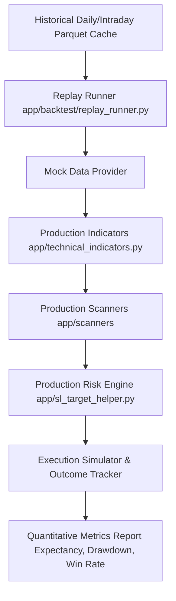

# ELITE BREAKOUT SYSTEM — UPCOMING IMPROVEMENTS & ROADMAP SPECIFICATION

> **Canonical Roadmap Document**: This document outlines the prioritized roadmap of upcoming architectural, quantitative, risk management, and analytics enhancements for the **Elite Breakout System**.
>
> **Development Philosophy**: All strategy logic, indicator periods, and filter thresholds are currently **FROZEN**. Upgrades in Phase 1 focus on closing the empirical feedback loop (Alert Outcome Tracking & Replay Backtesting) so that future parameter adjustments are driven strictly by quantitative evidence rather than intuition.

| Roadmap Metadata | Value |
|---|---|
| **Document Target** | Post-Freeze System Enhancement Blueprint |
| **Primary Focus** | Empirical Feedback Loops, Risk Management & Confluence Scoring |
| **Governance Standard** | ANTIGRAVITY Rules 1-11 (Impact Analysis, RULE 10 Parameter Rationales) |
| **Baseline Revision** | Commit [`0d373495`](file:///Users/abhinavmaheshwari/Documents/ELITE_BREAKOUT_SYSTEM/docs/SYSTEM_RECONSTRUCTION_SPEC.md) (`origin/main`) |

---

# 1. Implementation Roadmap & Priority Matrix

| Feature ID | Category / Name | Priority | Recommendation | Complexity | Target Subsystem | Architectural Rationale |
|---|---|---|---|---|---|---|
| **F-01** | **Alert Outcome Tracking & Analytics** | **P0** | ✅ Implement | Medium | `app/database.py`<br>`app/analytics.py` | Closes feedback loop by logging trade exits, $R$-multiples, and win rates per scanner/regime. |
| **F-02** | **Replay Backtest Harness** | **P0** | ⭐ Mandatory | High | `app/backtest/` | Allows replaying 2-3 years of historical NSE data through exact production code paths. |
| **F-03** | **Relative Strength (RS) Engine vs Nifty** | **P1** | ✅ Implement | Low | `app/swing_utils.py`<br>`app/macro_utils.py` | 63-day RS rating vs Nifty; awards scoring bonus for outperforming stocks. |
| **F-04** | **Cross-Scanner Confluence Alert Tier** | **P1** | ⭐ Recommended | Medium | `app/confluence_engine.py` | Combines multi-signal hits (Fundamental + EOD + Pullback) into an "Elite Confluence" alert tier. |
| **F-05** | **Financial-Sector Scorer (`_score_fin`)** | **P1** | ✅ Implement | Medium | `app/daily_builder.py` | Expands banking screeners with GNPA/NNPA, NIM, CASA, and Capital Adequacy. |
| **F-06** | **Earnings-Date Blackout Filter** | **P1** | ✅ Implement | Low | `app/scanners/` | Suppresses or flags new alerts $N$ days before earnings results to prevent gap-down losses. |
| **F-07** | **Sector & Industry Regime Layer** | **P2** | ✅ Implement | Medium | `app/macro_utils.py` | Ranks sector RS to boost breakouts occurring in leading market sectors. |
| **F-08** | **Portfolio-Level Risk Constraints** | **P2** | ✅ Implement | Medium | `app/risk_engine.py` | Enforces `MAX_POSITION_PCT`, max open positions, sector concentration, and daily risk budgets. |
| **F-09** | **Delivery % Institutional Conviction** | **P2** | ✅ Implement | Low | `app/daily_builder.py` | Awards quality scoring bonus for high NSE delivery % on breakout day. |
| **F-10** | **Gap-Aware Execution Risk** | **P2** | ⚠️ Investigate | Medium | `app/sl_target_helper.py` | Flags high-gap frequency stocks and adjusts risk budget for illiquidity slippage. |
| **F-11** | **Trade Management & Trailing SL** | **P3** | Later | Medium | `app/trade_manager.py` | Moves SL to breakeven at $1R$ and trails stops below structural swing lows. |
| **F-12** | **Regime-Adaptive Risk Scaling** | **P3** | ⚠️ Carefully | High | `app/config.py` | Dynamically scales `ACCOUNT_RISK_BUDGET_PCT` based on macro regime score. |

---

# 2. Phase 1: Foundational Quantitative Engine (P0 / P1)

## 2.1 Feature F-01: Alert Outcome Tracking & Feedback Loop Engine (P0)

### Architectural Design
Extends PostgreSQL database schema to track every alert from creation to eventual exit:

```sql
CREATE TABLE IF NOT EXISTS alert_outcomes (
    alert_id INTEGER PRIMARY KEY REFERENCES alerts(id),
    symbol VARCHAR(20) NOT NULL,
    scanner VARCHAR(30) NOT NULL,
    regime VARCHAR(20) NOT NULL,
    entry_price NUMERIC(10, 2) NOT NULL,
    stop_loss NUMERIC(10, 2) NOT NULL,
    target_1 NUMERIC(10, 2) NOT NULL,
    target_2 NUMERIC(10, 2),
    alert_timestamp TIMESTAMPTZ NOT NULL,
    exit_timestamp TIMESTAMPTZ,
    exit_reason VARCHAR(20), -- 'T1_HIT', 'T2_HIT', 'SL_HIT', 'EXPIRED'
    realized_rr NUMERIC(5, 2),
    holding_period_bars INTEGER,
    max_favorable_excursion_r NUMERIC(5, 2), -- MFE in R
    max_adverse_excursion_r NUMERIC(5, 2)    -- MAE in R
);
```

### Empirical Analytics Output
Computes monthly per-scanner and per-regime performance matrices:
- **Expectancy ($R$)**: $\text{Expectancy} = (\text{WinRate} \times \text{AvgWin\_R}) - (\text{LossRate} \times 1.0)$
- **Sharpe / Sortino Ratio**: Realized risk-adjusted returns per scanner category.
- **Threshold Validation**: Empirically proves whether `MIN_CLOSE_LOCATION = 0.75` outperforms `0.70` or `0.80`.

---

## 2.2 Feature F-02: Comprehensive Replay Backtest Harness (P0)

### Architectural Design
A dedicated backtesting runner (`app/backtest/replay_runner.py`) that replays production scanners over 2–3 years of historical daily and intraday OHLCV data using **exact production code paths**:



### Non-Negotiable Contract
- **No Code Drift**: The backtester MUST import `app/technical_indicators.py` and `app/sl_target_helper.py` directly. Writing separate "backtest-only" indicator or SL logic is strictly prohibited.

---

## 2.3 Feature F-03: Relative Strength (RS) Engine vs. Nifty 50 (P1)

### Technical Specification
Calculates the 63-trading-day (3-month) Relative Strength of each equity candidate against the Nifty 50 Index (`^NSEI`):

$$\text{Stock\_Ret}_{63d} = \frac{\text{Close}_{\text{today}} - \text{Close}_{t-63}}{\text{Close}_{t-63}} \times 100$$

$$\text{Nifty\_Ret}_{63d} = \frac{\text{Nifty}_{\text{today}} - \text{Nifty}_{t-63}}{\text{Nifty}_{t-63}} \times 100$$

$$\text{RS\_Rating} = \text{Stock\_Ret}_{63d} - \text{Nifty\_Ret}_{63d}$$

### Integration Strategy
Rather than hard-rejecting stocks with low RS, RS rating is integrated as a **scoring bonus component** (+15 pts for top 20% RS percentile), preserving opportunity while favoring market leaders.

---

## 2.4 Feature F-04: Cross-Scanner Confluence Alert Tier (P1)

### Technical Specification
Monitors signals emitted across scanners within a rolling 3-day window to generate high-confidence **"Elite Confluence Alerts"**:

```mermaid
flowchart TD
    DB[(Alerts DB)] --> Engine[Confluence Engine app/confluence_engine.py]
    Engine --> Check1{Fundamental Watchlist Tier 1?}
    Engine --> Check2{EOD Breakout Signal Fired?}
    Engine --> Check3{Pullback Resumption Fired?}
    Engine --> Check4{Macro Regime == BULL / STRONG_BULL?}
    
    Check1 & Check2 & Check3 & Check4 -->|All True| Confluence[ELITE CONFLUENCE ALERT Score: 95+ | Allocation: 100%]
```

---

## 2.5 Feature F-05: Financial-Sector Scorer (`_score_fin`) Enhancement (P1)

### Technical Specification
Expands the existing `_score_fin` function under [`app/daily_builder.py`](file:///Users/abhinavmaheshwari/Documents/ELITE_BREAKOUT_SYSTEM/app/daily_builder.py) with dedicated banking and NBFC metrics:
- **Capital Adequacy Ratio (CAR)**: $\ge 15\%$ (+15 pts)
- **Net Interest Margin (NIM)**: $\ge 3.5\%$ (+15 pts)
- **Gross NPA Trend**: YoY Decreasing GNPA (+15 pts)
- **Net NPA Ratio**: $\le 1.0\%$ (+15 pts)
- **CASA Ratio**: $\ge 40\%$ (+10 pts)
- **Credit Growth**: YoY Advances Growth $\ge 15\%$ (+15 pts)

---

## 2.6 Feature F-06: Configurable Earnings-Date Blackout (P1)

### Technical Specification
Queries company financial calendar data prior to alert generation:
- **Blackout Window**: Suppresses new trade alerts $N$ days (Default: 3 days) prior to quarterly earnings announcements.
- **High-RR Exemption**: Allows alerts if $RR \ge 3.0$ and expected risk distance is small ($SL \le 4.0\%$).

---

# 3. Phase 2: Portfolio Governance & Market Structure (P2)

## 3.1 Feature F-07: Sector & Industry Regime Scoring Layer (P2)
Ranks the 63-day RS of all 14 NSE sector indices (Nifty Bank, Nifty IT, Nifty Auto, Nifty Pharma, etc.). Stocks belonging to top 3 performing sectors receive a **+10 point Sector Tailwind bonus**.

## 3.2 Feature F-08: Portfolio-Level Risk Constraints (P2)
Enforces multi-position portfolio risk limits:
- `MAX_OPEN_POSITIONS = 10`
- `MAX_SECTOR_ALLOCATION_PCT = 25.0%`
- `DAILY_PORTFOLIO_RISK_CAP_PCT = 3.0%` (max account equity at risk across all open positions)

## 3.3 Feature F-09: Delivery % Institutional Conviction Bonus (P2)
Processes daily NSE Bhavcopy delivery data (`app/delivery_validator.py`):
- Delivery Volume % $\ge 60\%$ on breakout day awards a **+8 point Institutional Conviction bonus**.

---

# 4. Phase 3: Execution Risk & Trade Management (P3)

## 4.1 Feature F-10: Gap-Aware Execution Risk Engine (P3)
Calculates historical overnight gap volatility for each symbol:
- If average 20-day overnight gap $\ge 2.0\%$, applies a **$1.2\times$ slippage buffer** to risk distance calculations.

## 4.2 Feature F-11: Trade Management & Trailing SL Engine (P3)
Automates trade management after alert entry:
- **Breakeven Trigger**: Moves SL to entry price once $T_1$ ($1.5R$) is reached.
- **Trailing Stop**: Trails stop loss below the most recent 1H swing low as price advances toward $T_2 / T_3$.

## 4.3 Feature F-12: Regime-Adaptive Risk Scaling (P3)
Scales `ACCOUNT_RISK_BUDGET_PCT` based on `MarketRegimeEngine` score:
- `STRONG_BULL` $\rightarrow$ `ACCOUNT_RISK_BUDGET_PCT = 1.25%`
- `BULL` $\rightarrow$ `ACCOUNT_RISK_BUDGET_PCT = 1.0%`
- `SIDEWAYS` $\rightarrow$ `ACCOUNT_RISK_BUDGET_PCT = 0.5%`
- `BEAR` / `STRONG_BEAR` $\rightarrow$ `ACCOUNT_RISK_BUDGET_PCT = 0.0%` (Trading Halted)

---

# 5. Governance & Strategy Change Validation Protocol

Per [`ANTIGRAVITY.md`](file:///Users/abhinavmaheshwari/Documents/ELITE_BREAKOUT_SYSTEM/ANTIGRAVITY.md) governance rules, any future strategy parameter change or new feature deployment MUST satisfy the **6-Metric Validation Protocol** using the Replay Backtest Harness (F-02):

1. **Hypothesis**: Clearly state what behavior should improve.
2. **Backtest Period**: Run over identical 2-year historical dataset.
3. **Evaluation Metrics**:
   - Total Alert Count & Frequency
   - Realized Win Rate (%)
   - Realized Risk-to-Reward Ratio ($R$)
   - System Expectancy ($R$ per trade)
   - Maximum Equity Drawdown (%)
   - Sector Concentration Variance
4. **Adoption Criteria**: Adopt the change **ONLY IF** system expectancy increases with statistical significance without inflating maximum drawdown.
