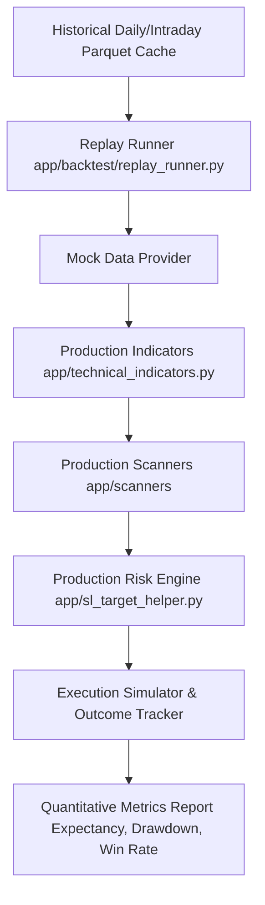

# ELITE BREAKOUT SYSTEM — UPCOMING IMPROVEMENTS & ROADMAP SPECIFICATION

> **Canonical Roadmap Document**: This document outlines the prioritized roadmap of remaining upcoming architectural, quantitative, risk management, and analytics enhancements for the **Elite Breakout System**.
>
> **Status Summary**: Features **F-01, F-03, F-04, F-05, F-07, and F-13** are **100% IMPLEMENTED & VERIFIED** in commit `2402baaf` with 280 passing tests.

| Roadmap Metadata | Value |
|---|---|
| **Document Target** | Active & Remaining System Enhancement Blueprint |
| **Primary Focus** | Backtesting, Portfolio Constraints, & Execution Risk |
| **Governance Standard** | ANTIGRAVITY Rules 1-11 (Impact Analysis, RULE 10 Parameter Rationales) |
| **Baseline Revision** | Commit [`2402baaf`](file:///Users/abhinavmaheshwari/Documents/ELITE_BREAKOUT_SYSTEM/docs/SYSTEM_RECONSTRUCTION_SPEC.md) (`origin/main`) |

---

# 1. Remaining Implementation Roadmap & Priority Matrix

| Feature ID | Category / Name | Priority | Recommendation | Complexity | Target Subsystem | Architectural Rationale |
|---|---|---|---|---|---|---|
| **F-02** | **Replay Backtest Harness** | **P0** | ⭐ Mandatory | High | `app/backtest/` | Allows replaying 2-3 years of historical NSE data through exact production code paths. |
| **F-06** | **Earnings-Date Blackout Filter** | **P1** | ✅ Implement | Low | `app/scanners/` | Suppresses or flags new alerts $N$ days before earnings results to prevent gap-down losses. |
| **F-08** | **Portfolio-Level Risk Constraints** | **P2** | ✅ Implement | Medium | `app/risk_engine.py` | Enforces `MAX_POSITION_PCT`, max open positions, sector concentration, and daily risk budgets. |
| **F-09** | **Delivery % Institutional Conviction** | **P2** | ✅ Implement | Low | `app/daily_builder.py` | Awards quality scoring bonus for high NSE delivery % on breakout day. |
| **F-10** | **Gap-Aware Execution Risk** | **P2** | ⚠️ Investigate | Medium | `app/sl_target_helper.py` | Flags high-gap frequency stocks and adjusts risk budget for illiquidity slippage. |
| **F-11** | **Trade Management & Trailing SL** | **P3** | Later | Medium | `app/trade_manager.py` | Moves SL to breakeven at $1R$ and trails stops below structural swing lows. |
| **F-12** | **Regime-Adaptive Risk Scaling** | **P3** | ⚠️ Carefully | High | `app/config.py` | Dynamically scales `ACCOUNT_RISK_BUDGET_PCT` based on macro regime score. |

---

# 2. Implemented & Verified Upgrades Log (Commit `2402baaf`)

| Feature ID | Feature Name | Implementation Status | Target Module | Verified Capabilities |
|---|---|---|---|---|
| **F-01** | **Alert Outcome Tracking & Analytics** | ✅ **COMPLETED** | `app/outcome_tracker.py` `app/database.py` | Logs trade exits, realized $R$-multiples, running MFE/MAE, same-bar ambiguous SL collision rule, and renders Expectancy Heatmap on Admin UI. |
| **F-03** | **Relative Strength (RS) vs Nifty 50** | ✅ **COMPLETED** | `app/macro_utils.py` `app/eod_scanner.py` | 63-day RS rating relative to Nifty 50 over active scan universe; awards +10 pt RS bonus when $RS \ge 80th$ percentile. |
| **F-04** | **Cross-Scanner Confluence Tier** | ✅ **COMPLETED** | `app/confluence_engine.py` | Independent 3-signal confluence (`FM_Score >= 75` + Signal + `RS >= 80%`) promoting trades to `ELITE_CONFLUENCE_ALERT`. |
| **F-05** | **Financial-Sector Scorer (`_score_fin`)** | ✅ **COMPLETED** | `app/daily_builder.py` | Pure fundamental banking scorer evaluating Net NPA trend, Banded NIM (3.0-6.0%), CAR, and CASA ratio with safe fallbacks. |
| **F-07** | **Sector & Industry Regime Layer** | ✅ **COMPLETED** | `app/macro_utils.py` | Ranks 14 NSE sector indices using blended 63d/21d lookback and 3-session hysteresis rule for +8 pt Tailwind bonus. |
| **F-13** | **Advanced Outcome Analytics & Attribution** | ✅ **COMPLETED** | `app/outcome_tracker.py` `app/admin_dashboard.html` | Preview Mode Analytics engine computing dual confidence badges, feature attribution, score band expectancy, capture efficiency %, and rolling validation. |

---

# 3. Detailed Specifications of Remaining Upcoming Features

## 3.1 Feature F-02: Comprehensive Replay Backtest Harness (P0)

### Architectural Design
A dedicated backtesting runner (`app/backtest/replay_runner.py`) that replays production scanners over 2–3 years of historical daily and intraday OHLCV data using **exact production code paths**:

### Non-Negotiable Contract
- **No Code Drift**: The backtester MUST import `app/technical_indicators.py` and `app/sl_target_helper.py` directly. Writing separate "backtest-only" indicator or SL logic is strictly prohibited.

---

## 3.2 Feature F-06: Configurable Earnings-Date Blackout (P1)

### Technical Specification
Queries company financial calendar data prior to alert generation:
- **Blackout Window**: Suppresses new trade alerts $N$ days (Default: 3 days) prior to quarterly earnings announcements.
- **High-RR Exemption**: Allows alerts if $RR \ge 3.0$ and expected risk distance is small ($SL \le 4.0\%$).

---

## 3.3 Feature F-08: Portfolio-Level Risk Constraints (P2)
Enforces multi-position portfolio risk limits:
- `MAX_OPEN_POSITIONS = 10`
- `MAX_SECTOR_ALLOCATION_PCT = 25.0%`
- `DAILY_PORTFOLIO_RISK_CAP_PCT = 3.0%` (max account equity at risk across all open positions)

---

## 3.4 Feature F-09: Delivery % Institutional Conviction Bonus (P2)
Processes daily NSE Bhavcopy delivery data (`app/delivery_validator.py`):
- Delivery Volume % $\ge 60\%$ on breakout day awards a **+8 point Institutional Conviction bonus**.

---

## 3.5 Feature F-10: Gap-Aware Execution Risk Engine (P2)
Calculates historical overnight gap volatility for each symbol:
- If average 20-day overnight gap $\ge 2.0\%$, applies a **$1.2\times$ slippage buffer** to risk distance calculations.

---

## 3.6 Feature F-11: Trade Management & Trailing SL Engine (P3)
Automates trade management after alert entry:
- **Breakeven Trigger**: Moves SL to entry price once $T_1$ ($1.5R$) is reached.
- **Trailing Stop**: Trails stop loss below the most recent 1H swing low as price advances toward $T_2 / T_3$.

---

## 3.7 Feature F-12: Regime-Adaptive Risk Scaling (P3)
Scales `ACCOUNT_RISK_BUDGET_PCT` based on `MarketRegimeEngine` score:
- `STRONG_BULL` $\rightarrow$ `ACCOUNT_RISK_BUDGET_PCT = 1.25%`
- `BULL` $\rightarrow$ `ACCOUNT_RISK_BUDGET_PCT = 1.0%`
- `SIDEWAYS` $\rightarrow$ `ACCOUNT_RISK_BUDGET_PCT = 0.5%`
- `BEAR` / `STRONG_BEAR` $\rightarrow$ `ACCOUNT_RISK_BUDGET_PCT = 0.0%` (Trading Halted)

---

## 3.8 Feature F-13: Advanced Outcome Analytics & Feature Attribution (P2)
Extends `app/outcome_tracker.py` and Admin API endpoints to analyze historical trade outcomes once live trade count reaches statistical significance ($N \ge 100$):
- **Feature Attribution**: Calculates win rate and average $R$-multiple per isolated feature ($RS \ge 80$ vs $RS < 80$, Sector Tailwind vs No Tailwind).
- **Expectancy by Score Bands**: Evaluates expectancy across score ranges (70–75, 75–80, 80–85, 85–90, 90+) to detect if increasing score thresholds improves expectancy.
- **Score Calibration Monitoring**: Tracks expected win rates vs observed success rates per score tier to monitor calibration accuracy.
- **Rolling Window Validation**: Computes rolling 3-month and 6-month expectancy metrics to detect strategy regime shifts or alpha decay over time.

---

# 4. Governance & Strategy Change Validation Protocol

Per [`ANTIGRAVITY.md`](file:///Users/abhinavmaheshwari/Documents/ELITE_BREAKOUT_SYSTEM/ANTIGRAVITY.md) governance rules, any future strategy parameter change or new feature deployment MUST satisfy the **6-Metric Validation Protocol** using the Replay Backtest Harness (F-02):

1. **Hypothesis**: Clearly state what behavior should improve.
2. **Backtest Period**: Run over identical 2-year historical dataset.
3. **Evaluation Metrics**:
   - Total Alert Count & Frequency
   - Realized Win Rate (%)
   - Realized Risk-to-Reward Ratio ($R$)
   - System Expectancy ($R$ per trade)
   - Maximum Equity Drawdown (%)
   - Sector Concentration Variance
4. **Adoption Criteria**: Adopt the change **ONLY IF** system expectancy increases with statistical significance without inflating maximum drawdown.
