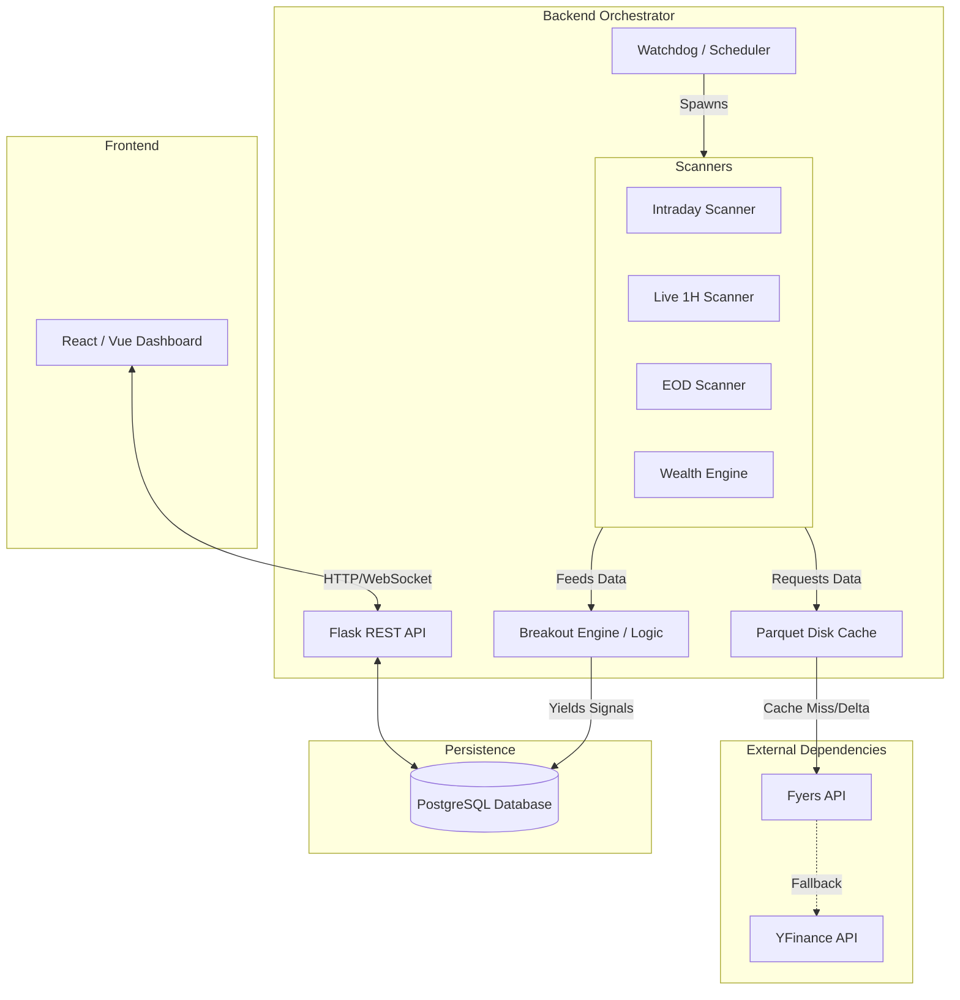
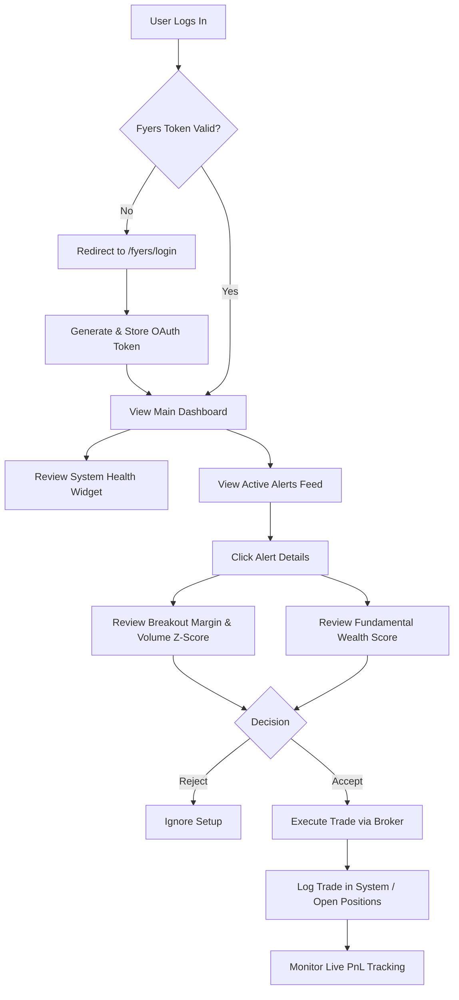
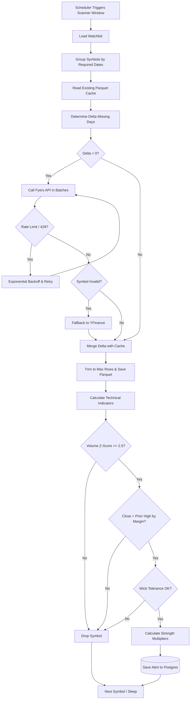

# Project Documentation Specification: Elite Breakout System

## 1. Executive Summary & Product Vision

### Problem Statement
Retail traders and self-directed investors suffer from information overload. Identifying high-probability trading setups in a sea of thousands of listed equities requires manually merging fundamental analysis (balance sheets, valuations) with real-time technical momentum (breakouts, volume surges, relative strength). Relying on disparate tools leads to missed opportunities, "fake" breakouts, and emotional trading errors. 

### Core Value Proposition
The **Elite Breakout System** bridges the gap between institutional-grade quantitative screening and retail accessibility. It is a highly autonomous, self-healing algorithmic system that continuously scans the market to identify stocks possessing an optimal blend of solid fundamentals and explosive momentum. The system mathematically qualifies setups using anti-fake-breakout logic, generates high-conviction signals for both active trading and long-term wealth compounding, and presents them in a unified, noise-free dashboard.

---

## 2. User Roles & Core Functionalities (Frontend)

### Persona 1: The Active Trader / Investor
The primary consumer of the system. This persona relies on the system to spoon-feed them mathematically validated, high-conviction setups.

**Core Functionalities:**
- **Unified Alert Feed:** A real-time chronological stream of system-generated signals across all timeframes (Intraday, 1H, EOD, Reversal).
- **Wealth Engine Screener:** Access to a sorted list of equities ranked by the proprietary 100-Point Fundamental & Momentum Score.
- **Position Tracking:** Monitor live PnL, trailing stop-losses, and performance metrics for active open positions.
- **System Health Monitor:** View the real-time operational status of background scanners (OK, DEGRADED, DOWN).
- **Brokerage Integration (Fyers):** Secure OAuth token generation and active session management for market data access.

### Persona 2: The System Administrator
(Often the same as the Active Trader, but interacting with the system at a configuration level).

**Core Functionalities:**
- **Environment Management:** Configure API limits, define breakout lookback windows, and tweak multiplier thresholds via system configurations.
- **Database Operations:** Clear stale alerts, trigger manual fundamental data rebuilds, or flush price caches.

---

## 3. Dashboard & Analytics Functionalities

### Main Dashboard Widgets & KPIs
- **Global Portfolio Metrics:** Total Realized PnL, Active Open PnL, Win/Loss Ratio, and Overall Market Breadth (Advancers vs. Decliners).
- **Scanner Health Matrix:** A visual traffic-light system (Green/Yellow/Red) showing the operational status of the Intraday, 1H Live, EOD, and Reversal scanners.
- **Top Wealth Picks (Leaderboard):** A top-10 list of stocks scoring >80 on the 100-Point Wealth Engine schema.
- **Active Breakouts (Live Ticker):** A scrolling list or dedicated widget showing stocks currently piercing their 52W or Session highs with volume confirmation.

### Data Visualizations
- **Equity Curve Chart:** Time-series line chart tracking cumulative PnL of system-generated signals over time.
- **Sector Allocation Pie Chart:** Visual breakdown of current open positions by industry sector.
- **Fundamental Radar Chart:** A pentagon-shaped radar chart for Wealth Engine stocks visualizing the balance between Quality, Growth, Valuation, Momentum, and Cash Flow.

### Filtering & Export Capabilities
- **Date Ranges:** Filter historical alerts by Today, This Week, This Month, or Custom Date Range.
- **Signal Types:** Toggle switches to isolate specific signals (e.g., *Show only 'Volume Surge'* or *Hide 'Session Breakout'*).
- **Export:** 1-click CSV/Excel export of the filtered alert table or current open positions for external journaling.

---

## 4. Business Logic & Decision Matrix

### Technical Rules Engine (Anti-Fake-Breakout Logic)
When a scanner evaluates a stock, it must pass a strict hierarchy of gates before an alert is fired:
1. **Closing Price Confirmation:** The candle's `Close` must exceed the rolling maximum of the previous *N* periods.
2. **Anti-Wick Tolerance:** The candle's `Low` must be $> \text{Resistance} \times 0.997$. (The body must sit above the level; wicks piercing the level are rejected).
3. **Minimum Breakout Margin:** The close must exceed the resistance by a timeframe-adjusted margin (e.g., 0.5% for 1H, 0.7% for EOD).
4. **Volume Z-Score Check:** The breakout candle's volume must have a Z-Score $\ge 2.5$ relative to the 20-period moving average. 
   - *Decision:* If Volume Z-Score $< 2.5 \rightarrow$ REJECT (Low conviction).
5. **Divergence Penalty:** If On-Balance Volume (OBV) is trending downwards while price breaks out, the generated signal strength is penalized by 50%.

### Fundamental Rules Engine (100-Point Wealth Engine)
When evaluating for long-term wealth, the decision matrix scores the stock across 6 dimensions:
- **Quality (25 pts):** Meets ROE $> 15\%$, ROCE $> 15\%$, Debt-to-Equity $< 0.5$.
- **Growth (25 pts):** Positive YoY Revenue and Net Profit growth.
- **Valuation (10 pts):** PEG Ratio $< 1.0$ (Max Points) vs PEG $> 1.5$ (Zero Points).
- **Momentum (20 pts):** Relative strength vs Nifty index over 6 months $> 0$.
- **Cash Flow (10 pts):** Positive Free Cash Flow Margin.
- **Ownership (10 pts):** Institutional (FII/DII) accumulation quarter-over-quarter.

*Action Matrix:* If Total Score $> 80 \rightarrow$ Flag as "Strong Buy". If Total Score $< 50 \rightarrow$ Filter out of dashboards entirely.

---

## 5. Deep Dive: The Scanner Lifecycle (End-to-End)

To understand exactly how the system processes data, here is the granular step-by-step lifecycle of a single scan cycle (e.g., the `Live 1H Scanner`).

### Step 1: Input Generation (The Watchlist)
Before any API calls are made, the scanner needs to know *what* to scan.
- **Source:** The system relies on `watchlist_cache.py` which returns a Pandas DataFrame of active symbols.
- **Cache Hit:** If the watchlist was already built today, it serves the list instantly from in-memory cache.
- **Disk/DB Restore:** If the memory is empty (e.g., server rebooted), it attempts to read `data/active_watchlist.parquet` from the local disk. If missing, it queries the PostgreSQL database to download the latest `.parquet` file to avoid rebuilding.
- **Fallback (Daily Builder):** If all caches are empty, `daily_builder.py` is invoked. It connects to the NSE, downloads the entire active F&O and Nifty 500 universe, applies a baseline liquidity filter (excluding penny stocks or illiquid options), and saves the `active_watchlist.parquet`.

### Step 2: Data Acquisition & Parquet Merging
The scanner passes the `watchlist` to `fetch_watchlist_data()` in `price_cache.py`.
- **Read Local Cache:** For every symbol, the system reads `data/history/<interval>/<symbol>.parquet`.
- **Identify Delta:** It finds the timestamp of the last recorded candle. If the last candle is from June 21st, and today is June 23rd, the `range_from` is set to June 21st.
- **API Fetch:** The system batches these symbols (max 3 concurrent workers to protect rate limits) and calls the `Fyers API` requesting *only* the delta dates.
- **Merge & Deduplicate:** The newly fetched 2 days of data are concatenated with the 200 days of data loaded from the Parquet file. Any overlapping candles (due to timezone offsets or partial days) are deduplicated by keeping the `last` entry.
- **Cap & Save:** The merged DataFrame is capped at a maximum row count (e.g., 5000 rows for 15m data) to prevent infinite memory growth, and instantly saved back to disk, overwriting the old `.parquet` file.
- **Return:** The scanner now has a fully updated, massive DataFrame for every symbol without having requested it all from the API.

### Step 3: Qualification (Indicator Calculation & Breakout Engine)
The scanner iterates over the dictionary of updated DataFrames. For each stock:
1. **Apply Indicators:** It runs `apply_indicators(df)`. This calculates technicals using pandas vectorization: SMA, EMA, MACD, Bollinger Bands, RSI, Average True Range (ATR), and On-Balance-Volume (OBV). It also calculates structural metrics like `BASE_WIDTH` (the tightness of the current consolidation).
2. **Breakout Engine Detection:** The DataFrame is passed to `breakout_engine.detect_breakouts()`.
3. **The Logic Gates:**
   - **Gate 1 (Volume Confirmation):** Is the current candle's volume $\ge 2.5$ standard deviations above the 20-bar average?
   - **Gate 2 (Close Margin):** Did the closing price pierce the 20-bar rolling maximum by at least 0.5% (for 1H)?
   - **Gate 3 (Wick Tolerance):** Is the candle's Low sitting above the breakout level (preventing fake wick breakouts)?
4. **Scoring:** If all gates pass, a raw score is generated. This score is mathematically boosted if `BASE_WIDTH` is extremely tight (1.5x multiplier) or penalized if `OBV` is trending downwards (0.5x multiplier).

### Step 4: Rejection Handling & Diagnostics
If a stock fails, it is not simply ignored; the system explicitly categorizes the failure to maintain a diagnostic heartbeat. The scanner tracks a `rejection_counts` dictionary:
- `no_data`: The API returned a completely empty dataframe.
- `missing_col`: The API dropped a required column (e.g., 'Volume' missing from YFinance).
- `forming_candle_stripped`: The current candle has not finished forming yet (preventing premature alerts).
- `insufficient_bars`: The stock IPO'd recently and does not have the minimum required bars (e.g., < 200 bars for EOD).
- `indicator_fail`: The pandas indicator calculation resulted in NaNs.
- `stale_data`: The last timestamp in the dataframe is from a previous day (Market is closed or API is halted).

### Step 5: Alert Generation
If a stock passes the Breakout Engine, it generates an alert dictionary containing:
- `symbol`: The NSE ticker (e.g., `NSE:RELIANCE-EQ`).
- `timestamp`: The exact timestamp of the breakout candle.
- `signals`: A JSON dictionary of the breakout types and their calculated strength scores (e.g., `{"52W Breakout": 24.5, "Volume Surge": 15.2}`).
- `metrics`: Key indicators at the time of breakout (RSI, Breakout Margin %, Volume Z-Score).

### Step 6: Persistence & Saving
The final phase is saving the data safely to the PostgreSQL database (`database.py`):
1. **Upsert Alerts:** The alert is inserted into the `alerts` table. If the same alert was generated in a previous scan cycle (same symbol, same interval, same timestamp), it is treated as an `UPSERT` to update the signal strength without duplicating the UI row.
2. **Scanner Health:** The system updates the `scanner_health` table for this specific scanner, setting `status='OK'` and `last_run=NOW()`. If the scanner hit excessive rate limits or errors, it sets `status='DEGRADED'` along with the error message.
3. **Fetch Errors:** Any symbols that completely failed to return data from the APIs are logged in the `fetch_errors` table for admin review (allowing the admin to investigate delisted stocks or BE series migrations).

## 6. Visual Flow Charts (Mermaid.js)

### System Architecture Diagram

### User Journey Flowchart

### Backend Scanner Logic Flowchart

