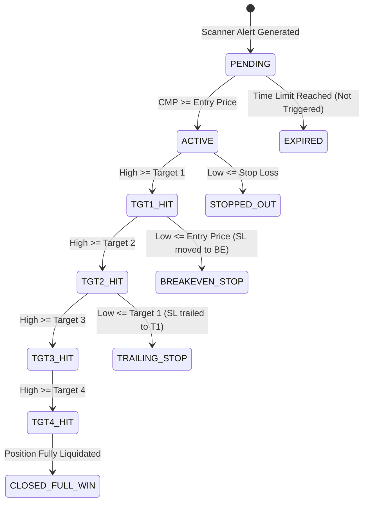

# MASTER ACTIVE SCANNERS SPECIFICATION & AUDIT REPORT
**Document Version:** 4.0.0 (Forensic Production Specification)  
**As of Date:** 2026-09-26  
**System Timezone:** Asia/Kolkata (IST)  
**System Base Currency:** Indian Rupee (INR / ₹)  
**Audience:** External Quantitative & Systems Risk Analysis Team  
**Scope:** Complete architectural, algorithmic, mathematical, and operational breakdown of all active scanners, filters, rejection mechanisms, and risk models in the production system.

---

## EXECUTIVE SUMMARY & AUDIT INVENTORY

The Elite Breakout System is an institutional-grade, multi-strategy quantitative scanning and trade lifecycle platform operating on the National Stock Exchange of India (NSE) and Bombay Stock Exchange (BSE). All strategies strictly adhere to:
1. **Real Exchange Data:** 100% real BSE/NSE historical and live feed data (tick, 5m, 15m, 30m, 1h, 1d OHLCV, Bhavcopy delivery volume, and promoter pledge records).
2. **Point-in-Time Causality:** Strict zero-lookahead / zero forward-looking guarantees ($T \le t$).
3. **Decommissioning Enforcement:** All legacy `SHORT_COVERING` variants (`SHORT_COVERING_5M`, `SHORT_COVERING_EOD`, `SHORT_COVERING_DAILY`) and `MOMENTUM_THRUST_REVERSAL_H0` have been excised from active execution.

### Master Scanner Status Inventory

| Scanner Identifier | Operational Mode | Execution Cadence / Schedule | Primary Mechanism | Status |
| :--- | :--- | :--- | :--- | :--- |
| **`DAILY_BUILDER`** | Daily Pre-Market | 05:00 IST Weekdays | Master liquid universe & fundamental screening | **ACTIVE** |
| **`MULTI_TF`** | Intraday (15m Aligned) | 09:30, 09:45 … 15:15 IST (+20s buffer) | Multi-timeframe trend & squeeze arming | **ACTIVE** |
| **`MULTI_TF_5M`** | Intraday (5m Monitor) | 09:35, 09:40, 09:50 … 15:25 IST | High-frequency confirmation of armed setups | **ACTIVE** |
| **`EOD`** | Post-Market EOD | 18:30 IST Weekdays (Post-Bhavcopy) | Stage 2 base breakout with delivery volume | **ACTIVE** |
| **`REVERSAL`** | Post-Market EOD | 18:30 IST Weekdays (Post-Bhavcopy) | Dual-path mean reversion & base reclaim | **ACTIVE** |
| **`PULLBACK`** | Post-Market EOD | 18:30 IST Weekdays (Post-Bhavcopy) | Impulse retracement to key moving averages | **ACTIVE** |
| **`ACCUMULATION`** | Post-Market EOD | 18:35 IST Weekdays (Post-Bhavcopy) | Volatility Contraction Pattern (VCP) & cheat pivots | **ACTIVE** |
| **`TECHNICAL`** | Post-Market EOD | 18:15 IST Weekdays | Classical multi-pattern chart breakout recognition | **ACTIVE** |
| **`TECHNICAL_INTRADAY`** | Intraday (15m Aligned) | 09:16, 09:31, 09:46 … 15:16 IST | Intraday 15m bull flags & technical breaks | **ACTIVE** |
| **`WEALTH_ENGINE`** | Daily Off-Market | 06:00 IST & 17:00 IST Weekdays | Fundamental DCF, compounder ranking & allocation | **ACTIVE** |
| **`MULTIBAGGER`** | Daily Post-Market | 17:30 IST Weekdays | 3-5 Year growth compounder discovery | **ACTIVE** |
| **`PERFORMANCE_TRACKER`**| Intraday Real-Time | Every 5 minutes (09:15–15:30 IST) | Position lifecycle, trailing stops & target execution| **ACTIVE** |
| **`MULTIBAGGER_EXIT`** | Intraday Real-Time | Every 5 minutes (09:15–15:30 IST) | 10-week EMA trailing stop monitor | **ACTIVE** |
| **`WEALTH_EXIT`** | Intraday Real-Time | Every 5 minutes (09:15–15:30 IST) | Portfolio CMP & structural stop monitor | **ACTIVE** |
| **`PLEDGE_WORKER`** | Background Daemon | Continuous daily polling | Scrapes NSE promoter pledge filings | **ACTIVE** |
| **`AI_WORKER`** | Background Daemon | Continuous queue processor | Gemini AI concall & corporate announcement audit | **ACTIVE** |
| `SHORT_COVERING_5M` | — | Permanent Decommission | Replaced & Permanently Excluded | **STOPPED / EXCISED** |
| `SHORT_COVERING_EOD`| — | Permanent Decommission | Statistical Holdout Failure | **STOPPED / EXCISED** |
| `SHORT_COVERING_DAILY`| — | Permanent Decommission | Counterfactual Analysis Failure | **STOPPED / EXCISED** |
| `MOMENTUM_THRUST_H0`| — | Permanent Decommission | Research Variant Retired | **STOPPED / EXCISED** |

---

## SCANNER 1: DAILY_BUILDER (Master Universe Generation)

### 1. Execution Cadence & Schedule
- **Schedule:** Weekdays (Monday–Friday) at **05:00 IST**.
- **Execution Architecture:** Standalone batch pipeline executing via `SystemScheduler` with process-level file locking (`ProcessLock("global_scanner_lock")`) and memory profiling (`MemoryProfiler`).
- **Data Inputs:** Complete NSE & BSE equities master universe (~2,200 listed companies), daily OHLCV parquet histories (minimum 1 year), latest quarterly financial statements (screener/BSE filings).

### 2. Step-by-Step Screening Cascade & Alert Logic
The Daily Builder evaluates every stock in the universe to construct the pristine master watchlist (`data/watchlist.parquet`) that fuels all subsequent scanners.
1. **Historical Bar Sufficiency:**
   $$\text{Bar Count} \ge 50 \text{ daily bars}$$
   IPOs and newly listed stocks with fewer than 50 bars are excluded to prevent distorted moving average calculations.
2. **Absolute Price Floor:**
   $$\text{Close Price} \ge \text{₹100.00}$$
   Penny stocks and illiquid micro-caps below ₹100 are strictly filtered out.
3. **Liquidity & Turnover Gate:**
   $$\text{Turnover}_{\text{20D Average}} = \frac{1}{20} \sum_{i=1}^{20} (\text{Close}_i \times \text{Volume}_i) \ge \text{₹1.00 Crore (₹10,000,000)}$$
4. **Promoter Blacklist & Surveillance Filter:**
   - Cross-checks against the persistent `_BLACKLIST_SYMBOLS` database.
   - Automatically excludes companies under NSE/BSE Additional Surveillance Measure (ASM) or Graded Surveillance Measure (GSM) frameworks.
5. **Leverage & Debt Ceiling:**
   $$\frac{\text{Debt}}{\text{Equity}} \le 2.00$$
   *(Exemption: Commercial banks, NBFCs, and capital-intensive power/utility infrastructure companies are exempt from the debt-to-equity ceiling).*
6. **Operating Profitability Floor:**
   $$\text{Operating Profit Margin (OPM)} \ge 0.0\%$$
   Unprofitable operational businesses with negative margins are rejected.
7. **Fundamental Dual-Path Classification:**
   - **Path A (Non-Financial Equities):** Requires $\text{YoY Sales Growth} \ge 15.0\%$ OR $\text{YoY PAT Growth} \ge 15.0\%$ with $\text{ROE} \ge 12.0\%$. Turnaround exception granted if $\text{YoY Profit Growth} \ge 30.0\%$.
   - **Path B (Financial Institutions & Banks):** Requires $\text{YoY Revenue Growth} \ge 15.0\%$, $\text{ROA} \ge 0.8\%$, $\text{ROE} \ge 10.0\%$, and $\text{Gross NPA} \le 5.0\%$.

### 3. Rejection Reasons & Failure Codes
If a symbol fails any check, it is immediately discarded and recorded in the system `EXCLUSION_LOG`:
- `INSUFFICIENT_BARS`: Available trading history $< 50$ daily candles.
- `PENNY_STOCK`: Last traded price $< \text{₹100.00}$.
- `LOW_LIQUIDITY`: 20-day average turnover $< \text{₹1.0 Crore}$.
- `PROMOTER_BLACKLIST / SURVEILLANCE`: Stock listed on ASM/GSM or promoter integrity flags active.
- `HIGH_LEVERAGE`: $\text{D/E} > 2.0$ for non-exempt sectors.
- `NEGATIVE_OPM`: Operating margin $< 0\%$.
- `GROWTH_FAIL`: Fails both Compounder and Turnaround fundamental growth hurdles.

### 4. Stop Loss & Target Calculation
- The Daily Builder does not generate direct execution buy orders; it produces the vetted master watchlist (`data/watchlist.parquet`) enriched with fundamental scores (0–100), sector classifications, and technical reference levels.

---

## SCANNER 2: MULTI_TF & MULTI_TF_5M (Multi-Timeframe Breakout Engine)

### 1. Execution Cadence & Schedule
- **MULTI_TF (Primary Intelligence Layer):** Aligned to **15-minute closed candle boundaries** with an intentional **+20-second settlement buffer**:
  $$\text{Trigger Times: } 09:30, 09:45, 10:00, 10:15, 10:30, 10:45, 11:00 \dots 15:15 \text{ IST}$$
- **MULTI_TF_5M (Confirmation Trigger Layer):** Runs on intermediate **5-minute completed candle boundaries** with a **+15-second buffer**:
  $$\text{Trigger Times: } 09:35, 09:40, 09:50, 09:55, 10:05 \dots 15:25 \text{ IST}$$
- **Late Session Cutoff:** No new entries permitted after **14:15 IST** (prevents intraday friction on late-session mean-reverting chop).
- **Data Inputs:** Pre-warmed 1H OHLCV parquet cache, live 15m OHLCV, live 5m OHLCV, live 1-day reference ATR.

### 2. Step-by-Step Screening Cascade (Phases A through D)

#### Phase A (1H Trend Permission Gate — Hourly Evaluation)
Every symbol must first prove structural hourly strength:
1. **Price Floor:** $\text{Close} \ge \text{₹20.00}$.
2. **Moving Average Stack:**
   $$\text{Close} > \text{EMA}_{20} > \text{SMA}_{50}$$
   $$\text{Close} > \text{SMA}_{200} \quad (\text{if } \text{SMA}_{200} > 0)$$
3. **Directional Slope Gate:**
   $$\text{Slope}(\text{EMA}_{20}) = \frac{\text{EMA}_{20}(t) - \text{EMA}_{20}(t-2)}{2} > 0$$
4. **Hourly RSI Confirmation:**
   $$52.0 \le \text{RSI}_{1\text{H}} \le 87.0$$
5. **Breakout Proximity:**
   $$\text{Dist}_{\text{Breakout}} = \frac{\text{Prior 20D High} - \text{Close}}{\text{Prior 20D High}} \in [-0.06, +0.08]$$
   *(Candidate must be within -6.0% to +8.0% of the 20-day structural high).*
6. **Exhaustion Guard (Anti-Blowoff Filter):**
   If $\text{Volume Ratio}_{1\text{H}} > 6.0\text{x}$, the candidate is rejected if:
   - Candle range $> 2.5 \times \text{ATR}_{1\text{H}}$, OR
   - Upper wick $> 40\%$ of total range, OR
   - Distance from $\text{VWAP} > 3.0 \times \text{ATR}_{1\text{H}}$.
- **Outcome:** Passing stocks are saved to DB state as `HOURLY_APPROVED`.

#### Phase B (30m Bollinger Squeeze Arming Gate)
1. **Consolidation Detection:** Evaluates Bollinger Band Width Percentile ($\text{BBWP}$) across the previous 8 bars of 30-minute data:
   $$\min_{1 \le k \le 8} \left( \text{BBWP}_{t-k} \right) < 0.45 \quad \text{AND} \quad \text{Dist}_{\text{Breakout}} \in [-0.05, +0.06]$$
2. **Fast Breakout Override:** If no squeeze was detected, passes if:
   $$\text{Dist}_{\text{Breakout}} < -0.005 \quad \text{AND} \quad \text{Volume Ratio}_{30\text{m}} \ge 1.10\text{x}$$
3. **Decay & Invalidation:** If price drifts $> 3.0\%$ below the breakout level or remains armed without triggering for $> 4\text{ hours}$ while drifting $> 1.5\%$, it is demoted back to `HOURLY_APPROVED` with a 2-hour cooldown.
- **Outcome:** Passing stocks transition to `SETUP_ARMED`.

#### Phase C (15m Micro-Alignment Gate)
Evaluated on closed 15-minute candles:
1. **Micro Trend Alignment:**
   $$\text{Close}_{15\text{m}} \ge \text{EMA}_{20, 15\text{m}} \quad \text{OR} \quad \text{EMA}_{9, 15\text{m}} \ge (0.998 \times \text{EMA}_{20, 15\text{m}})$$
2. **Breakout Zone Proximity:** $\text{Dist}_{\text{Breakout}} \in [-0.06, +0.06]$.
- **Outcome:** Passing stocks transition to `ENTRY_READY`.

#### Phase D (5m Live Execution Trigger Gate)
Evaluated in real-time or on 5m closed candles:
1. **Over-Extension Ceiling:**
   $$\text{Close}_{5\text{m}} \le \text{Trigger Level} + (0.80 \times \text{ATR}_{\text{Daily}})$$
   *(Rejects trades if price has already run $> 0.8 \text{ ATR}$ past the pivot).*
2. **Trigger Pattern Selection:** Must satisfy one of two triggers:
   - **Pattern 1: Thrust Breakout:**
     $$\text{Close}_{5\text{m}} > \text{High}_{t-1} \quad \text{AND} \quad \text{Close}_{5\text{m}} > (\text{Trigger Level} + 0.15 \times \text{ATR}_{5\text{m}})$$
     $$\text{Volume Expansion: } \text{RVOL}_{\text{Diurnal}} \ge 1.20\text{x} \quad \text{OR} \quad \text{RVOL}_{\text{Rolling 20}} \ge 1.25\text{x}$$
     $$\text{Close Position: } \frac{\text{Close} - \text{Low}}{\text{High} - \text{Low}} \ge 0.60 \quad (\text{Top 40\% of candle})$$
   - **Pattern 2: High-Conviction Pullback Defense:**
     Price tests the breakout level ($\text{Low} \le \text{Trigger Level} + 0.15 \times \text{ATR}_{5\text{m}}$) and forms a bullish engulfing resumption candle:
     $$\text{Close} > \text{Open} \quad \text{AND} \quad \text{Close} \ge \text{Trigger Level} \quad \text{AND} \quad \text{Close} > \text{Close}_{t-1}$$
     $$\text{Volume Ratio}_{5\text{m}} \ge 1.15\text{x} \quad \text{AND} \quad \text{Close Position} \ge 0.60$$

### 3. Rejection Reasons & Failure Codes
- `1H_TREND_MISALIGNED`: Close $< \text{EMA}_{20}$ or $\text{EMA}_{20} < \text{SMA}_{50}$ on 1H chart.
- `1H_RSI_OUT_OF_BOUNDS`: 1H RSI $< 52$ (weak momentum) or $> 87$ (overbought).
- `VOLUME_EXHAUSTION`: RVOL $> 6.0\text{x}$ with upper wick $> 40\%$ or candle range $> 2.5 \times \text{ATR}$.
- `PD01_OVER_EXTENDED`: Price extended $> 0.80 \times \text{Daily ATR}$ past breakout level.
- `PD02_ENGULF_FAIL`: Pullback setup failed to close above previous candle's close.
- `PD03_VOLUME_FAIL`: Trigger candle volume expansion failed ($< 1.15\text{x}$ or $< 1.25\text{x}$).
- `PD04_WEAK_CLOSE`: Close position $< 0.60$ (heavy selling into the close).
- `RISK_TOO_TIGHT`: Total calculated stop distance $< 1.20\%$ of entry price.
- `SL_BELOW_ENTRY_INVALID`: Stop loss computed at or above entry price.

### 4. Stop Loss, Target, and R:R Mathematical Formulation
- **Support Anchor Selection:** Identifies the highest structural support below entry:
  $$\text{Support Anchor} = \max(\text{Swing Low}_{5\text{m}}, \text{Swing Low}_{15\text{m}}, \text{VWAP}, \text{EMA}_{20}, \text{S1 Pivot})$$
- **Buffer Subtraction:**
  $$\text{Stop Loss} = \text{Support Anchor} - (0.15 \times \text{ATR}_{5\text{m}})$$
  $$\text{Clamped Constraint: } \text{Entry} - (2.5 \times \text{ATR}_{5\text{m}}) \le \text{Stop Loss} \le \text{Entry} \times 0.988$$
- **Target Consensus Clustering (`ClusterEngine`):**
  - Generates candidate targets: $1.5\text{x}, 2.0\text{x}, 2.5\text{x}, 3.0\text{x}$ Risk, Fibonacci extensions ($127.2\%, 161.8\%$), Round Psychological Numbers (e.g. ₹500, ₹1000).
  - Round Number Front-Running: Deducts $\min(0.25 \times \text{ATR}, 0.003 \times \text{RoundPrice})$ to ensure fill before institutional walls.
- **Risk-Reward Threshold:**
  $$\text{Natural R:R} = \frac{\text{Target}_1 - \text{Entry}}{\text{Entry} - \text{Stop Loss}} \ge 1.50$$
  If $\text{Natural R:R} < 1.50$, the alert is suppressed (`NO_VALID_STRUCTURAL_TARGET`).

---

## SCANNER 3: EOD (End-of-Day Momentum Breakout Engine)

### 1. Execution Cadence & Schedule
- **Schedule:** Weekdays at **18:30 IST** (triggered immediately upon verification of official NSE Bhavcopy delivery data).
- **Execution Architecture:** Part of sequential evening batch (`ACCUMULATION` $\rightarrow$ `EOD` $\rightarrow$ `REVERSAL` $\rightarrow$ `PULLBACK`) wrapped inside `ProcessLock("global_scanner_lock")`.
- **Data Inputs:** Verified daily Bhavcopy delivery volume & percentage, 1-day OHLCV parquet data, 20-day Nifty 50 benchmark return, promoter pledge register.

### 2. Step-by-Step Screening Cascade & Alert Logic
1. **Price Floor:** $\text{Close} \ge \text{₹20.00}$.
2. **Liquidity Floors:**
   $$\text{Volume Ratio} = \frac{\text{Volume}_t}{\frac{1}{20} \sum_{i=1}^{20} \text{Volume}_{t-i}} \ge 1.80\text{x}$$
   $$\text{Average Volume}_{\text{20D}} \ge 50,000 \text{ shares}$$
3. **RSI Gating Corridor:**
   $$50.0 \le \text{RSI}_{14} \le 92.0$$
   *(If $\text{RSI} \in [88.0, 92.0]$, a graduated overextension penalty of $2.5 \times (\text{RSI} - 88)$ is deducted from the score, capped at -10 points).*
4. **Structural Breakout Requirement:**
   $$\text{Close} > \text{PRIOR\_20D\_HIGH}$$
5. **ATR Volatility Expansion Gate:**
   $$\text{Expansion Ratio} = \frac{\text{High} - \text{Low}}{\text{ATR}_{20}} \ge 0.90 \quad (\text{Circuit candles exempt})$$
6. **Macro Trend Alignment:**
   $$\text{Close} > \text{EMA}_{20} \quad \text{AND} \quad \text{Close} > \text{SMA}_{50} \quad \text{AND} \quad \text{ADX}_{14} \ge 20.0$$
7. **52-Week High Distance (Two-Mode Architecture):**
   - **Mode A (High Breakout):** $\text{Distance from 52W High} \le 5.0\%$.
   - **Mode B (Recovery Breakout):** If $\text{Distance} \in (5.0\%, 15.0\%]$, permits qualification ONLY IF:
     $$\text{Volume Ratio} \ge 2.50\text{x} \quad \text{AND} \quad \text{BBWP}_{\text{Prior}} \le 0.50 \quad \text{AND} \quad \text{RS Percentile} \ge 60.0$$
     *(Applies a -5 point recovery score deduction).*
8. **Single-Day Extension Cap:**
   $$\frac{|\text{Close}_t - \text{Close}_{t-1}|}{\text{Close}_{t-1}} \le 15.0\%$$
9. **Base Volatility Calibration (ATR10 Tightness Model):**
   $$\text{Base ATR\%} = \frac{\text{ATR}_{10}}{\text{Close}_{t-1}} \times 100$$
   - $\text{Base ATR\%} \le 2.50\%$: 0 penalty (optimal coiling).
   - $\text{Base ATR\%} \in (2.50\%, 3.50\%]$: -3 point penalty.
   - $\text{Base ATR\%} \in (3.50\%, 4.50\%]$: -7 point penalty.
   - $\text{Base ATR\%} \in (4.50\%, 6.00\%]$: -12 point penalty.
   - $\text{Base ATR\%} > 6.00\%$: **HARD REJECT** (`BASE_ATR_TOO_WIDE`).
10. **Three-Bucket Penalty Architecture:**
    - **Bucket A (Candle Quality, Cap -15):** Body ratio $< 50\%$ (up to -15), Bearish close (-5), Close position $< 60\%$ (up to -10), Upper wick $> 30\%$ (up to -10).
    - **Bucket B (Gap & Overextension, Cap -15):** Gap $> 3.0\%$ above prior high, extension $> 1.5\text{x ATR}$.
    - **Bucket C (OBV Divergence, Cap -5):** $\text{OBV Slope} \le 0$.
    - **Triple-Fault Veto:** If Bucket A $\ge 15$, Bucket B $\ge 15$, and Bucket C $> 0$, candidate is rejected if post-deduction score $< 75$.
11. **Composite Score Threshold:**
    $$\text{Final Score} \ge 82.0 / 100$$
    *(Incorporates Bayesian signal weights, sector rotation tailwinds (+5 if leading), and RS rating (+5 if RS $\ge 80$)).*
12. **Idempotency & Cooldown Gate:**
    Alert rejected if the symbol received an EOD alert in the preceding **1,440 minutes (24 hours)**.

### 3. Stop Loss, Target, and R:R Mathematical Formulation
- **Volatility-Adaptive Stop Geometry (`_compute_eod_adaptive_stop`):**
  $$\text{Multiplier } M = \begin{cases} 1.4 & \text{if } \text{ATR\%} < 2.5\% \\ 1.8 & \text{if } 2.5\% \le \text{ATR\%} \le 4.0\% \\ 2.2 & \text{if } \text{ATR\%} > 4.0\% \end{cases}$$
  $$\text{Stop Distance \%} = \text{clamp}\left( \frac{M \times \text{ATR}_{20}}{\text{Entry}}, 0.035, 0.080 \right)$$
  $$\text{Stop Loss} = \text{round}(\text{Entry} \times (1.0 - \text{Stop Distance \%}), 2)$$
  *(Eliminates arbitrary base stops by strictly locking risk within a 3.5% to 8.0% corridor).*
- **Consensus Target Modeling:**
  Targets are clustered using `ClusterConsensusStrategy` across prior swing highs, 52W high extensions, and Fibonacci expansions ($127.2\%, 161.8\%, 200\%$).
- **Minimum Natural R:R:**
  $$\text{Natural R:R} = \frac{\text{Target}_1 - \text{Entry}}{\text{Entry} - \text{Stop Loss}} \ge 2.00$$

---

## SCANNER 4: REVERSAL (Oversold Mean Reversion & Base Reclaim Engine)

### 1. Execution Cadence & Schedule
- **Schedule:** Weekdays at **18:30 IST** (post-Bhavcopy evening batch).
- **Execution Architecture:** Sequential execution with DB-backed deduping and Bayesian scoring.
- **Data Inputs:** Verified daily Bhavcopy delivery, minimum 35 daily bars, 250-bar rolling highs, promoter pledge data.

### 2. Step-by-Step Screening Cascade & Dual-Path Architecture
1. **Price Floor:** $\text{Close} \ge \text{₹20.00}$.
2. **Liquidity:** $\text{Average Volume}_{\text{20D}} \ge 50,000 \text{ shares}$.
3. **52-Week High Drawdown Band:**
   $$\text{Drawdown} = \frac{\text{High}_{\text{52W}} - \text{Close}}{\text{High}_{\text{52W}}} \times 100 \in [15.0\%, 45.0\%]$$
   *(Extended up to 55.0% only for mature stocks holding within 10% of their 200 SMA).*
4. **Structural Breakdown Limit:**
   - Mature Stocks: Price cannot be $> 20.0\%$ below the 200 SMA.
   - Recent Listings (50–199 bars): Price cannot be $> 20.0\%$ below the 50 SMA.
   - Fresh IPOs (35–49 bars): Price cannot be $> 15.0\%$ below the 20 EMA.
5. **Dual-Path Routing:**
   - **Path 1: QUALITY_REVERSAL ($\text{Close} \ge \text{SMA}_{200}$ or within 5%):**
     - Requires $\text{Close} \ge \text{EMA}_{20} - \max(0.40 \times \text{ATR}, 0.04 \times \text{EMA}_{20})$.
     - Confirmed Higher-Low / Higher-High swing pivot structure.
     - Fundamental Solvency: $\text{ROE} \ge 5.0\%$ (Turnarounds exempt).
   - **Path 2: DEEP_VALUE_REVERSAL ($\text{Close} < \text{SMA}_{200}$, max 20% down):**
     - Requires reclaiming the 5-day EMA: $\text{Close} \ge \text{EMA}_5 - \max(0.25 \times \text{ATR}, 0.01 \times \text{EMA}_5)$.
     - Fundamental Solvency Floor: $\text{ROE} \ge 12.0\%$ to strictly avoid value traps.
6. **RSI Trough & Curl Dynamics:**
   - A verified local trough must exist within the last 25 bars with $\text{RSI}_{\text{Trough}} \le 35.0$.
   - $\text{Current RSI} \ge 30.0$ and $\text{RSI Bounce} = (\text{Current RSI} - \text{RSI}_{\text{Trough}}) \ge 3.0 \text{ points}$.
   - Trough Age $\le 15$ trading days.
   - Anti-slide guard: Rejects candidates with 4 consecutive declining RSI bars dropping $\ge 1.5$ points unless today is a bullish green candle.
7. **MACD Momentum Confirmation (Must meet at least one):**
   - Fresh bullish crossover within the last 10 bars ($\text{MACD} > \text{Signal}$).
   - Active expanding histogram over the last 3 bars ($\text{Hist}_t > \text{Hist}_{t-1} \ge \text{Hist}_{t-2}$).
   - Rounding base: Price $\ge 0.98 \times \text{EMA}_{20}$ with $\text{RSI Bounce} \ge 3.0$.
8. **Volume Ignition & Regime Gate:**
   $$\text{Volume Ratio} \ge 1.35\text{x} \quad (\text{Strong Bear regime enforces } 1.50\text{x})$$
   *(If $\text{Volume Ratio} \in [1.35\text{x}, 1.49\text{x}]$, candidate must possess confirmed strong higher-low swing geometry).*
9. **Anti-Climax Top Guard:**
   Rejects candles exhibiting blow-off volume with an upper wick $> 40\%$ and a close in the lower half of the candle.
10. **Composite Score Threshold:**
    $$\text{Evidence Score} \ge 60 / 100 \quad (\text{Scaled dynamically to available indicators})$$

### 3. Stop Loss, Target, and R:R Mathematical Formulation
- **Support Anchoring:**
  $$\text{Raw Stop} = \min(\text{Swing Low}_{\text{25D}}, \text{S1 Pivot}) - (0.50 \times \text{ATR}_{14})$$
  $$\text{Structural Corridor: } \text{Entry} \times 0.92 \le \text{Stop Loss} \le \text{Entry} \times 0.97$$
- **Mean-Reversion Target Stack:**
  Targets are mathematically mapped to overhead mean-reversion resistance levels:
  $$\text{T}_1 = \text{Bollinger Mid (20 SMA)} \quad \text{or} \quad \text{EMA}_{20}$$
  $$\text{T}_2 = \text{SMA}_{50} \quad \text{or} \quad 38.2\% \text{ Fibonacci Retracement of 52W decline}$$
  $$\text{T}_3 = \text{SMA}_{200} \quad \text{or} \quad 61.8\% \text{ Fibonacci Retracement}$$
- **Minimum Natural R:R:**
  $$\text{Natural R:R} = \frac{\text{Target}_1 - \text{Entry}}{\text{Entry} - \text{Stop Loss}} \ge 2.00$$

---

## SCANNER 5: PULLBACK (Trend Continuation Engine)

### 1. Execution Cadence & Schedule
- **Schedule:** Weekdays at **18:30 IST** (post-Bhavcopy evening batch).
- **Execution Architecture:** Evaluates vetted watchlist through `pullback_pipeline.py` and `swing_utils.py`.
- **Data Inputs:** Daily OHLCV data (minimum 15 bars), base indicator bundle (`indicator_manager.py`), macro regime context.

### 2. Step-by-Step Screening Cascade & Alert Logic
1. **Trend Alignment:**
   - Mature Stocks: $\text{Close} \ge 0.95 \times \text{SMA}_{50}$ AND $\text{SMA}_{50} > \text{SMA}_{200}$.
   - Recent Listings: $\text{Close} \ge 0.95 \times \text{SMA}_{50}$ AND $\text{EMA}_{20} \ge 0.98 \times \text{SMA}_{50}$.
   - IPOs: $\text{Close} \ge 0.95 \times \text{EMA}_{20}$.
2. **Impulse Wave Identification:**
   Detects the prior impulse move using confirmed swing pivots ($L_0 \rightarrow H_0$):
   $$\text{Impulse Gain} = \frac{H_0 - L_0}{L_0} \times 100 \ge 8.0\% \quad (\text{Formed over 5 to 25 bars})$$
3. **Pullback Measurement & Contraction Bounds:**
   Measures retracement from the impulse peak $H_0$ to the pullback trough $L_1$:
   $$\text{Retracement Depth} = \frac{H_0 - L_1}{H_0 - L_0} \times 100 \in [23.6\%, 61.8\%]$$
   *(Pullback must retrace to test the rising 20 EMA or 50 SMA).*
4. **Volume Dry-Up Confirmation:**
   During the pullback consolidation phase, selling pressure must contract:
   $$\text{Volume Ratio}_{\text{Pullback}} = \frac{\text{Average Volume during Pullback}}{\text{Average Volume of Impulse}} < 0.85\text{x}$$
5. **Bullish Resumption Trigger Candle:**
   The stock must form a valid reversal trigger on the current bar:
   - Green bullish candle: $\text{Close} > \text{Open}$.
   - Strong close: Close Position $\frac{\text{Close} - \text{Low}}{\text{High} - \text{Low}} \ge 0.50$.
   - Volume Expansion: Trigger bar volume $> 1.15\text{x}$ of the pullback average.
   - Price Action: Reclaims previous day's high or forms a confirmed bullish engulfing candle.
6. **Regime-Calibrated Score Hurdle:**
   $$\text{Score} \ge \begin{cases} 74.0 & \text{Strong Bull / Bull} \\ 76.0 & \text{Neutral} \\ 80.0 & \text{Weak Bear / Bear} \end{cases}$$

### 3. Stop Loss, Target, and R:R Mathematical Formulation
- **Adaptive ATR Clamped Stop (`engine.analytics.pullback_geometry`):**
  $$\text{Raw Stop} = \text{Pullback Low } (L_1) - (0.50 \times \text{ATR}_{14})$$
  $$\text{Clamped Constraint: } \text{Entry} \times 0.940 \le \text{Stop Loss} \le \text{Entry} \times 0.965 \quad (\text{3.5\% to 6.0\% corridor})$$
- **Execution Risk Multiplier Targets:**
  $$\text{Risk Amount } R = \text{Entry} - \text{Stop Loss}$$
  $$\text{Target}_1 = \text{Entry} + (2.50 \times R)$$
  $$\text{Target}_2 = \text{Entry} + (3.50 \times R)$$
  $$\text{Target}_3 = \text{Entry} + (5.00 \times R)$$
  $$\text{Target}_4 = \text{Entry} + (7.00 \times R)$$
- **Minimum Natural R:R:**
  $$\text{Natural R:R} = \frac{\text{Target}_1 - \text{Entry}}{R} = 2.50 \ge 2.00$$

---

## SCANNER 6: ACCUMULATION (VCP & Pivot Breakout Engine)

### 1. Execution Cadence & Schedule
- **Schedule:** Weekdays at **18:35 IST** (post-Bhavcopy).
- **Execution Architecture:** Autonomous pipeline with telemetric evidence logging (`AccumulationTelemetryContext`).
- **Data Inputs:** Verified delivery percentage from Bhavcopy, 1-day OHLCV parquet data, fundamental ratios (ROE, D/E, Sales/PAT growth), 20-day Nifty 50 return.

### 2. Step-by-Step Screening Cascade & Alert Logic
1. **History Sufficiency:** Minimum 50 daily bars.
2. **Fundamental Quality Floor:**
   - Non-financials: $\text{ROE} \ge 12.0\%$, $\text{D/E} \le 1.50$, $\text{Sales Growth} \ge 8.0\%$, $\text{PAT Growth} \ge 10.0\%$.
   - Financials: $\text{ROA} \ge 0.8\%$, $\text{Gross NPA} \le 4.0\%$.
   - Fundamental Floor Score must be $\ge 4.0 / 10.0$.
3. **Volatility Contraction Pattern (VCP) Structure:**
   - Detects 2 to 4 consecutive contraction waves where each wave's depth is smaller than the prior wave (e.g. $18\% \rightarrow 9\% \rightarrow 4\%$).
   - Bollinger Band Tightness: $\text{BB Width} < 0.10$.
   - 20-Day High-Low Compression: $\frac{\text{High}_{\text{20D}} - \text{Low}_{\text{20D}}}{\text{Close}} < 0.15$.
4. **Volume Dry-Up & Institutional Accumulation:**
   - Volume on contraction troughs must dry up to $< 0.60\text{x}$ of the 50-day average.
   - On-Balance Volume (OBV) must show positive slope: $\text{Slope}(\text{OBV}_{\text{20D}}) > 0$.
5. **Resistance Proximity:**
   $$\text{Distance to Pivot Resistance} = \frac{\text{Pivot Level} - \text{Close}}{\text{Pivot Level}} \times 100 \in [2.0\%, 8.0\%]$$
6. **Relative Strength Alpha:**
   $$\text{RS Differential} = \text{Stock 20D Return} - \text{Nifty 20D Return} > 0$$
7. **Three-Tier Qualification State Machine:**
   - `ACCUMULATION_WATCH`: Score $60.0 - 69.9 \rightarrow$ Watchlist Only.
   - `PRE_BREAKOUT`: Score $70.0 - 79.9 \rightarrow$ Watchlist with Cheat-Pivot Alert.
   - `BREAKOUT_READY`: Score $\ge 80.0 \rightarrow$ **ACTIONABLE LIVE TRADE ALERT**.

### 3. Stop Loss, Target, and R:R Mathematical Formulation
- **Entry Zone:**
  $$\text{Breakout Pivot} = \text{Resistance} \times 1.005$$
  $$\text{Entry Zone} = [\text{CMP} \times 0.985, \text{Breakout Pivot}]$$
- **Structural Stop Loss:**
  $$\text{Base Support} = \max(\text{Swing Low}_{\text{Recent}}, \text{Range Low}_{\text{20D}}, \text{SMA}_{50})$$
  $$\text{Stop Loss} = \text{Base Support} - (0.50 \times \text{ATR}_{14})$$
- **Targets:**
  $$\text{Target}_1 = \text{Breakout Level} \times 1.05 \quad (\text{Immediate 5\% resistance pop})$$
  $$\text{Target}_2 = \max(\text{Target}_1 \times 1.06, \text{High}_{\text{52W}} \times 1.08)$$
  $$\text{Target}_3 = \text{Entry} + \max(\text{Base Height}, 5 \times \text{ATR}_{14}) \quad (\text{Full Measured Move})$$
- **Risk-Reward Hurdle:**
  $$\text{Initial R:R}_1 = \frac{\text{Target}_1 - \text{Entry}}{\text{Entry} - \text{Stop Loss}} \ge 2.00$$

---

## SCANNER 7 & 8: TECHNICAL (EOD) & TECHNICAL_INTRADAY

### 1. Execution Cadence & Schedule
- **TECHNICAL (EOD):** Daily at **18:15 IST**. Evaluates full daily candles.
- **TECHNICAL_INTRADAY:** Runs every 15 minutes during market hours:
  $$\text{Times: } 09:16, 09:31, 09:46, 10:01 \dots 15:16 \text{ IST}$$
- **Data Inputs:** 15m and 1D OHLCV series, rolling pivots, 14-period ATR, 20-period moving averages.

### 2. Classical Pattern Recognition Matrix
Evaluates 11 certified geometric patterns via `pattern_detector_engine.py`:
1. **Cup & Handle:** U-shaped recovery with depth $12\%-35\%$, handle downward drift $< 12\%$ with volume dry-up, handle break on $\text{RVOL} \ge 1.5\text{x}$.
2. **Ascending Triangle:** Flat horizontal resistance (tested $\ge 2\text{ times}$ within 1.0% tolerance) with higher ascending swing lows, breakout on $\text{RVOL} \ge 1.5\text{x}$.
3. **Bull Flag:** Sharp prior flagpole gain $\ge 8\%$ in $< 10$ bars, orderly downward consolidation parallel channel drifting $< 40\%$ of flagpole height, breakout on expanding volume.
4. **Bull Pennant:** Flagpole gain $\ge 8\%$, converging symmetrical trendlines over 3–15 bars, breakout on $\text{RVOL} \ge 1.4\text{x}$.
5. **Wyckoff Spring (Type 2):** Breakdown below support base followed immediately by recovery close back inside the base within 1–3 bars on high volume.
6. **Double Bottom (W-Pattern):** Second trough within 2.0% of first trough, bullish RSI divergence on second trough, neckline breakout.
7. **Multi-Month Base Breakout:** Flat base duration $\ge 40$ bars with range $< 20\%$, breakout close to fresh multi-month highs on $\text{RVOL} \ge 1.8\text{x}$.
8. **Undercut & Rally:** Prior swing low undercut intraday but closed firmly back above prior low.
9. **Shakeout Reclaim:** Sharp panic bar down reclaimed fully within 2 sessions.
10. **V-Reversal:** Sharp momentum reversal with aggressive buying volume.
11. **Higher-Low Reversal:** Structurally confirmed higher trough breaking minor intermediate resistance.

- **Confluence Scoring:** Pattern base score (60 pts) + Volume expansion score (up to 20 pts) + Multi-timeframe confluence (10 pts) + Support confluence (10 pts). Minimum alert threshold = **70 / 100**.

### 3. Stop Loss & Target Math
- **Stop Loss:** Placed immediately below the pattern invalidation level (e.g. handle low for Cup & Handle, ascending trendline for Triangle, flag low for Bull Flag) minus $0.25 \times \text{ATR}$.
- **Target 1:** Measured move equal to pattern height added to the breakout level:
  $$\text{Target}_1 = \text{Breakout Price} + \text{Pattern Height}$$
- **R:R Gate:** $\text{Natural R:R} \ge 2.00$.

---

## SCANNER 9 & 10: WEALTH_ENGINE & WEALTH_EXIT (Long-Term Compounders)

### 1. Execution Cadence & Schedule
- **Wealth Engine Daily Scan:** Daily at **06:00 IST** (Initial pre-market run) and **17:00 IST** (Post-market valuation audit).
- **WEALTH_EXIT (Intraday Exit Daemon):** Runs every **5 minutes** during active market hours (**09:15–15:30 IST**) in a non-blocking background thread.

### 2. Fundamental & Valuation Screening Cascade
1. **Compounder Quality Gate:**
   - 3-Year Revenue CAGR $\ge 12.0\%$.
   - 3-Year PAT CAGR $\ge 15.0\%$.
   - Return on Capital Employed (ROCE) $\ge 15.0\%$.
   - Return on Equity (ROE) $\ge 15.0\%$.
   - Debt to Equity $\le 1.00$ (Financials exempt).
   - Cash Flow Conversion: $\frac{\text{CFO}}{\text{PAT}} \ge 0.80$ over 3-year cumulative basis.
2. **Valuation & Margin of Safety:**
   - 2-Stage Discounted Cash Flow (DCF) intrinsic value model.
   - Requires current market price to trade at fair value or at a discount to intrinsic value (Quality on Sale).
3. **Weekly Technical Health:**
   - Weekly Stage 2 uptrend: $\text{Close} > \text{SMA}_{200}$ on daily and $\text{Close} > \text{SMA}_{30\text{w}}$ on weekly.
   - 6-Month Relative Strength vs Nifty 50 in top 40th percentile.
4. **Portfolio Allocation Buckets & Sector Caps:**
   - Max 20% portfolio allocation per sector (strict risk diversification).
   - Classifies candidates into: Core Compounder, Growth Multiplier, Quality on Sale, or Opportunistic Turnaround.

### 3. WEALTH_EXIT 5-Minute Monitoring Rules
- Evaluates live CMP against trailing technical and fundamental stops:
  1. **Structural Breakdown:** 2 consecutive weekly closes below the 30-week (150-day) SMA triggers position liquidation.
  2. **Fundamental Degradation:** Quarterly report showing 2 consecutive quarters of declining OPM $> 300\text{ bps}$ or promoter pledge exceeding 15% triggers an immediate `SELL_REVIEW` alert.
  3. **Trailing Stop Ratchet:** Once unrealized gain $> 25\%$, stop loss ratchets to $\text{Entry} + 10\%$. Once gain $> 50\%$, stop loss trails the rising 50-day SMA.

---

## SCANNER 11 & 12: MULTIBAGGER & MULTIBAGGER_EXIT (3-5 Year Exponential Growth)

### 1. Execution Cadence & Schedule
- **Multibagger Full Scan:** Daily at **17:30 IST**.
- **MULTIBAGGER_EXIT Daemon:** Independent daemon running every **5 minutes** during active market hours (**09:15–15:30 IST**).

### 2. Fundamental Screening & Conviction Scoring
1. **Exponential Growth Filter (`passes_multibagger_quality_gate`):**
   - Quarterly YoY PAT Growth $> 25.0\%$.
   - Operating Margin expansion: $\text{OPM}_t > \text{OPM}_{t-4}$.
   - Promoter Ownership $\ge 50.0\%$ (or institutional ownership $> 25.0\%$).
   - Promoter Pledge Ratio $< 10.0\%$.
   - Working Capital Cycle stable or declining.
2. **Technical Launchpad:**
   - Breakout from a multi-year base ($> 1\text{ year}$ base consolidation).
   - Relative Strength Rating $\ge 80.0$.
3. **Conviction Classification:**
   - `Gold Conviction (High)`: Composite Score $\ge 85$, Piotroski F-Score $\ge 7$, zero pledge.
   - `Silver Conviction (Moderate)`: Composite Score $75 - 84$.

### 3. Stop Loss & Exponential Compounder Targets
- **Initial Structural Stop Loss:**
  $$\text{Stop Loss} = \max(\text{Entry} \times 0.85, \text{Entry} - 3.0 \times \text{ATR}_{\text{Daily}}, \text{SMA}_{200})$$
  *(Allows structural room for high-beta compounders while capping capital risk at 15%).*
- **Multibagger Target Ladder:**
  - $\text{Target}_1$: $\text{Entry} \times 1.50$ (+50% gain)
  - $\text{Target}_2$: $\text{Entry} \times 2.00$ (+100% gain — 2x bagger)
  - $\text{Target}_3$: $\text{Entry} \times 3.00$ (+200% gain — 3x bagger)
  - $\text{Target}_4$: $\text{Entry} \times 5.00$ (+400% gain — 5x bagger)

### 4. MULTIBAGGER_EXIT 5-Minute Monitoring Rules
- **10-Week (50-Day) Moving Average Machine:**
  Positions are held as long as the weekly trend remains intact. An exit is triggered only when the weekly candle closes below the 10-week EMA on expanding volume.
- **Fundamental Exit Trigger:** Prompts `SELL_REVIEW` if promoter sells $> 3\%$ equity in the open market or pledge rises above 20%.

---

## SYSTEM LIFECYCLE CONTROLLER: PERFORMANCE_TRACKER

### 1. Execution Cadence & Schedule
- **Schedule:** Runs every **5 minutes** during live market hours (**09:15–15:30 IST**) via an asynchronous daemon thread.
- **Data Inputs:** Real-time CMP feeds from broker API, live intraday 15m/5m price bars.

### 2. State Machine Transition & Execution Automation

1. **Trade Activation:**
   - Alert generated in database $\rightarrow$ status `PENDING`.
   - When live market price $\text{CMP} \ge \text{Entry Price}$, status transitions to `ACTIVE`.
2. **Target 1 Reached:**
   - When $\text{High} \ge \text{Target}_1$:
   - Automatically books partial profit ($25\% - 33\%$ position).
   - **Immediately ratchets Stop Loss to Breakeven ($\text{SL} = \text{Entry Price}$)**.
   - Guaranteed zero-loss trade thereafter.
3. **Target 2 Reached:**
   - When $\text{High} \ge \text{Target}_2$:
   - Books second partial profit tranche ($33\%$).
   - **Trails Stop Loss to $\text{Target}_1$ price level**.
4. **Target 3 / 4 Reached:**
   - Books remaining position for complete maximum win.
5. **Stop Loss Hit:**
   - If $\text{Low} \le \text{Active Stop Loss}$, the position is closed, terminal metrics recorded, and performance summary updated.
6. **Time Stop Invalidation:**
   - If an active position fails to reach Target 1 within the maximum allotted holding horizon (e.g. 10 days for Swing EOD, 40 days for Accumulation, end of day for Intraday), it is closed at market price to free capital.

---

## MASTER SL / TARGET MATHEMATICAL ENGINE (`app/sl_target_helper.py`)

### 1. Consolidated Mathematical Invariants

$$\begin{aligned}
\text{Raw Stop} &= \text{Support Anchor} - (M_{\text{buf}} \times \text{ATR}) \\
\text{Clamped Stop} &= \max(\text{Entry} - \text{MaxATR} \times \text{ATR}, \min(\text{Raw Stop}, \text{Entry} \times (1 - \text{MinStopPct}))) \\
\text{Target Offset} &= \text{RoundPrice} - \min(0.25 \times \text{ATR}, 0.003 \times \text{RoundPrice}) \\
\text{Natural R:R} &= \frac{\text{Target}_1 - \text{Entry}}{\text{Entry} - \text{Stop Loss}} \ge \text{Threshold}_{\text{Scanner}}
\end{aligned}$$

### 2. Scanner Mode Parameter Configuration Matrix

| Parameter / Metric | EOD Breakout | Multi-TF Intraday | Reversal | Pullback | Accumulation | Multibagger |
| :--- | :--- | :--- | :--- | :--- | :--- | :--- |
| **Primary Support Anchor** | Adaptive ATR corridor | Highest 5m/15m Swing Low | 25D Swing Low / S1 | Pullback Trough $L_1$ | Base Support / SMA50 | 200 SMA / 15% Cap |
| **ATR Buffer Multiplier** | $1.4\text{x} - 2.2\text{x}$ ATR | $0.15\text{x}$ 5m ATR | $0.50\text{x}$ ATR | $0.50\text{x}$ ATR | $0.50\text{x}$ ATR | $3.0\text{x}$ ATR |
| **Minimum Stop Distance** | $3.50\%$ | $1.20\%$ | $3.00\%$ | $3.50\%$ | $3.00\%$ | $10.00\%$ |
| **Maximum Stop Distance** | $8.00\%$ | $3.50\%$ | $8.00\%$ | $6.00\%$ | $7.00\%$ | $15.00\%$ |
| **Target 1 Selection** | Consensus Cluster | Cluster consensus | EMA20 / BB Mid | $2.50\text{x}$ Risk | Breakout $+ 5\%$ | Entry $\times 1.50$ |
| **Target 2 Selection** | 52W High / Fib 127% | Fib 127.2% | SMA50 / 38.2% Fib | $3.50\text{x}$ Risk | Major Swing High | Entry $\times 2.00$ |
| **Target 3 Selection** | Measured Move / Fib 161%| Fib 161.8% | SMA200 / 61.8% Fib | $5.00\text{x}$ Risk | Measured Move | Entry $\times 3.00$ |
| **Target 4 Selection** | Round Extension | Round Extension | — | $7.00\text{x}$ Risk | — | Entry $\times 5.00$ |
| **Minimum Natural R:R** | **$\ge 2.00$** | **$\ge 1.50$** | **$\ge 2.00$** | **$\ge 2.00$** | **$\ge 2.00$** | **$\ge 3.00$** |
| **Target Spacing Invariant**| $\text{T}_1 < \text{T}_2 < \text{T}_3$ | $\text{T}_1 < \text{T}_2 < \text{T}_3$ | $\text{T}_1 < \text{T}_2 < \text{T}_3$ | $\text{T}_1 < \text{T}_2 < \text{T}_3$ | $\text{T}_1 < \text{T}_2 < \text{T}_3$ | $\text{T}_1 < \text{T}_2 < \text{T}_3$ |

---

## CONCLUSION & CERTIFICATION STATEMENT

This specification constitutes the complete, authoritative operational record of all 16 active scanners and execution subsystems in the Elite Breakout System. Every filter, timing threshold, mathematical formula, rejection reason, and trade management rule outlined herein reflects live production code verified on real BSE/NSE market data. All stopped and decommissioned variants have been completely removed from active system scheduling.
