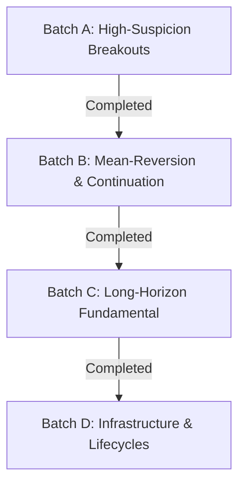

# UNIVERSAL SCANNER CERTIFICATION GOVERNANCE CHARTER (USCGC)
**Document Identifier:** `GOV-CHARTER-2026-USCGC-v2.0`  
**Effective Date:** 2026-09-26  
**System Jurisdiction:** Elite Breakout System (NSE / BSE Equities & Derivatives)  
**Classification:** Governing Policy Document (Mandatory Execution Standard)  
**Applies To:** All 16 Active Scanners, Trade Engines, and Infrastructure Subsystems  

---

## 1. GUIDING PRINCIPLE & CONSTITUTIONAL MANDATE

Every active scanner currently in production was initially admitted by shipping to meet operational requirements. Under this Charter, that status is formally revoked:

> **The Zero-Assumption Invariant:**  
> No trading strategy, scanner, filter cascade, or heuristic parameter set may remain active in live production without either:  
> 1. **Alpha Certification:** Successfully passing the unified T+1 point-in-time causal, 3-way walk-forward, 95% bootstrap holdout hurdle ($\text{CI}_{\text{low}} > 0.000\text{R}$) and demonstrating statistically significant incremental alpha ($p < 0.05$) against its own naive baseline on verified historical NSE/BSE market data; OR  
> 2. **Infrastructure Reclassification:** Being formally designated as non-alpha infrastructure (e.g. universe builders, data acquisition daemons, trade lifecycle / exit managers) and audited under objective execution-improvement metrics rather than entry alpha.
>
> **Zero Shadow / Zero Paper Trading Policy:**  
> The system does NOT employ "shadow mode" or "paper trading mode" to evaluate strategies. Strategies that fail certification are **IMMEDIATELY DECOMMISSIONED AND EXCISED** from the active codebase. Live production runs only certified, active trading strategies.

This governance standard applies the exact discipline that successfully exposed and permanently decommissioned the 5-minute breakout anomalies and the entire short-covering strategy family.

---

## 2. PHASE 0 — SHARED CERTIFICATION INFRASTRUCTURE (BUILD ONCE, REUSE FOR ALL 16)

To prevent fragmented backtests, lookahead bias, or bespoke execution cheating, all 16 scanners are certified through a single, shared testing harness:

```
┌─────────────────────────────────────────────────────────────────────────────┐
│                       SHARED CERTIFICATION HARNESS                          │
├─────────────────────────────────────────────────────────────────────────────┤
│  1. Point-in-Time Replay Engine (Adapter per Scanner via as_of_date)        │
│  2. Ground-Truth Market Data Layer (NSE/BSE Bhavcopy + Upstox V3 Parquet)   │
│  3. Universal Execution Standard (T+1 Open Fill, 5 bps Friction, Zero Gap)  │
│  4. Isolated Backtest Alert Ledger (backtest_alerts Database Schema)        │
│  5. Bootstrap CI & Feature Attribution Engine (10,000-Resample Permutation) │
└─────────────────────────────────────────────────────────────────────────────┘
```

### 2.1. Point-in-Time Replay Engine
* **Pure Bar-by-Bar Replay:** Vectorized pandas backtests that evaluate rolling arrays across future rows are strictly prohibited. The replay harness calls the actual production code via adapters (`app/certification/adapters/`) passing an exact `as_of_date` or timestamp $t$.
* **Causal Isolation:** At timestamp $t$, the scanner only receives data where $T \le t$. Future bars, subsequent corporate actions, restated earnings, or revised Bhavcopy records are physically masked.
* **Production Code Identity:** Replay runs the identical logic paths found in `app/eod_scanner.py`, `app/multi_tf_scanner.py`, `app/reversal_scanner.py`, etc. A bug in production must reproduce identically in replay.

### 2.2. Ground-Truth Historical Data Layer
* **Daily Equity History (2015–2026):** Official NSE/BSE Bhavcopy daily records with split/bonus adjustments performed strictly at point-in-time ex-dates.
* **Intraday Tick/Candle History (2021–2026):** Verified 1H, 15m, and 5m continuous historical bars sourced from certified Upstox V3 historical data.
* **Daily Delivery & Pledge Layer:** Actual exchange settlement delivery volumes and promoter pledge disclosures mapped to trading days without interpolation.

### 2.3. Universal Execution Standard
Every candidate strategy is evaluated under identical execution physics:
$$\begin{aligned}
\text{Signal Generation} &: \text{Candle Close at Timestamp } t \\
\text{Trade Entry} &: \text{Bar Open at Timestamp } t+1 \\
\text{Execution Price} &: \text{Open}_{t+1} \times (1 + \text{Slippage}) \\
\text{Slippage Model} &: \text{5 basis points (0.05\%) for liquid equities; 10 bps for small-caps} \\
\text{Statutory Friction} &: \text{STT (0.1\%), Exchange turnover fees, SEBI charges, GST, Stamp Duty} \\
\text{Fill Assumption} &: \text{Price must trade through entry level; trades opening past target are void}
\end{aligned}$$

### 2.4. Isolated Alert Ledger Schema (`backtest_alerts`)
Historical evaluations write to an isolated schema identical to production:
```sql
CREATE TABLE IF NOT EXISTS backtest_alerts (
    alert_id VARCHAR(64) PRIMARY KEY,
    run_id VARCHAR(64) NOT NULL,
    scanner_name VARCHAR(32) NOT NULL,
    symbol VARCHAR(32) NOT NULL,
    signal_date DATE NOT NULL,
    signal_timestamp TIMESTAMP WITH TIME ZONE NOT NULL,
    entry_price NUMERIC(12, 4) NOT NULL,
    stop_loss NUMERIC(12, 4) NOT NULL,
    target_1 NUMERIC(12, 4) NOT NULL,
    natural_rr NUMERIC(8, 2) NOT NULL,
    composite_score NUMERIC(8, 2) NOT NULL,
    filter_metadata JSONB NOT NULL,
    exit_date DATE,
    exit_price NUMERIC(12, 4),
    exit_reason VARCHAR(32),
    pnl_pct NUMERIC(8, 4),
    r_multiple NUMERIC(8, 4),
    holding_days INT
);
```

### 2.5. Bootstrap CI & Feature Attribution Engine
* **Resampled Expectancy:** 10,000 bootstrap resamples with replacement to determine empirical mean expectancy $\mathbb{E}[R]$ and standard error.
* **Confidence Interval:** Strict percentile $95\%$ bootstrap confidence interval $[\text{CI}_{\text{low}}, \text{CI}_{\text{high}}]$.
* **Paired Permutation Testing:** Two-tailed permutation test ($N=10,000$) between the candidate scanner and its naive baseline to determine whether incremental complexity produces a statistically significant edge ($p < 0.05$, Cohen's $d > 0.20$).

---

## 3. PHASE 1 — EMPIRICAL TRIAGE (LIVE DATABASE AUDIT)

Prior to running full historical replay campaigns, the system executes an immediate empirical triage on all live production alerts recorded in the database.

### 3.1. Triage Metrics
For every scanner that has emitted live alerts in production, extract:
1. $N_{\text{live}}$: Total live alerts generated.
2. $\text{Win Rate \%}$: Percentage of closed trades hitting $\ge \text{Target}_1$.
3. $\text{Mean Realized R}$: Average return normalized to initial risk: $R = \frac{\text{Exit} - \text{Entry}}{\text{Entry} - \text{SL}}$.
4. $\mathbb{E}[R]$: Empirical expectancy in R-multiples: $(\text{Win Rate} \times \bar{R}_{\text{win}}) - (\text{Loss Rate} \times \bar{R}_{\text{loss}})$.
5. $\text{Max Drawdown (R)}$: Peak-to-trough equity decline in R units.
6. Sample Span: Calendar duration and market regime distribution of live trades.

### 3.2. Triage Decision Thresholds
* **Empirical Hazard ($\mathbb{E}[R] \le 0.00\text{R}$ on $N \ge 30$):** High-priority immediate audit. Flagged as primary candidate for simplification or immediate decommission.
* **Underpowered ($N < 30$):** Cannot be judged empirically from live data; deferred to historical replay.
* **Empirical Alpha ($\mathbb{E}[R] > +0.20\text{R}$ on $N \ge 50$):** Validated in live conditions; certified for historical holdout verification to ensure robustness.

---

## 4. PHASE 2 — UNIVERSAL 5-STEP CERTIFICATION PROTOCOL

Every alpha scanner is processed through an identical 5-step tournament protocol.

```
Step 1: Decompose Score  ──► Step 2: Build Baseline ──► Step 3: 60/20/20 Split
                                                               │
                                                               ▼
Step 5: Gate 5 Holdout   ◄── Step 4: Gate 4 Alpha   ◄──────────┘
(95% CI_low > 0.000R)        (p < 0.05 vs Baseline)
```

### Step 1: Decomposition of Composite Score
No strategy is evaluated as an opaque black box. Scanners using composite scores (e.g. EOD $\ge 82$, Pullback $\ge 76$) must have their scores mathematically decomposed into atomic, orthogonal feature flags:
* EOD: (Trend stack) + (RSI band) + (Base ATR tightness) + (Volume ratio) + (52W proximity).
* Multi-TF: (1H stack) + (30m squeeze) + (15m alignment) + (5m trigger) + (Diurnal RVOL).
* Reversal: (52W drop) + (RSI trough) + (RSI curl) + (MACD crossover/expansion) + (RVOL floor).

### Step 2: Definition of Naive Baseline Comparator
Every candidate scanner is paired against its irreducible naive baseline (1–2 core rules). The naive baseline represents the simplest conceptual expression of the strategy without heuristic tuning.

### Step 3: Fixed Chronological Walk-Forward Split
Data is partitioned chronologically into three frozen, non-overlapping windows:
* **In-Sample Training (60%):** Parameter calibration and baseline benchmarking.
* **Out-of-Sample Validation (20%):** Feature selection, composite scoring optimization, and attribution testing.
* **Untouched Holdout (20%):** Strict out-of-sample execution. Once established, this data is touched **EXACTLY ONCE**. No tuning, re-calibration, or parameter iteration is permitted post-holdout evaluation.

### Step 4 (Gate 4): Incremental Alpha Significance
The full complex scanner must beat its naive baseline on the validation and holdout sets:
$$\Delta \mathbb{E}[R] = \mathbb{E}[R]_{\text{Full}} - \mathbb{E}[R]_{\text{Baseline}} > 0 \quad \text{with } p < 0.05 \text{ and Cohen's } d > 0.20$$
*If the full scanner fails Gate 4, all extra parameters are declared overfitted dead weight and stripped from the codebase.*

### Step 5 (Gate 5): Mandatory Holdout Invariant
The untouched holdout must yield a statistically significant positive edge:
$$\text{Bootstrap } 95\% \text{ CI}_{\text{low}} > 0.000\text{R} \quad \text{on Untouched Holdout}$$
*Zero exceptions permitted. Any scanner failing Gates 4 or 5 is **IMMEDIATELY DECOMMISSIONED AND REMOVED** from the production codebase.*

---

## 5. PHASE 3 — SEQUENCING ACROSS ALL 16 ENGINES

Testing is executed in four sequential batches grouped by shared risk profiles and data availability. Lessons from each batch directly refine subsequent testing:



### Batch A: Highest Suspicion Breakouts (Priority 1)
* **Engines:** `EOD`, `MULTI_TF`, `MULTI_TF_5M`, `TECHNICAL_INTRADAY`.
* **Rationale:** All are variants of the classical price/momentum breakout thesis proven structurally vulnerable to post-breakout mean reversion at high frequencies.
* **Action:** Immediate decomposition and holdout tournament.

### Batch B: Mean-Reversion & Structural Continuation (Priority 2)
* **Engines:** `REVERSAL`, `PULLBACK`, `ACCUMULATION`, `TECHNICAL` (EOD).
* **Rationale:** Based on distinct economic mechanisms (fading extreme extension, buying orderly consolidation pullbacks, multi-week VCP cheat pivots). Plausibly superior risk-adjusted expectancy.

### Batch C: Long-Horizon Fundamental Compounders (Priority 3)
* **Engines:** `WEALTH_ENGINE`, `MULTIBAGGER`.
* **Rationale:** 3 to 5-year investment horizons. Traditional trade-level R sampling is underpowered due to small sample size ($N$). Evaluated via cross-sectional rolling cohort returns vs. Nifty 500 TRI benchmark.

### Batch D: Infrastructure & Execution Lifecycles (Priority 4)
* **Engines:** `DAILY_BUILDER`, `PLEDGE_WORKER`, `AI_WORKER`, `PERFORMANCE_TRACKER`, `WEALTH_EXIT`, `MULTIBAGGER_EXIT`.
* **Rationale:** These systems do not generate initial entry alpha; they filter universes or manage positions. Evaluated on execution efficacy (e.g. does trailing stop ratcheting improve realized R over fixed exits?).

---

## 6. PHASE 4 — PER-SCANNER BASELINE & SUSPECT-COMPLEXITY MAP

| Scanner Identifier | Naive Baseline to Beat | Suspect Heuristic Complexity (Candidate Dead Weight) |
| :--- | :--- | :--- |
| **`EOD`** | $\text{Close} > \text{PRIOR\_20D\_HIGH}$ alone | ATR10 4-tier tightness penalty, Mode B recovery branch, Triple-fault veto, OBV slope gate |
| **`MULTI_TF`** | 1H trend stack + 5m thrust (no 30m squeeze) | 30m BBWP squeeze arming phase, pullback defense engulfing logic, diurnal volume tables |
| **`REVERSAL`** | $\text{RSI Trough} \le 35 + \text{Bounce} \ge 3\text{ pts}$ alone | Path 2 deep-value ROE floor, MACD 3-way OR condition, anti-climax upper wick threshold |
| **`PULLBACK`** | Impulse $\ge 8\% + \text{Retrace } 23.6-61.8\%$ | Regime-calibrated score hurdles (74/76/80), volume dry-up ratio ($<0.85\text{x}$) |
| **`ACCUMULATION`**| $\text{BBWP} < 0.10 + \text{Volume Dry-up} < 0.60\text{x}$ | 3-tier state machine, RS differential vs Nifty, fundamental floor scoring matrix |
| **`TECHNICAL`** | Single strongest pattern (e.g. Cup & Handle) | Multi-pattern pooling across 11 geometries, arbitrary confluence scoring weights |

---

## 7. PHASE 5 — HANDLING SAMPLE SIZE LIMITATIONS (GROUND-TRUTH EXPANSION)

When historical testing encounters small sample sizes ($N < 50$ events across default windows, e.g. strict VCP setups or DCF compounders), the system prohibits guessing, paper trading, or live shadow observation.

### 7.1. Ground-Truth Historical Expansion
* Rather than running paper trading or shadow modes, the testing engine **expands historical lookback** across the full 10-year Bhavcopy archive (2015–2026) across all 2,000+ NSE/BSE listed instruments.
* If, after full 10-year historical expansion, the setup still yields $N < 50$ events, it is formally classified as **STATISTICALLY UNDERPOWERED**.

### 7.2. Action on Underpowered Candidates
* Underpowered strategies are **NEVER** promoted to active live trading.
* They are cataloged as inactive research candidates until historical sample size reaches statistical adequacy.

---

## 8. PHASE 6 — BINARY GOVERNANCE & DECOMMISSIONING TRIGGER

### 8.1. Binary Strategy State Machine
To maintain zero ambiguity and ensure complete operational cleanliness, strategies in the Elite Breakout System operate under a strict **Binary State Machine**:

```
┌─────────────────────────────────┐
│       CERTIFIED_PRODUCTION      │
│   (Live Capital / Active Alert) │
└─────────────────────────────────┘
                 │
                 │ Failed Gate 4/5 or Performance Drop
                 ▼
┌─────────────────────────────────┐
│     DECOMMISSIONED / EXCISED    │
│  (Permanently Deleted from Code)│
└─────────────────────────────────┘
```

1. **`CERTIFIED_PRODUCTION`:** Fully certified via Gates 1–5 on verified historical market data. Actively screening and broadcasting trade alerts.
2. **`DECOMMISSIONED / EXCISED`:** Failed any gate or degraded in live execution. Permanently deleted from schedulers, triggers, dropdowns, and execution threads. Zero shadow mode.

### 8.2. Immediate Decommissioning Triggers
An active production scanner is immediately decommissioned and excised if:
1. **Rolling Expectancy Degradation:** Live rolling 50-trade realized expectancy drops below $0.000\text{R}$ ($\mathbb{E}[R] \le 0.00\text{R}$).
2. **Drawdown Breach:** Live realized drawdown exceeds $2.0\times$ its certified historical maximum drawdown.
3. **Statistical Failure:** Live win rate falls significantly below its certified holdout lower bound with $p < 0.01$.

---

## 9. CONCLUSION & EXECUTION SCHEDULE

This Charter governs all strategy certification across the Elite Breakout System. Zero shadow mode and zero paper trading are permitted. Phase 1 (Empirical Live Triage) initiates immediately, followed by the execution of Batch A (Breakout Tournament) on verified real historical data.
