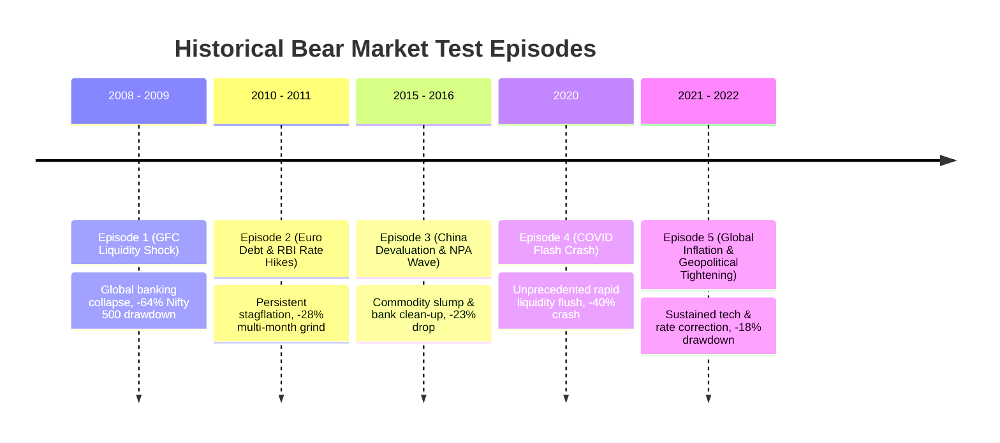
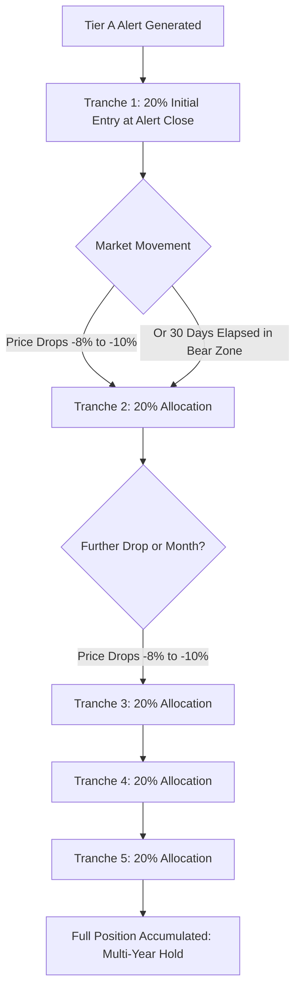

# 🛡️ Bear-Market Resilient Compounder (BMRC) — Backtest & Certification Plan

## 1. Executive Summary & Objective

The **Bear-Market Resilient Compounder (BMRC)** strategy operates on an institutional value-investing thesis: during broad equity market drawdowns, high-quality compounders with pristine balance sheets, secular ROCE, and resilient cash flows hold up significantly better than the broader market. When acquired at a valuation discount relative to their historical median and accumulated in staggered tranches, they provide asymmetric multi-year upside with minimized drawdown risk.

This document establishes the **rigorous, causal, point-in-time (PIT) backtest and governance certification plan** for BMRC, strictly adhering to the project's **Mandatory Real-Market-Data Protocol** and **Temporal Replication & Regime Robustness Gate**.

---

## 2. Core Architecture & Data Provenance Matrix

| Domain | Historical Requirement | Authoritative Source | Audit & Invariant Protocol |
| :--- | :--- | :--- | :--- |
| **Market Data (OHLCV)** | Daily Adjusted & Unadjusted 1D Candles (2007–2026) | **Upstox API** / Certified Local Parquet | Provider = `UPSTOX`, Native fields (`timestamp, open, high, low, close, volume`), IST timezone, Zero synthetic interpolation. |
| **Delivery Data** | Security-wise Delivery Quantity & Traded Qty | **NSE Bhavcopy Archive** | Official exchange Bhavcopy only. Cross-referenced against Upstox volume. |
| **Benchmark** | Nifty 500 Daily Index TRI & Closing | **NSE Index Feeds** | Underlying benchmark for regime gating and relative drawdown calculation. |
| **PIT Fundamentals** | Balance Sheet, P&L, Cash Flow, Shareholding, Pledging | **Audited Annual/Quarterly Filings & NSE XBRL** | **Strict Point-In-Time Watermarking**: Financials available strictly as of historical disclosure timestamp (`filing_date <= decision_date`). Restated future numbers are strictly barred. |
| **Valuation Medians** | 7-Year Rolling Median P/E & EV/EBITDA | **Historical Causal PIT Series** | Calculated dynamically using only historical earnings reported *before* the evaluation date. |

> [!IMPORTANT]
> **Zero-Lookahead / Anti-Restatement Invariant**:
> Using modern restated fundamentals on historical periods causes massive lookahead bias (e.g. knowing a 2011 loss was restated in 2013). Financial metrics must reflect only the exact numbers available to a fund manager on that specific scan date.

---

## 3. Historical Bear Market Test Episodes

To satisfy the **Mandatory Temporal Replication Gate (Anti-Pooled-Bias)**, BMRC must not be validated on a single aggregated pool. It must prove structural resilience across **5 distinct historical bear market regimes**:



1. **Episode 1: Global Financial Crisis (Jan 2008 – Mar 2009)**
   * *Index Peak-to-Trough*: Jan 8, 2008 to Mar 9, 2009 ($\approx -64\%$ on Nifty 500).
   * *Test Hypothesis*: Tests balance-sheet survival under extreme credit freezes and interest coverage stress.
2. **Episode 2: European Sovereign Debt & Rate Hikes (Nov 2010 – Dec 2011)**
   * *Index Peak-to-Trough*: Nov 5, 2010 to Dec 20, 2011 ($\approx -28\%$).
   * *Test Hypothesis*: Tests multi-quarter valuation de-rating during rising cost-of-capital environments.
3. **Episode 3: Commodity Crash, Chinese Devaluation & NPA Flush (Mar 2015 – Feb 2016)**
   * *Index Peak-to-Trough*: Mar 4, 2015 to Feb 29, 2016 ($\approx -23\%$).
   * *Test Hypothesis*: Tests non-cyclical cash flow resilience and earnings stability when industrial demand stalls.
4. **Episode 4: COVID-19 Flash Crash (Jan 2020 – Apr 2020)**
   * *Index Peak-to-Trough*: Jan 20, 2020 to Mar 23, 2020 ($\approx -39\%$).
   * *Test Hypothesis*: Tests algorithmic relative-strength decoupling and delivery absorption during severe panics.
5. **Episode 5: Global Inflation & Rate Hike Cycle (Oct 2021 – Jun 2022)**
   * *Index Peak-to-Trough*: Oct 19, 2021 to Jun 17, 2022 ($\approx -18\%$).
   * *Test Hypothesis*: Tests modern valuation sanity against high-flying multiples in mid/large caps.

---

## 4. Multi-Stage Filter & Scoring Engine Specifications

### Stage 0: Macro Regime Gate
* **Scan Frequency**: Weekly EOD (Friday close).
* **Activation Gate**:
  $$\text{Nifty 500 Close} < \text{SMA}_{200}(\text{Nifty 500}) \quad \text{OR} \quad \text{Drawdown}_{\text{from 52W High}}(\text{Nifty 500}) \ge 15\%$$
* If Gate = `FALSE`: Scanner is dormant (zero alerts generated).

### Stage 1: Fundamental Survival Pass/Fail Gate
Any non-passing company is **hard blocked** (Score = 0):
* **Market Capitalization**: $\ge ₹3,000\text{ Cr}$ as of scan date.
* **Non-Financial Companies**:
  * Debt / Equity: $\le 0.50$
  * Interest Coverage ($\text{EBIT} / \text{Interest}$): $\ge 4.0\times$
  * Promoter Pledging: $\le 5.0\%$ of total promoter holding
  * 5-Year Average ROCE: $\ge 15.0\%$
  * 5-Year Cumulative Operating Cash Flow to Net Profit ($\sum \text{OCF} / \sum \text{PAT}$): $\ge 70.0\%$
  * 5-Year Profit CAGR: $\ge 12.0\%$
  * Worst Annual Profit Drawdown (over past 5 years): $\ge -20.0\%$
* **Banking / NBFC Companies**:
  * Capital Adequacy Ratio (CAR): $\ge 16.0\%$
  * Gross NPA: $\le 3.0\%$ | Net NPA: $\le 1.0\%$
  * Return on Assets (ROA): $\ge 1.4\%$

### Stage 2: Relative Strength & Price Decoupling Gate
* **Relative Drawdown**:
  $$\text{Drawdown}_{\text{Stock}}(T_{\text{Index Peak}} \to T_{\text{Today}}) \le 0.70 \times \text{Drawdown}_{\text{Nifty 500}}(T_{\text{Index Peak}} \to T_{\text{Today}})$$
* **Trend Health**: $\text{Close} \ge 0.85 \times \text{SMA}_{200}$
* **Down-Day Resilience**:
  $$\frac{\text{Count of days when } \Delta\text{Nifty 500} \le -1.0\% \text{ AND } \Delta\text{Stock} > \Delta\text{Nifty 500}}{\text{Total days when } \Delta\text{Nifty 500} \le -1.0\%} \ge 60\%$$
* **No Capitulation**: No new 52-week low printed in the last 30 trading sessions.

### Stage 3: Valuation Sanity Filter
* **Historical Multiples**: Current P/E or EV/EBITDA $\le 0.85 \times \text{Median}_{\text{7-Year}}(\text{P/E or EV/EBITDA})$ (minimum 15% discount).
* **Earnings Decay Guard**: Trailing 12-Month Net Profit must not decline by more than $-10.0\%$ YoY.

### Stage 4: Delivery Accumulation Footprint (Bonus Layer)
* 10-day Average Delivery Percentage $\ge 1.30\times$ 60-day Average Delivery Percentage.
* 10-day Average True Range compression: $\text{ATR}_{10} / \text{ATR}_{14} \le 1.0$.
* Daily average delivery turnover $\ge ₹5\text{ Cr}$ (filters out illiquid micro-caps).

### Stage 5: Multi-Factor Composite Scoring (0–100 Scale)

```text
┌─────────────────────────────────────────────────────────────┐
│                   COMPOSITE BMRC SCORE                      │
├───────────────────────────────┬─────────────────────────────┤
│ Balance Sheet & Cash Quality  │ 30 Points                   │
│ Capital Return & Growth       │ 20 Points                   │
│ Relative Strength vs Index    │ 25 Points                   │
│ Historical Valuation Discount │ 15 Points                   │
│ Institutional Delivery Footprint │ 10 Points                │
└───────────────────────────────┴─────────────────────────────┘
```

* **Tier A Alert**: Score $\ge 75$ (Immediate candidate for staged accumulation).
* **Tier B Watchlist**: Score $60 - 74$ (Secondary candidate; alert held on radar).
* **Unqualified**: Score $< 60$ (Discarded).

---

## 5. Staged Tranche Capital Allocation & Execution Model

Unlike swing breakouts that buy 100% on a single bar, BMRC models **Institutional Dollar-Cost-Averaging (Pyramiding)** across a declared capital budget (e.g. ₹10 Lakhs max per stock, capped at 6% of total portfolio):



### Allocation Simulation Matrix:
1. **Tranche 1 (20% of Position Cap)**: Filled at the Friday closing price of the Tier A alert.
2. **Tranches 2 through 5 (20% each)**:
   * **Rule A (Price-step)**: If price drops an additional $-8.0\%$ to $-10.0\%$ from the prior tranche fill price.
   * **Rule B (Time-step)**: If 30 calendar days pass without hitting Rule A while the macro regime remains in `BEAR`.
   * **Rule C (Cease accumulation)**: If the stock rebounds $> +15\%$ above Tranche 1 before all tranches fill, remaining tranches are cancelled to avoid chasing.

---

## 6. Thesis-Break Monitoring & Liquidation Engine

BMRC holds for **1 to 5 years**. Exits are NOT governed by trailing ATR stops or short-term technical indicators; they are strictly governed by **fundamental thesis deterioration**:

```text
┌────────────────────────────────────────────────────────────────────────┐
│                   THESIS-BREAK EXIT CONDITIONS                         │
├────────────────────────────────────────────────────────────────────────┤
│ 1. Capital Destruction: ROCE < 12% for 2 consecutive fiscal years      │
│ 2. Leverage Spike:      D/E > 1.0 or Promoter Pledge > 15%             │
│ 3. Cash Flow Erosion:   OCF / PAT < 50% for 2 consecutive fiscal years │
│ 4. Governance Shock:    Auditor resignation or SEBI forensic inquiry    │
│ 5. Valuation Euphoria:  Trailing P/E > 2.0x 7-Year Historical Median   │
└────────────────────────────────────────────────────────────────────────┘
```

If any condition triggers, the position is liquidated on the first trading day post official disclosure.

---

## 7. Statistical Certification Metrics Battery

For each of the 5 bear episodes, and on the cross-episode pooled dataset, the backtest engine will calculate:

### 1. Alpha & Horizon Performance
* **1-Year Forward CAGR & Net Return vs Nifty 500**
* **3-Year Forward CAGR & Net Return vs Nifty 500**
* **5-Year Forward CAGR & Net Return vs Nifty 500**
* **Staged Tranche Internal Rate of Return (IRR)** vs **Lump-Sum Buy** vs **Nifty 500 SIP**

### 2. Risk & Drawdown Profile
* **Maximum Post-Alert Drawdown (Max Adverse Excursion - MAE)**
* **Downside Capture Ratio**: $\frac{\text{Average BMRC Return on Down Months}}{\text{Average Nifty 500 Return on Down Months}}$ (Target: $< 0.50$)
* **Ulcer Index & Sortino Ratio**

### 3. Signal Count & Selectivity Guard
* **Overfitting / Selectivity Bounds**:
  * Minimum signals per bear episode: $\ge 5$ stocks (avoids over-parameterization).
  * Maximum signals per bear episode: $\le 45$ stocks (avoids dilution / indexing).

### 4. Robustness & Sensitivity Stress Test ($\pm 20\%$ Bounds)
Perturb all core parameters by $\pm 20\%$:
* ROCE threshold: $12\% \leftrightarrow 18\%$
* D/E threshold: $0.40 \leftrightarrow 0.60$
* Relative Drawdown ratio: $0.56 \leftrightarrow 0.84$
* Valuation discount: $12\% \leftrightarrow 18\%$
* **Robustness Invariant**: If forward Sharpe or 3-year Alpha collapses by more than $30\%$ under perturbation, the strategy fails certification for parameter fragility.

---

## 8. Implementation & Verification Roadmap

| Phase | Milestone | Deliverable Script | SLA |
| :---: | :--- | :--- | :---: |
| **Phase 1** | **Dataset Certification & Provenance** | `scripts/certify_bmrc_market_data.py` | Day 1 |
| **Phase 2** | **Point-In-Time Fundamentals Builder** | `engine/research/bmrc_pit_builder.py` | Day 2 |
| **Phase 3** | **Causal Bear Market Simulation Engine** | `engine/research/bmrc_backtest_runner.py` | Day 3 |
| **Phase 4** | **Tranche vs Lump-Sum Performance Analyzer** | `reports/bmrc_staged_allocation_study.py` | Day 4 |
| **Phase 5** | **Governance Verdict & Dashboard Registration**| `reports/bmrc_certification_report.md` | Day 5 |
