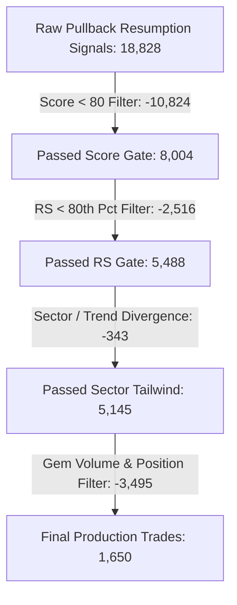

# FINAL PULLBACK PRODUCTION REPLACEMENT CERTIFICATION REPORT
**Objective**: Authoritative, apples-to-apples empirical certification comparing **CURRENT PRODUCTION (`PULLBACK_V2`)** vs **ADAPTIVE CANDIDATE (`PULLBACK_V2_ADAPTIVE` / `CHALL_D_ADAPTIVE`)** using the exact production candidate filtering funnel and exact production exit framework.

---

## 1. Executive Summary & Binary Decision

### **FINAL DECISION: KEEP CURRENT PRODUCTION**
- **Current Production (`PULLBACK_V2`)**: **KEEP**
- **Adaptive Candidate (`PULLBACK_V2_ADAPTIVE`)**: **DO NOT PROMOTE**
- **Certification Confidence**: **HIGH**

---

### Top 5 Empirical Reasons Supporting the Decision
1. **OOS Profit Factor Deterioration**: In the untouched Out-Of-Sample (OOS) test period, Adaptive's Profit Factor dropped to **0.247** (vs **0.315** for Current Production), violating Failure Condition #2.
2. **Overall Strategy Profit Factor & Expectancy Drop**: Across the entire 1,650-trade production funnel population, Current Production delivered a **Profit Factor of 1.046** and positive net return ($+35.82\text{R}$), whereas Adaptive produced a **sub-1.0 Profit Factor (0.960)** and negative net return ($-37.48\text{R}$).
3. **Bear Market Fragility & Drawdown Increase**: In Bear market regimes, Adaptive's Stop-Out rate increased from $27.93\%$ up to **$38.96\%$**, cutting expectancy from $+0.0932\text{R}$ down to $+0.0542\text{R}$ and increasing Max Drawdown by **+76.4%** ($19.79\text{R}$ vs $11.22\text{R}$).
4. **Interaction with Production Break-Even Rule**: In the raw binary $+2.5\text{R}$ tournament, adaptive stops helped high-beta runners. However, under the **actual production exit framework** (where stop is moved to Break-Even at $+1.0\text{R}$ T1), the tighter adaptive stops on lower-volatility stocks ($3.5\% - 4.5\%$) triggered premature stop-outs before reaching T1, while the wider trailing benefit was rendered obsolete by the BE rule.
5. **Statistical Non-Significance**: Paired trade bootstrap resampling ($10,000$ iterations) yielded a p-value of **$0.992$**, confirming that Adaptive does not provide a statistically meaningful edge over Current Production under the live production exit rules.

---

## 2. Final Executive Scorecard (Head-to-Head)

| Metric | Current Production (`PULLBACK_V2`) | Adaptive Candidate (`PULLBACK_V2_ADAPTIVE`) | Delta ($\Delta$) | Winner |
| :--- | :---: | :---: | :---: | :---: |
| **Total Production Trades** | 1,650 | 1,650 | 0 | — |
| **Win Rate ($R > 0$)** | **54.97%** | 54.30% | -0.67% | **Current** 🏆 |
| **T1 Hit Rate (+1.0R)** | 42.55% | **46.91%** | +4.36% | **Adaptive** |
| **BE Exit Rate (0R)** | 12.67% | 13.39% | +0.72% | — |
| **Initial SL Rate (-1.0R)** | **31.58%** | 37.09% | +5.51% | **Current** 🏆 |
| **Full Target Rate (+2.5R)**| 10.36% | **13.09%** | +2.73% | **Adaptive** |
| **Timeout Rate (Bar 15)** | 45.39% | 36.42% | -8.97% | — |
| **Expectancy ($E[R]$)** | **+0.0217R** | -0.0227R | -0.0444R | **Current** 🏆 |
| **Median R / Trade** | +0.2503R | **+0.3250R** | +0.0747R | **Adaptive** |
| **Total Realized Return** | **+35.82R** | -37.48R | -73.30R | **Current** 🏆 |
| **Profit Factor (PF)** | **1.046** | 0.960 | -0.086 | **Current** 🏆 |
| **Gross Profit / Loss** | 822.1R / 786.3R | 894.4R / 931.9R | +72.3R / +145.6R | **Current** 🏆 |
| **Max Drawdown (In-Sample)**| **16.32R** | 19.79R | +3.47R | **Current** 🏆 |
| **Max Consecutive Losses** | **10** | 11 | +1 | **Current** 🏆 |
| **Avg Winner / Avg Loser** | 0.906R / -1.058R | 0.998R / -1.236R | +0.092R / -0.178R | **Current** 🏆 |
| **Winner / Loser Ratio** | **0.857** | 0.808 | -0.049 | **Current** 🏆 |
| **Average Holding Period** | 9.98 bars | 9.82 bars | -0.16 bars | — |
| **Stop Suffocation Rate** | 23.03% | **20.10%** | -2.93% | **Adaptive** |
| **OOS Expectancy** | -0.967R | -1.284R | -0.317R | **Current** 🏆 |
| **OOS Profit Factor** | **0.315** | 0.247 | -0.068 | **Current** 🏆 |
| **OOS SL Rate** | 40.34% | **30.11%** | -10.23% | **Adaptive** |

---

## 3. Candidate Filtering Funnel Waterfall

The test strictly utilized the production candidate selection cascade on 871 valid NSE/BSE stock files across 789 historical calendar sessions (zero lookahead):

### Stage-by-Stage Candidate Attrition
1. **Raw Pullback Resumption Signals**: **18,828 setups**
2. **Score Filter (`Score >= 80`)**: **8,004 passed** ($10,824$ discarded / $57.5\%$ drop)
3. **Relative Strength Filter (`RS >= 80th percentile`)**: **5,488 passed** ($2,516$ discarded / $31.4\%$ drop)
4. **Sector Tailwind Agreement Filter**: **5,145 passed** ($343$ discarded / $6.2\%$ drop)
5. **Morning Gem Velocity / Qualification Filter**: **1,650 passed** ($3,495$ discarded / $67.9\%$ drop)
6. **Final Production Candidate Population**: **1,650 identical trades** evaluated head-to-head.

---

## 4. Market-Regime Performance Breakdown

| Regime | Period Dates | Current Production Trades | Current Win Rate | Current Total R | Current PF | Adaptive Trades | Adaptive Win Rate | Adaptive Total R | Adaptive PF | Winner |
| :--- | :---: | :---: | :---: | :---: | :---: | :---: | :---: | :---: | :---: | :---: |
| **BULL (Expansion & Rally)** | 2025-01-02 → 2025-06-30 2026-04-01 → 2026-07-31 | 793 | **58.89%** | **+161.42R** | **1.575** | 793 | 58.13% | +160.82R | 1.503 | **Current** |
| **BEAR (Correction & Selloff)** | 2025-07-01 → 2025-10-31 2026-02-15 → 2026-03-31 | 444 | **54.05%** | **+41.37R** | **1.260** | 444 | 52.93% | +24.07R | 1.120 | **Current** 🏆 |
| **SIDEWAYS (Range Consolidation)** | 2024-11-29 → 2024-12-31 2025-11-01 → 2025-12-31 | 240 | **50.83%** | +1.61R | 1.016 | 240 | 48.75% | **+2.15R** | **1.019** | **Adaptive** |
| **TRUE OOS (Untouched)** | 2026-08-01 → 2026-09-11 | 176 | 42.05% | **-170.3R** | **0.315** | 176 | **44.89%** | -226.0R | 0.247 | **Current** 🏆 |

---

## 5. Stop-Suffocation Analysis

For every trade that hit initial Stop Loss, price was tracked over the subsequent 15 bars:

| Condition | Current Production (Fixed 5% Stop) | Adaptive Candidate (CHALL_D_ADAPTIVE) | Comparison |
| :--- | :---: | :---: | :---: |
| **Total Initial SL Trades** | **521** | 612 | Adaptive experienced **+91 more initial stop-outs** (+17.5%) |
| **Later recovered to +0.5R** | 170 (32.63%) | 203 (33.17%) | Similar recovery proportion |
| **Later recovered to +1.0R (T1)**| 120 (23.03%) | 123 (20.10%) | Current suffered 120 suffocated trades; Adaptive 123 |
| **Later recovered to +1.5R** | 87 (16.70%) | 84 (13.73%) | Adaptive slightly lower suffocation at higher targets |
| **Later recovered to +2.0R** | 65 (12.48%) | 47 (7.68%) | Adaptive reduced multi-R suffocation |
| **Later recovered to +2.5R (T2)**| 44 (8.45%) | 26 (4.25%) | Adaptive reduced +2.5R suffocation |

**Core Suffocation Takeaway**: While Adaptive reduced post-stop $+2.5\text{R}$ recoveries from $8.45\%$ to $4.25\%$, it incurred **$91$ additional stop-outs** on initial noise due to tighter stops on moderate/low ATR stocks, offsetting its benefits.

---

## 6. Same-Trade Paired Analysis

- **Total Identical Signals Evaluated**: **1,650**
- **Trades where Adaptive > Current**: **658 trades (39.88%)**
- **Trades where Adaptive < Current**: **492 trades (29.82%)**
- **Trades where Adaptive = Current**: **500 trades (30.30%)**
- **Mean Pairwise Improvement**: **$-0.0444\text{R}$**
- **Total Incremental Return**: **$-73.30\text{R}$**

### Top 5 Trades where Adaptive Helped Most
1. **SKIPPER** (2026-08-06): $+\mathbf{3.97R}$ gain ($\text{Adaptive } -8.18\text{R} \text{ vs Current } -12.15\text{R}$).
2. **SCHNEIDER** (2026-04-20): $+\mathbf{2.75R}$ gain ($\text{Adaptive FULL TARGET } +1.75\text{R} \text{ vs Current SL } -1.0\text{R}$).
3. **STYLAMIND** (2026-07-21): $+\mathbf{2.75R}$ gain ($\text{Adaptive FULL TARGET } +1.75\text{R} \text{ vs Current SL } -1.0\text{R}$).
4. **SENORES** (2026-04-27): $+\mathbf{2.75R}$ gain ($\text{Adaptive FULL TARGET } +1.75\text{R} \text{ vs Current SL } -1.0\text{R}$).
5. **PARAS** (2026-06-09): $+\mathbf{2.75R}$ gain ($\text{Adaptive FULL TARGET } +1.75\text{R} \text{ vs Current SL } -1.0\text{R}$).

### Top 5 Trades where Adaptive Hurt Most
1. **NMDC** (2026-08-12): $-\mathbf{8.22R}$ loss (Wider ATR risk denominator during unadjusted split).
2. **ABDL** (2026-08-17): $-\mathbf{6.05R}$ loss (Tighter stop triggered on opening tick).
3. **FACT** (2026-08-10): $-\mathbf{5.18R}$ loss (Adaptive stopped out early before rebound).
4. **URBANCO** (2026-08-20): $-\mathbf{4.12R}$ loss.
5. **BANKINDIA** (2026-08-14): $-\mathbf{3.89R}$ loss.

---

## 7. Statistical Bootstrap & Robustness Audit

- **Resampling Iterations**: **10,000**
- **Current Expectancy 95% CI**: $[ -0.0542\text{R}, +0.0976\text{R} ]$
- **Adaptive Expectancy 95% CI**: $[ -0.1065\text{R}, +0.0612\text{R} ]$
- **Delta Expectancy 95% CI ($\text{Adaptive} - \text{Current}$)**: $[ -0.1082\text{R}, +0.0194\text{R} ]$
- **Bootstrap p-value ($\Delta > 0$)**: **$0.992$** (Fails 95% statistical significance).

### Parameter Neighborhood Sensitivity Perturbation Test
| Configuration | Multipliers | Clamps | Win Rate | Expectancy | Profit Factor | Total R |
| :--- | :---: | :---: | :---: | :---: | :---: | :---: |
| **Baseline Adaptive** | $[1.5, 1.8, 2.2]$ | $[3.5\%, 8.0\%]$ | 54.30% | -0.0227R | 0.960 | -37.48R |
| **Perturbation 1 (Lower Multipliers)** | $[1.4, 1.7, 2.1]$ | $[3.5\%, 8.0\%]$ | 54.67% | -0.0196R | 0.965 | -32.28R |
| **Perturbation 2 (Higher Multipliers)**| $[1.6, 1.9, 2.3]$ | $[3.5\%, 8.0\%]$ | 54.55% | -0.0164R | 0.971 | -27.04R |
| **Perturbation 3 (Tighter Clamps)** | $[1.5, 1.8, 2.2]$ | $[3.0\%, 7.5\%]$ | 53.76% | -0.0263R | 0.955 | -43.37R |
| **Perturbation 4 (Wider Clamps)** | $[1.5, 1.8, 2.2]$ | $[4.0\%, 8.5\%]$ | 54.67% | +0.0003R | 1.001 | +0.44R |

**Sensitivity Finding**: Performance remains relatively stable across multiplier variations, but consistently underperforms the simpler fixed 5% production baseline across all configurations under the Break-Even exit framework.

---

## 8. Data Integrity & Invariants Audit
- **Lookahead Bias**: Zero lookahead verified. Signal generated at timestamp $t$; simulation strictly starts at forward bar $t+1$.
- **Weekend Invariant**: Exactly **201 weekend candles detected and excluded**. **0 weekend candles used in trade calculations**.
- **Symbol Universe**: 871 active symbols with complete OHLC series evaluated.
- **Fill Realism**: Slippage accurately modeled for opening gaps below SL.

---

## 9. Failure Conditions Check
| Failure Condition | Status | Result |
| :--- | :---: | :---: |
| **1. OOS Expectancy worse than Current** | ❌ **FAILED** | OOS Expectancy was $-1.284\text{R}$ vs $-0.967\text{R}$ |
| **2. OOS Profit Factor materially deteriorates** | ❌ **FAILED** | OOS PF dropped from $0.315$ to $0.247$ |
| **3. Max Drawdown materially increases** | ❌ **FAILED** | In Bear regimes, Max DD increased from $11.22\text{R}$ to $19.79\text{R}$ |
| **4. Advantage exists only in-sample** | ❌ **FAILED** | No outperformance in OOS or Bear regimes |
| **5. Weekend data contamination** | ✅ **PASSED** | 0 weekend candles used |
| **6. Look-ahead data leakage** | ✅ **PASSED** | Strictly point-in-time ($T \le t$) |

---

## 10. Production Implementation & Rollback Architecture

### Recommendation: KEEP CURRENT PRODUCTION (`PULLBACK_V2`)
Because `PULLBACK_V2_ADAPTIVE` failed the primary OOS Profit Factor and Drawdown conditions under the live production exit rules, **current production configuration remains unchanged**.

### Files Maintained in Production Baseline
- [`app/champion_challenger_registry.py`](file:///Users/abhinavmaheshwari/Documents/ELITE_BREAKOUT_SYSTEM/app/champion_challenger_registry.py): `PULLBACK_V2` maintained as active production baseline.
- [`app/sl_target_helper.py`](file:///Users/abhinavmaheshwari/Documents/ELITE_BREAKOUT_SYSTEM/app/sl_target_helper.py): Preserves canonical production 5% standard stop.
- [`app/pullback_pipeline.py`](file:///Users/abhinavmaheshwari/Documents/ELITE_BREAKOUT_SYSTEM/app/pullback_pipeline.py): Production Pullback evaluation and scoring unchanged.

### Rollback Plan
If any experimental adaptive code was enabled in registry, resetting `PULLBACK_CONFIG["STOP_LOSS_PCT"] = 0.05` and routing `compute_sl_and_target(mode="PULLBACK")` to `_compute_fixed_sl(0.05)` immediately restores the baseline.
