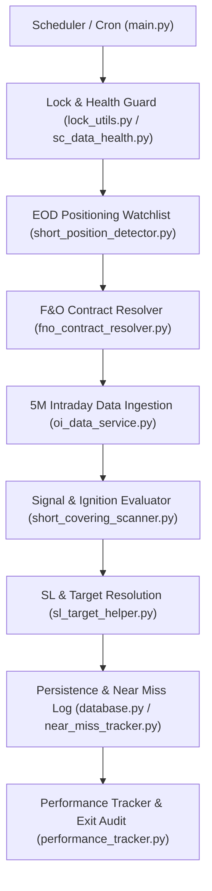

# SHORT COVERING 5M — COMPONENT & DEPENDENCY MAP

> [!NOTE]
> **Audit Context**: Complete structural map of all modules, functions, classes, data sources, timeframes, and timestamp semantics involved in `SHORT_COVERING_5M` signal generation, data ingestion, risk management, execution, and persistence across the repository.

---

## 1. System Architecture Map

---

## 2. Dependency Matrix

| Component | File Path | Class / Function | Input | Output | Data Source | Timeframe | Timestamp Semantics |
| :--- | :--- | :--- | :--- | :--- | :--- | :--- | :--- |
| **Scheduler Trigger** | `app/main.py` | `_trigger_short_covering_5m` | Cron timer / Manual call | Scanner execution trigger | Process scheduler | 5m intervals (09:20–15:25 IST) | Execution Trigger Time (IST) |
| **Concurrency Guard** | `app/lock_utils.py` | `ProcessLock("short_covering_5m_lock")` | Lock name | Boolean lock acquired | File system locks | Real-time | Lock Acquisition Time |
| **Health & Mutation Audit** | `app/short_covering/sc_data_health.py` | `SCDataHealthGate.assess_data_health` | Current session date & provider probe | Health status & candidate eligibility | Upstox / Fyers live feeds | Intraday | Feed Observation Time |
| **EOD Candidate Provider** | `app/short_covering/short_position_detector.py` | `ShortPositionDetector.detect_candidates` | EOD price & OI historical series | `List[EODShortPositionCandidate]` | Daily parquet files / DB | 1D | Session Closing Date ($T \le t$) |
| **F&O Contract Resolver** | `app/short_covering/fno_contract_resolver.py` | `FNOContractResolver.get_near_future_symbol` | Equity ticker symbol | Upstox/Fyers F&O instrument key | Master instruments JSON | Contract Expiry | Expiry Date (Near-month FUT) |
| **5M Data Ingestion** | `app/short_covering/oi_data_service.py` | `OIDataService.get_intraday_5m_data` | Symbol & Target Date | `pd.DataFrame` (OHLCV + OI) | Upstox/Fyers historical API & Parquet | 5M | Bar Start Time ($T \le t$, IST) |
| **Ignition Evaluator** | `app/short_covering/short_covering_scanner.py` | `ShortCoveringScanner.evaluate_symbol_5m` | 5M DataFrame & EOD Candidate | `ShortCoveringSignal` / Rejection Diagnostic | 5M Price & OI Series | 5M | Bar Timestamp of Signal Candle |
| **SL & Target Helper** | `app/sl_target_helper.py` | `calculate_sl_target_bracket` | Entry price, ATR, Scanner type | `(SL, T1, T2, T3)` tuple | Config & 15m ATR | Intraday | Signal Bar Close |
| **Alert Persistence** | `app/database.py` | `save_alert_if_new` | Alert dictionary | Alert ID / Insert Status | SQLite `scanner_alerts.db` / `production.db` | Real-time | Alert Generation Timestamp |
| **Near Miss Logger** | `app/near_miss_tracker.py` | `log_near_miss` | Rejection gate & candidate stats | Persisted near miss record | SQLite `alerts.db` | Real-time | Rejection Timestamp |
| **Performance Tracker** | `app/performance_tracker.py` | `process_trade_history` | Alert dict & 5M price series | Trade PnL & Exit State | Historical 5M Candle Feeds | 5M | Bar Close Timestamp |

---

## 3. Data Ingestion & Time-Semantics Specification

1. **Bar Timestamp Convention**: All 5-minute bar timestamps (e.g. `09:20:00+05:30`) represent the **Bar Start Time**. A candle labeled `09:20:00` aggregates market trading between `09:20:00` and `09:24:59`.
2. **OI Publication Latency**: Open Interest data points received from exchange feeds reflect snapshot polling intervals. In `oi_data_service.py`, contract OI is mapped to the corresponding 5M candle bar by alignment with the nearest lower 5M boundary.
3. **Point-In-Time Invariant**: At timestamp $t$, only data $T \le t$ is accessible to feature calculators and gating functions. Forward candles ($T > t$) are strictly isolated.
