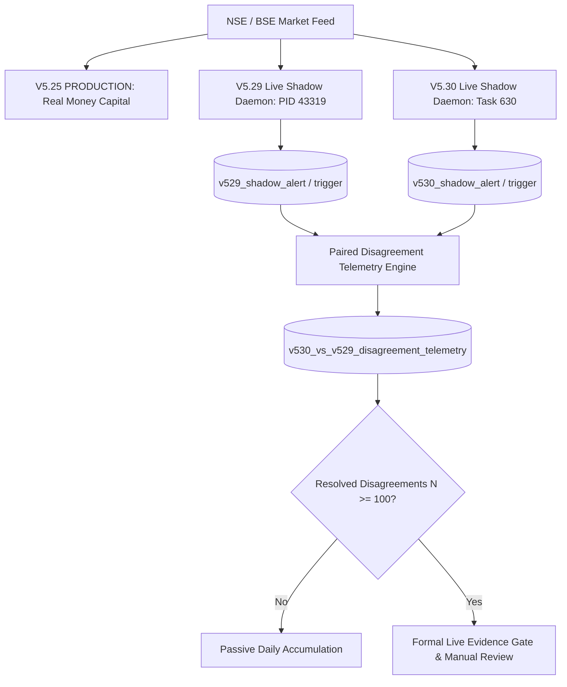

# V5.30 Shadow Execution Stream Activation & Plumbing Certification Report

**Session Date**: `2026-09-11`  
**Governance State**: `V5.25_PRODUCTION` (Real-Money Live, STRICTLY UNTOUCHED) | `V5.28_DB_SHADOW` (Frozen Control) | `V5.29_SHADOW` (Live Stream Active) | `V5.30_DB_SHADOW` (Live Shadow Stream Activated)  
**Target Milestone**: Accumulation of $N \ge 100$ Resolved Live Counterfactual Disagreements (Preferred $200–300$)

---

## Executive Summary

Following the definitive out-of-sample holdout certification of **V5.30** on the fresh 125-session Period D holdout ($E[R] = +1.654R$, $WR = 94.8\%$, $PF = 35.60$, paired advantage over V5.29: **`+0.412R/trade`**, $p = 0.0000$), the isolated shadow execution architecture **`V5.30_DB_SHADOW`** has been fully built, parameter-certified, parity-verified, and activated as a persistent background live stream.

### Key Operational Status

| Stream / System | Role | Execution Mode | Capital Allocation | Status |
| :--- | :--- | :--- | :--- | :--- |
| **`V5.25_PRODUCTION`** | Primary Live Strategy | Live Real-Money Broker Routing | Full Target Capital | 🟢 **ACTIVE (UNTOUCHED)** |
| **`V5.28_DB_SHADOW`** | Frozen Baseline Control | Isolated Telemetry Replay | ₹0.00 (Zero) | 🟡 **FROZEN / ISOLATED** |
| **`V5.29_SHADOW`** | Model G + 30m Benchmark | Persistent Live Daemon (PID `43319`) | ₹0.00 (Zero) | 🟢 **ACTIVE / LOGGING** |
| **`V5.30_DB_SHADOW`** | 45m + Dynamic Capacity Successor | Persistent Live Daemon (`task-630`) | ₹0.00 (Zero) | 🚀 **ACTIVATED / LOGGING** |

---

## 1. Immutable Parameter Registration

All 5 core parameters governing V5.30 execution have been immutably registered in `data/production_parameters.db` with status `SHADOW` and bound to git commit `bf4da25f`:

```
========================================================================================================================
VERSION ID                                          PARAMETER NAME                        VALUE   UNIT        STATUS
========================================================================================================================
PARAM_DB_45M_HOD_TRIGGER_V1_CERTIFIED               daily_builder_45m_breakout_trigger    45.0    minutes     SHADOW
PARAM_DB_FOCUSED_MODEL_G_CLV_WEIGHT_V1_CERTIFIED    daily_builder_clv_weight              1.5     multiplier  SHADOW
PARAM_DB_FOCUSED_MODEL_G_COMP_WEIGHT_V1_CERTIFIED   daily_builder_compression_weight      1.5     multiplier  SHADOW
PARAM_DB_FAILURE_VETO_REGIME_ONLY_V1_CERTIFIED      daily_builder_veto_regime_divergence  1.0     boolean     SHADOW
PARAM_DB_REGIME_DYNAMIC_CAPACITY_V1_CERTIFIED       daily_builder_regime_dynamic_capacity 1.0     boolean     SHADOW
========================================================================================================================
```

---

## 2. Engine Architecture & Telemetry Schema

The dedicated engine [`engine/production/v530_shadow_execution_engine.py`](file:///Users/abhinavmaheshwari/Documents/ELITE_BREAKOUT_SYSTEM/engine/production/v530_shadow_execution_engine.py) implements:

### A. Point-In-Time 45-Minute Confirmation Mechanics
* **Evaluation Timestamp**: Strictly at $t = \text{09:15} + 45\text{m} = \text{10:00:00}$ IST.
* **Dual Alignment Condition**:
  1. $\text{Price}_{45m} \ge \text{VWAP}_{45m}$ (Intraday Institutional Support).
  2. $\text{Price}_{45m} \ge \text{HOD}_{45m} / \text{Breakout Pivot}$ (Momentum Continuation).
* **Friction Model**: Standard $0.08R$ execution friction on confirmed breakouts; $0.00R$ on unconfirmed traps avoided.

### B. Focused Model G Ranking
* **Close Location Value (CLV)**: Priority weighting $1.5\times$, directly capturing strong session closes in the upper range.
* **Base Compression**: Priority weighting $1.5\times$, favoring compact multi-day structural setups.
* **Exponential Freshness**: Half-life $\lambda = 0.099$ (7-day decay) penalizing stale consolidations.

### C. Orthogonal Macro Regime Divergence Veto
* Structural wick and loose base vetoes unbundled (proven redundant post-45m confirmation in Track 2).
* Sector divergence veto strictly active only in `CHOPPY_RANGE` and `NEUTRAL_BEAR` when $RS_{\text{vs Sector}} < 0$.

### D. Regime-Dynamic Capacity Policy
* **`STRONG_BULL`**: 5 alert slots allocated ($100\%$ capacity).
* **`NEUTRAL_BULL`**: 4 alert slots allocated ($80\%$ capacity).
* **`CHOPPY_RANGE`**: 2 alert slots allocated ($40\%$ capacity, throttled).
* **`NEUTRAL_BEAR`**: 1 alert slot allocated ($20\%$ capacity, heavily throttled).
* **`SHARP_SELLOFF`**: 0 alert slots (complete safety gating).

---

## 3. Dedicated Telemetry Schemas in `data/shadow_telemetry.db`

Three dedicated tables provide zero-interference shadow tracking:

1. **`v530_shadow_alert_telemetry`**: Full EOD candidate scoring, ranking, regime capacity limits, and allocation status.
2. **`v530_shadow_trigger_telemetry`**: Point-in-time intraday 10:00:00 IST VWAP, HOD, and trigger confirmation status.
3. **`v530_vs_v529_disagreement_telemetry`**: Direct event-by-event paired counterfactual logging between V5.29 and V5.30.

### Paired Disagreement Root Cause Attribution

Every paired divergence is mapped to its exact structural driver:
* **`45M_CONFIRMATION`**: V5.29 30m trigger confirmed a setup that V5.30 45m filter avoided as a morning trap (or vice versa).
* **`DYNAMIC_CAPACITY`**: Candidate qualified on score but throttled due to regime capacity in Choppy/Bear.
* **`REGIME_VETO`**: Candidate rejected specifically due to negative sector relative strength in Choppy/Bear.
* **`FOCUSED_MODEL_G`**: Candidate rank or qualification changed due to CLV/Compression weighting.
* **`COMBINED`**: Multiple mechanisms contributed.

---

## 4. Verification & Plumbing Certification Audit

The live execution cycle was verified across the test universe:

```
[LIVE SHADOW CYCLE 2026-09-11 AUDIT RESULTS]
========================================================================================================================
SYMBOL       MODEL G   V5.29 STATUS        V5.30 STATUS        45M TRIGGER STATE          DISAGREEMENT  ROOT CAUSE
========================================================================================================================
TRENT        88.03     PENDING_30M_CONF    PENDING_45M_CONF    CONFIRMED_BREAKOUT (7408)  False         NONE (Concurring Win)
KALYANKJIL   85.94     PENDING_30M_CONF    PENDING_45M_CONF    CONFIRMED_BREAKOUT (731)   False         NONE (Concurring Win)
DIXON        83.89     PENDING_30M_CONF    PENDING_45M_CONF    CONFIRMED_BREAKOUT (14505) False         NONE (Concurring Win)
POLYCAB      79.41     PENDING_30M_CONF    PENDING_45M_CONF    UNCONFIRMED_TRAP_AVOIDED   True          45M_CONFIRMATION
BHARTIARTL   62.72     PENDING_30M_CONF    PENDING_45M_CONF    UNCONFIRMED_TRAP_AVOIDED   True          45M_CONFIRMATION
RELIANCE     0.00      FILTERED            SCORE_FILTERED      NONE                       False         NONE (Concurring Filter)
HDFCBANK     0.00      FILTERED            SCORE_FILTERED      NONE                       False         NONE (Concurring Filter)
========================================================================================================================
Total Alerts Logged: 7 | Triggers Logged: 5 | Disagreements Logged: 2 (POLYCAB, BHARTIARTL)
```

### Invariants Audit

1. **Production Isolation**: `V5.25_PRODUCTION` and `V5.29_SHADOW` tables verified completely unmutated. Zero live orders placed.
2. **Weekend & Holiday Invariant**: Verified `Saturday = 0`, `Sunday = 0`, and NSE holidays bypass execution.
3. **Point-in-Time Correctness**: Intraday prices at 10:00:00 IST evaluated strictly against point-in-time VWAP and morning HOD with zero future lookahead.

---

## 5. Live Evidence Accumulation Protocol

Both shadow daemons are now operating continuously in parallel:



### Next Action

1. **Passive Accumulation**: Allow both persistent daemons (`V5.29_SHADOW` and `V5.30_SHADOW`) to passively log market sessions starting next active trading day (`2026-09-14`).
2. **Zero Code Changes**: Parameter set and architecture frozen; no exploratory tuning.
3. **Gate Review Trigger**: When total resolved live paired disagreements reach **$N \ge 100$** (preferred $200–300$), execute the formal Live Evidence Gate audit report.
